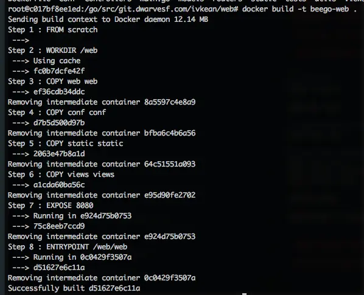

When using Docker, you will quickly realize that the image using to run a project takes a big capacity. A simple image ubuntu took nearly 200MB, but you don’t take full advantage of its available tools. Other images like Node, Go, etc almost run in Ubuntu, debian and only set up more environments to easily deploy. However, downloading a new image takes more time because of its big capacity and it seems to be not necessary at all.

I found an empty image, except some added metadata by Docker

```javascript
docker pull scratch
```

Therefore, this Docker image has the smallest capacity

## How to deploy an app web with this Docker image
* I will demo with beego web.
* I cannot compile app go in this empty image because it has no Go complier. And while using Mac, I cannot compile a Linux library. In reality, we absolutely can cross-compile but I will not mention in this blog. You can refer to [here](https://golang.org/doc/install/source#environment)
* So I need to create an environment to compile and docker build source Go

```javascript
docker run --rm -it -v "$GOPATH":/go  -e "GOPATH=/go"  -v /var/run/docker.sock:/var/run/docker.sock -v $(which docker):$(which docker) golang bash
```

* With the above command, `-rm` will delete container after exit,`v "$GOPATH":/go` share directory GOPATH to container, `e "GOPATH=/go", -v /var/run/docker.sock:/var/run/docker.sock` is used to run Docker into container (docker in docker). `v $(which docker):$(which docker)` is used to share command docker, golang is image environment to build Go binary and build image, bash to begin Bash session.
* This time, because I went into container, I cd to project `/go/src/git.dwarvesf.com/ivkean/web.`
* Create a Dockerfile with the content below

```javascript
# scratch
FROM scratch

WORKDIR /web

# copy binary into image
COPY web web

# copy other necessary files
COPY conf conf
COPY static static
COPY views views

EXPOSE 8080

ENTRYPOINT ["/web/web"]
```

* Build source by command: `go build`
* And link library by:`CGO_ENABLED=0 GOOS=linux go build -a -installsuffix cgo -o web .`
* Build with docker: `docker build -t beego-web .`



* Creating an image only takes 17.5MB


* Your laptop had an image, which is beego-web


