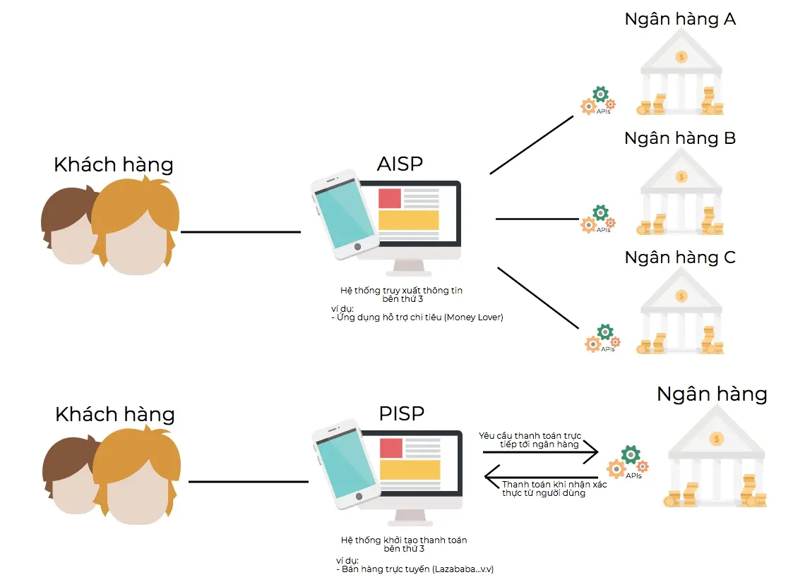

## T1: Retail 2.0
*Definition*

* Enhancing consumer engagement within brick and mortar - online/using mobile devices, moving beyond simply blending in the online and the mobile experience, all driven at the heart by sophisticated big data tools that truly enable contextual, personalized and real-time conversations between brands, retailers and consumers. [1]
* Made up of AR (augmented reality), VR (virtual reality), in-store apps, new payment methods and artificial intelligence.

### Personalized Exp
Designing or producing services and products to meet customer's individual requirements. You’re most likely already familiar with marketing personalization

### Simplified Authentication
Authentication can be one of the most significant sources of friction for your application’s users. This usability barrier can impact adoption of your product, increase the burden on support operations or product administrators and, in some cases, degrade security.

### Retail 3.0
Haravan: Support offline shop on online selling to trigger O2O (standardize data structure) ––> Create the foundation for big data and 4.0

### Retail 4.0


### O2O - Online to Offline
* Originally, implies an online trigger which prompts the customer to go to a physical location to complete their purchase
* Evolvingly, it is the ability to pay online and then pick up a product in an offline place, such as the retailers' physical store or 3rd party locations.
* Another O2O feature is returning items purchased online to the retailers' offline location.Open banking is also known as "open bank data." Open banking is a banking practice that provides third-party financial service providers open access to consumer banking, transaction, and other financial data from banks and non-bank financial institutions through the use of application programming interfaces (APIs). Open banking will allow the networking of accounts and data across institutions for use by consumers, financial institutions, and third-party service providers. Open banking is becoming a major source of innovation that is poised to reshape the banking industry.



```javascript
Takeway
- Open banking is the system of allowing access and control of consumer banking and financial accounts through third-party applications.
- Open banking has the potential to reshape the competitive landscape and consumer experience of the banking industry. 
- Open banking raises the potential for both promising gains and grave risks to consumers as more of their data is shared more widely.
```

## T2: Open Banking
Open banking is also known as "open bank data." Open banking is a banking practice that provides third-party financial service providers open access to consumer banking, transaction, and other financial data from banks and non-bank financial institutions through the use of application programming interfaces (APIs). Open banking will allow the networking of accounts and data across institutions for use by consumers, financial institutions, and third-party service providers.
Open banking is becoming a major source of innovation that is poised to reshape the banking industry.
