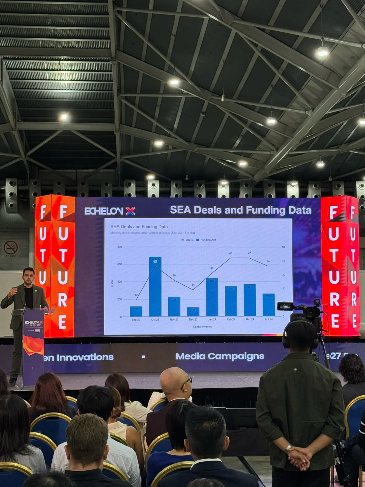
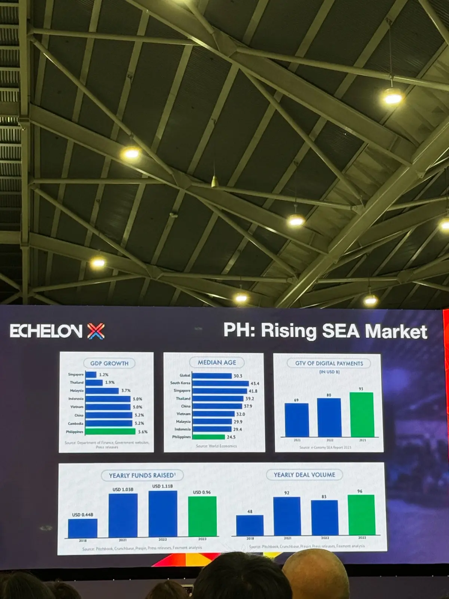
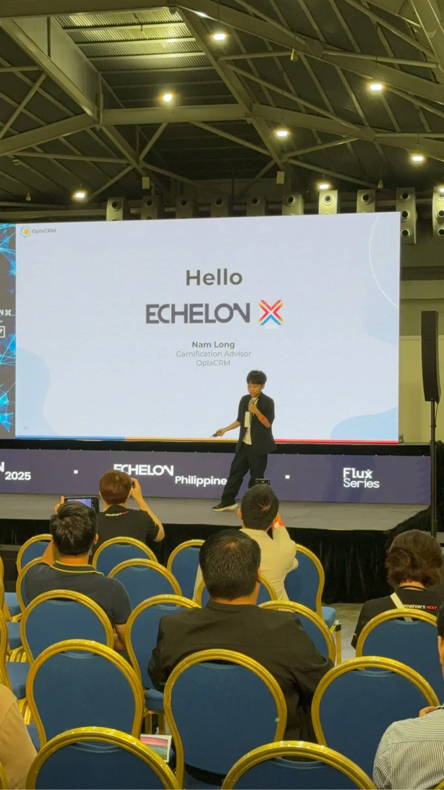
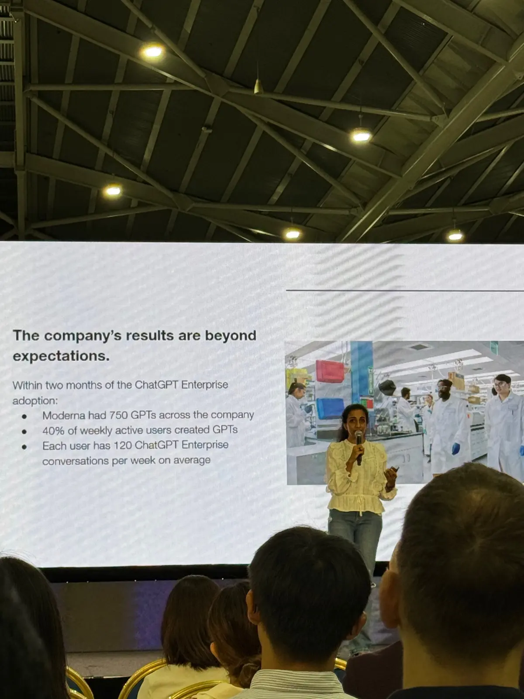

## Overall Market
The startup ecosystem in Southeast Asia (SEA) is showing promising signs of recovery. Some key statistics and insights:

### Funding Recovery
- **2024 SEA Startup Funding**: The total funding for startups in SEA is projected to reach $14 billion, up from $10 billion in 2023, marking a 40% year-on-year increase.
- **Number of Deals**: The number of deals in SEA has increased by 25% compared to the previous year, indicating renewed investor confidence.

### Key Markets
**Philippines and Indonesia**:
- The Philippines has seen a 50% increase in startup funding, reaching $2 billion in 2024.
- Indonesia continues to lead the region with $5 billion in total funding, up 30% from the previous year.

### Investor Sentiment
- Investors are still cautious, focusing heavily on the quality of startup teams. Most investors prioritize the **team's expertise and industry experience** over the product itself.

## AI Landscape
The AI sector in SEA is evolving rapidly, with several startups leveraging AI to drive innovation:

### AI Applications
- **Market Growth**: The AI market in SEA is expected to grow at a CAGR of 35% over the next five years, reaching a market size of $6 billion by 2028.
- **Key Use Cases**:
	- **AI to Assist Software Development**: AI is being used for tasks like prompt to design, design to code, and devops automation.
	- **Data Sorting and Consolidation**: Automating processes like documentation and customer support data consolidation.
	- **Threat/Fraud Detection**: Implementing AI models for fraud detection in banking and credit, and shielding against fake content.
	- **Management Systems Using AI**: AI-powered solutions for CRM, HRM, and other enterprise management systems.

### Challenges and Concerns:
- **Enterprise Adoption**: Only 15% of large enterprises in SEA have fully integrated AI solutions into their operations, reflecting a cautious approach. Most AI adoption is aimed at digital transformation initiatives.

- **Security and Privacy**: Data security and privacy are the primary concerns when adopting AI technologies.
- **Localization**: Developing localized AI models for the SEA market is a priority. For example, projects like [Sealion by AI Singapore](https://github.com/aisingapore/sealion) aim to cater to regional needs.
- **Cost vs Benefit**: High implementation costs are a significant barrier to AI adoption, necessitating rigorous cost-benefit analyses by businesses.
- **Ethical Concerns**: The potential misuse of AI, such as deepfake technology, is a significant concern, prompting companies to invest in AI ethics and governance frameworks.