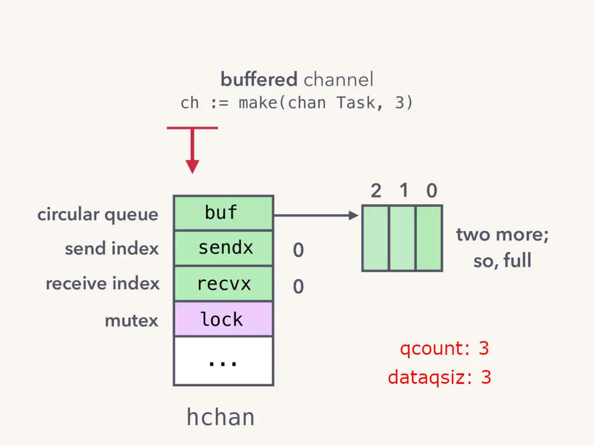
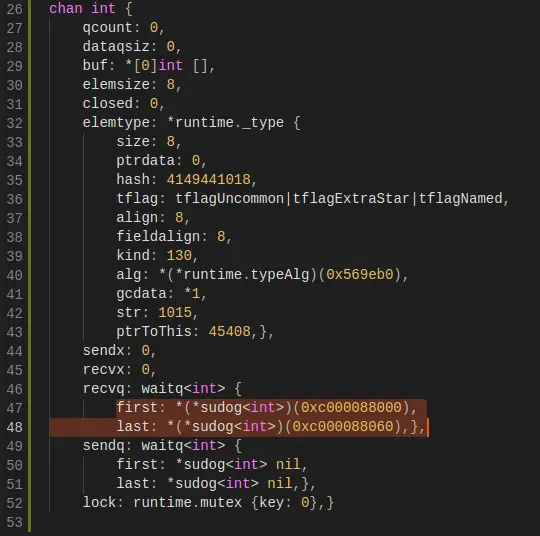
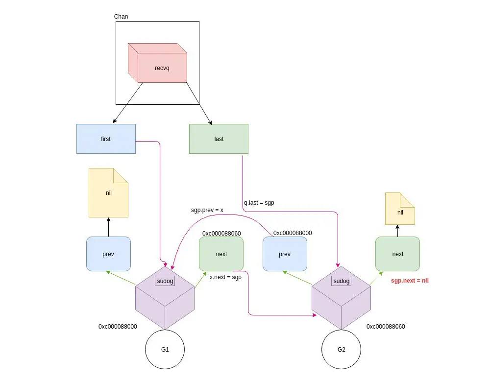
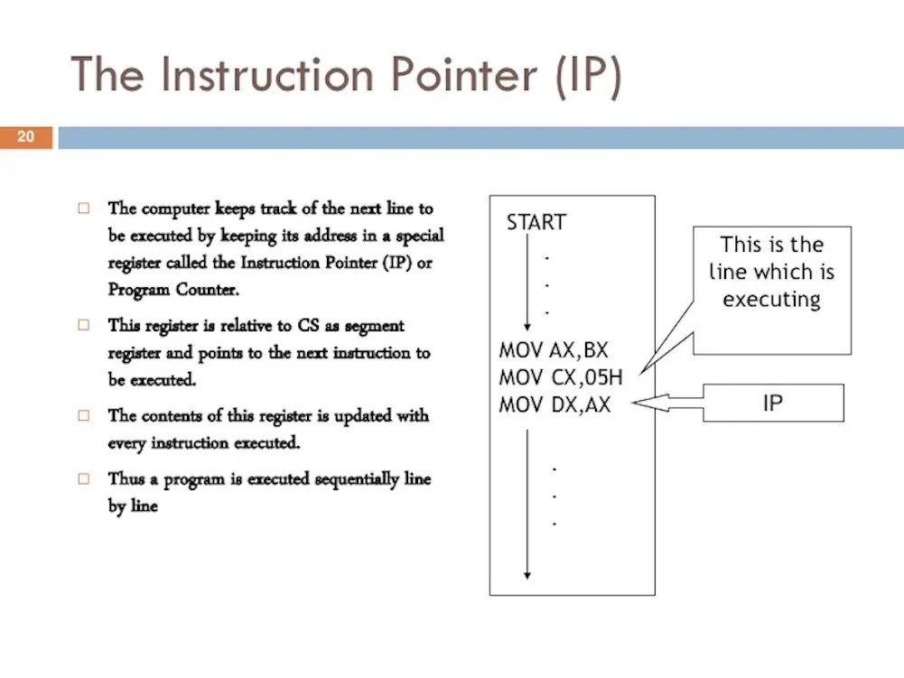
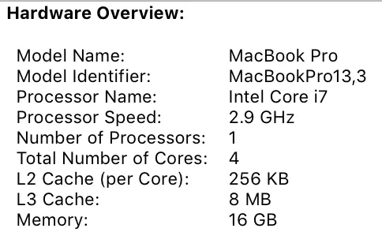

## Golang concurrency
When we talk about Golang, its most basic and popular characteristic is concurrency-support. Unlike other languages what is quite complex to build an concurrency system, Go concurrency primitives via Goroutines and channels make concurrent programming easy. So i am going to talk about Goroutines and similar things in other programming languages.

Firstly, we need to know Go is a concurrent language and not a parallel one. So what is the difference from concurrency and parallelism?

### Concurrency vs Parallelism
Concurrency means “out of order” execution. Another concept talk about concurrency as the capability to deal with lots of things at once. It's best explained with an example in real life: During playing Dota 2, let’s say, my mom asked me to buy something. Now i stop playing, go to the grocery and then starts playing again with rebuke of my team. This is a basic example of concurrency. In computing, concurrency is represented by the state when two or more tasks can start, run, and complete in overlapping time periods. It doesn't necessarily mean they'll ever both be running at the same time. Multitasking on a single-core machine is an example.

Parallelism is doing lots of things at the same time like other running tasks on a multicore processor. Let’s come back with the example above. Instead of taking order my mother, I play the game and listen to music at once freely. In this case, playing game and listening to music is "lots of things".


After understanding the way to compare concurrency with parallelism, we can research about Goroutines/channel and other well.

### Goroutines
Goroutines can be understood like a light weight thread. Instead of OS, Goroutines exists only in the virtual space of Go runtime. A Goroutines is started up with initial 2KB of stack size (This is the location where store answer of the question "what is this Go routine's current state?". It is contains local variables as well as pointers to heap allocated variables). Because Go’s stacks are dynamically sized, growing and shrinking with the amount of data stored. So we need only 4KB memory for Goroutines.


Goroutines are cheaper than others thing like it (thread) in other programming language because of ability growing and shrinking depend on programmer's desire. e.g a Java thread initially have 4MB while go-routine is somewhere around 2KB.

While some languages take an "concurrency at OS level" approach. Go implemented its own scheduler in order to keep concurrency concept at language level.

### Channel
Channel is a communication tool for Goroutines. Channel can be understand like pipes. So similar to water flows from one end to another in pipes, a Goroutines write data in one end and we can get it in another by using Channel.

Each channel has a type associated. This type decide data type that channel is allowed to transport and no other types can access into it.

When a data is sent to a channel, the control is blocked in the send statement until some other Go-routine reads from that channel. Similarly when data is read from a channel, the read is blocked until some Go-routine writes data to that channel. It also mean these are **unbuffered**.

In other words, by default Go channel are **unbuffered**.

So how to break this limit?

Like the way God made Eve from a part of Adam, Go provide another channel type that can buffered.

For buffered channel, providing the buffer length as the second argument to make to initialize a buffered channel:

```plain_text
 messages := make(chan string, capacity)
```

Capacity should be greater than 0 for a channel to have a buffer and we can send data to our channel until this is full, similar receives will not block when we read data until empty.


## Under the hood
### Channel implementation
When we implement a Go channel, a struct will be created, then it looks like following.

To have a comprehensive view, we have a few descriptions about the fields encountered in the channel structure.


* **buf** is the location where our data is actually stored. It is a circular queue.
* **dataqsize** is size of the circular queue. It represent capability of channel. When we declare make(chan int, N), **dataqsize** is N. It also let us know how many Goroutines can write data into this channel until blocked


* **qcount** represents the number of slots in the buf currently filled up.
* **elemsize** Is the size of a channel corresponding to a single element.
* **elemtype** used when messages are copied over from one Go-routine to the other. It has a bunch of fields which provide type and size information for the type of values the channel can hold.
* **closed** Indicates whether the current channel is in the closed state. After a channel is created, this field is set to 0, that is, the channel is open; by calling close to set it to 1, the channel is closed.



* **sendx** and **recvx** indicates the current index of buffer — backing array from where it can send data and receive data.
* **recvq** and **sendq** waiting queues, which are used to store the blocked Goroutines while trying to read data on the channel or while trying to send data from the channel.
* **lock** protects all fields in **hchan**, as well as fields in sudogs blocked on this channel.
* **sudog** struct is described in Golang source as a Go Routine in a wait list, such as for sending/receiving on a channel.
* 

We mentioned about sudog struct above. What is sudog? See the following image:


We have a full description for sudog struct in source. If something confuse, ignore it by looking at the original concept. Then we have a good description about sudog: sudog represents a Goroutine. recvq and sendq hold the information on the Goroutines which are currently blocking on the channel while receiving and sending respectively. They are pointers to sudog.

An example to know what happen when we declare Goroutines and channel.


What will be the structure of the channel before line **No 22?**



In Our Example Code before line 22 there are two Goroutines (goroutineA and goroutineB ) trying to read data from the channel ch.

Since before line 22 on a channel, there is no data we have put on the channel so both the Goroutines blocked for receive operation have been wrapped inside the **sudog** struct and is present on the recvq of the channel. **recvq** and **sendq** are basically linked list, which looks basically as below



### Go scheduler
To understand Go scheduler quickly, we will review a few concepts in OS and OS scheduler that support a program is runnable. If you knew about OS thread and OS scheduler, you should skip following section and jump to next part.

Computer Program is just a series of machine instructions that need to be executed one after other sequentially. So thread was born in other to account and sequentially execute the set of instructions it was assigned.

When we run a program, a process is initiated with a thread. A thread have the ability to create more threads. A thread can run parallel or concurrently and keep their own state is safe, local and independent execution of their instructions.

The OS scheduler is an operating system module that is responsible for making sure cores are not idle if there are threads that can be executing. It must also create the illusion that all the threads that can execute are executing at the same time.

If you are running on Linux, Mac or Windows, you are running on an OS that has a preemptive scheduler. This means a few important things. First, it means the scheduler is unpredictable when it comes to what Threads will be chosen to run at any given time. Thread priorities together with events, (like receiving data on the network) make it impossible to determine what the scheduler will choose to do and when.

Existing a piece called Program Counter in a Thread that allows the thread keep track of the next instruction to execute.



There are 3 states in thread
* **Waiting**: This means the Thread is stopped and waiting for something in order to continue. “Something” is waiting for the hardware (disk, network), system calls, synchronization calls (atomic, mutexes).
* **Runnable**: This means the Thread wants time on a core so it can execute its assigned machine instructions.
* **Executing**: This means the Thread has been placed on a core and is executing its machine instructions.

And 2 types of works
* **CPU-Bound**: This is work that never creates a situation where the Thread may be placed in Waiting states.
* **IO-Bound**: This is work that causes Threads to enter into Waiting states. This is work that consists in requesting access to a resource over the network or making system calls into the operating system.
**Context switches** is the duration that we swap a thread on and of a core. It take between ~1000 and ~1500 nanoseconds to do its work while the hardware should be able to reasonably execute averagely 12 instructions per nanosecond per core. So a context switch can cost we ~12k to ~18k instructions of latency. In essence, a context switch make lower performance by losing ability to execute a lot of machine instructions. It look like suitable with IO-Bound work but not with CPU-Bound work that requires work constantly.

After surfing over above all things, we have ability to understand following part quickly. It is the section that describe about GO scheduler and how it make Goroutines faster than threads.

### Getting started
When our program start up, it’s given a Logical Processor (P) for every virtual core identified on the host machine. So how many virtual core exist in your computer? Suppose that we have a Macbook with following system report:



We have 1 processor with total 4 cores. As you see the report don’t let us know directly how many virtual core here. But the Intel Core i7 processor has Hyper-Threading, which means there are 2 hardware threads per physical core. This will report to the Go program that 8 virtual cores are available for executing OS Threads in parallel. In another word, a hardware thread serve for a virtual cores.

Every P is assigned an OS Thread (M) that stands for machine. This means when I run a Go program on my machine, I have 8 available threads to execute my work, each individually attached to a P.

Every Go program is also given an initial Go-routine (G). Just as OS Threads are context-switched on and off a core, Goroutines are context-switched on and off an M.

Each P is given a Local Run Queue LRQ that manages the Goroutines assigned to be executed within the context of a P. These Goroutines take turns being context-switched on and off the M assigned to that P. The Global Run Queue(GRQ) is for Goroutines that have not been assigned to a P yet. There is a process to move Goroutines from the GRQ to a LRQ that we will discuss later.

Following figure provides an image of all these components together


The Go scheduler is part of the Go runtime, which is built into our application. This means the Go scheduler runs in user space. The current implementation of the Go schedule is a cooperating scheduler that needs well-defined user space events.

We can’t predict what the Go scheduler is going to do. This is because decision making for this cooperating scheduler doesn’t rest in the hands of developers, but in the Go runtime. It’s important to think of the Go scheduler as a preemptive scheduler and since the scheduler is non-deterministic, this is not much of a stretch.

There are four classes of events that occur in your Go programs that allow the scheduler to make scheduling decisions. This doesn’t mean it will always happen on one of these events. It means the scheduler gets the opportunity.
* The use of the keyword go
* Garbage collection
* System calls