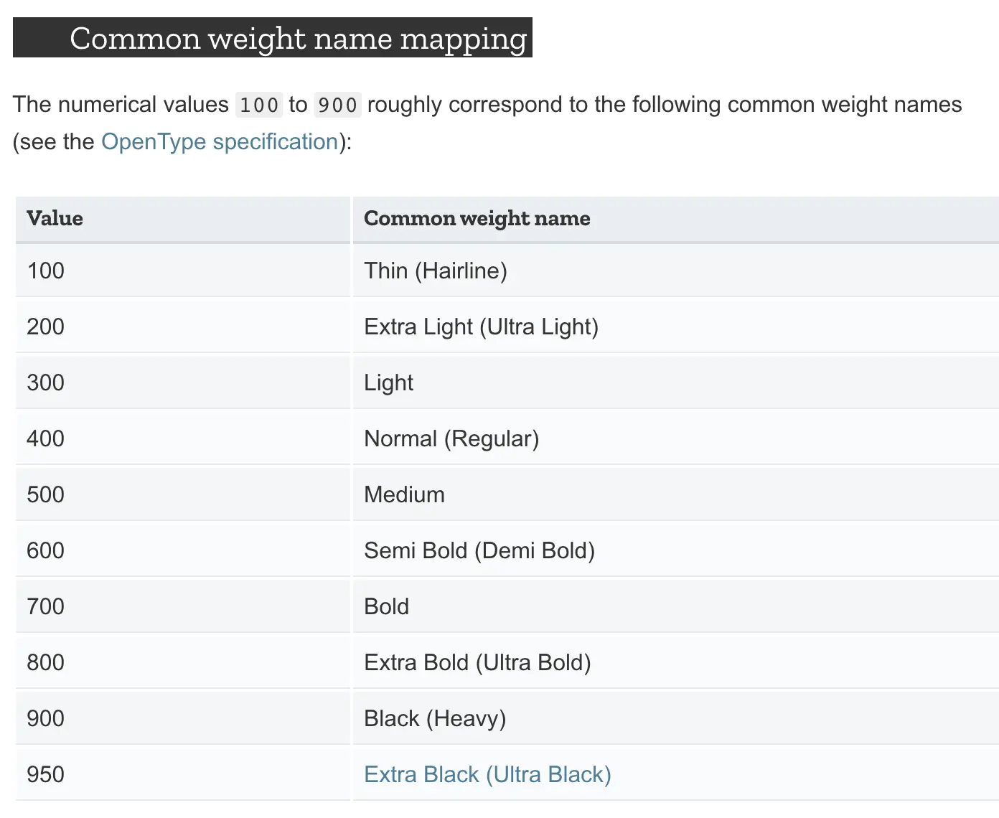

This talk is created from my experiences & lesson learnt, the rule and self-code I've built and believe to be applicable. So I can guarantee you may not find some of it in any other places on the internet.

## Color Style Naming Convention
There are 2 types of color: Flat & Gradient. We use a slash to categorize the color styles. Here are a few types we may go through:
* Main color
* Text color
* Background/ Base
* Status/ alert/ label background
* Alert/ notification
* Social network brand color
* Table
* Gradient

## Text Style Naming Convention
Text Style Generator is a tool in Figma that helps to create text style easier using plugins. Naming convention for Text Style will be based on a front-end method - the Common Weight Name Mapping.

When Common Weight Name Mapping is used in UI, we need to know the ratio between the font weights, which one is bold and which one is light. What we need is the consistency of text style in the overall UI, and Text Style Generator in Figma plugin makes it possible. It generates a new unified style by writing overlay on the previous one, and have it updated for all.

## Component Naming Convention & Component Structure

### Special Atom
* Iconography (Atoms)
* Assets (Atoms)

### Component Naming Convention
* **Formula 1**: Variations > Size > State
* **Formula 2:** Type > Level > Variations or Component Position > Size > State
* **Formula 3:** Variations or Component Position > Type > Level > Size > State

If Variation and Type (kind) have complex modify, we can consider dividing the Variation into Artboards.

### Component Structure
* Constructed in atomic design
* Created from the micro elements, Atoms; then expand it through the levels: Molecules - Organisms - Templates
* Possible cases: create folders for automatic show/hide function in UI

## Auto Layout Application

### Helps analyze the components
1. Button (Molecules) / Button Group
2. Table Row
3. Breadcrumb
4. Input Field

## Description of Design System
* Turn UI file/ design system into document
* Helps to note down a detailed instruction for the team (with >2 designers). This drives better communication between designer-designer and designer-developer.

