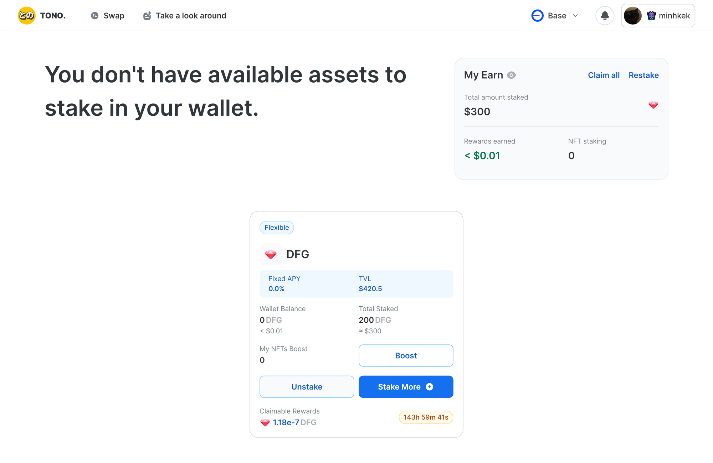
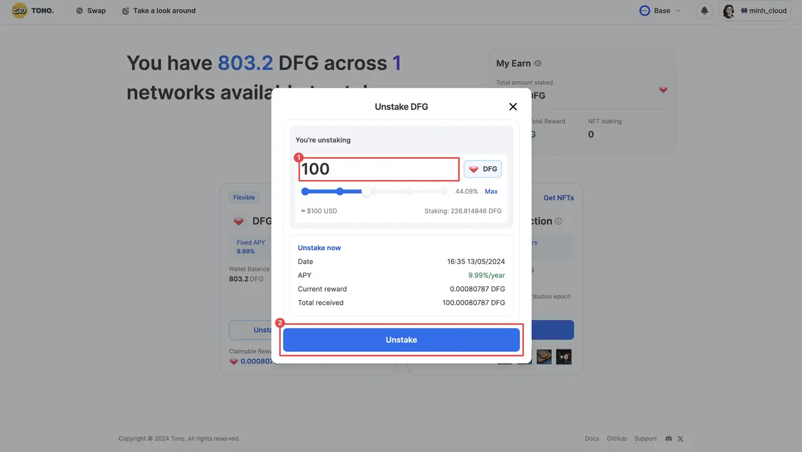

This guide will show you how to use $DFG staking to earn $USDC, cool merch, and more. You'll need a computer with a browser. But first, let's understand why you're doing this:

- $DFG is a token from Dwarves Foundation.
- In the future, Dwarves will give out $DFG tokens.
- You can get $DFG on Ethereum.
- Dwarves made a staking pool on Base.
- Stake your $DFG on Base to get rewards.
- Rewards will be calculated by this formular

Before going to the staking part, please make sure that you have completed these steps:
- Use Coinbase Wallet to store your tokens (Check [this guide](https://memo.d.foundation/playbook/community/how-to-setup-crypto-wallet-to-withdraw-icy/)).
- Get ETH to transfer $DFG from Ethereum to Base with Binance P2P (Follow [this guide](https://www.binance.com/en/blog/p2p/binance-p2p-newbie-guide-7428324997079645557)).
- Withdraw ETH from Binance to your Coinbase Wallet (See [this guide](https://www.binance.com/en/support/faq/how-to-withdraw-crypto-from-binance-115003670492)).
- Move $DFG from Ethereum to Base network (See [this guide](https://memo.d.foundation/playground/_memo/how-to-transfer-dfg-from-eth-to-base-for-staking/))

## Staking DFG on Base
Now it’s time to stake your DFG on Base to earn rewards like USDC or merch with Dwarves Foundation Earning.

1. Head over to [Dwarves Foundation Earning](https://tono.gg/dwarves), and log in by your Coinbase wallet.
    
    
    
2. Once you’re logged in, if you have your DFG already bridged from Ethereum, you should see your balance just like this
    
    
    
3. Now hit “Stake”, and choose the amount that you want to stake like this:
    
    
    
4. Hit “Stake” again, and confirm your 2 transactions on your Coinbase Wallet
    
    
    
5. And that’s it! You’ve successfully staked your DFG and now you can sit back and enjoy passive rewards from this.
    
    
    
6. You can keep track of your earnings with “My Earn” dashboard
    
    
    
The reward will be calculated with the APY is 9.99%/year.

## Withdraw $DFG and claim reward from the staking pool
Now, after a long time locking your DFG and having a decent claimable reward amount, it’s time to withdraw your $DFG and reward from the staking to the staking pool. 

1. Go to [Dwarves Foundation Earning](https://tono.gg/dwarves), and log in. Once you’re logged in, if you have staked $DFG, you will see the staked amount in the Total Staked section. 
2. Now hit “Unstake” button and choose amount you want to withdraw and hit “Unstake” again.

    

    

3. Confirm 2 transactions on your Coinbase wallet. 

    

4. And that’s it! You’ve successfully withdraw $DFG and all of the recent reward to your wallet. 

    

