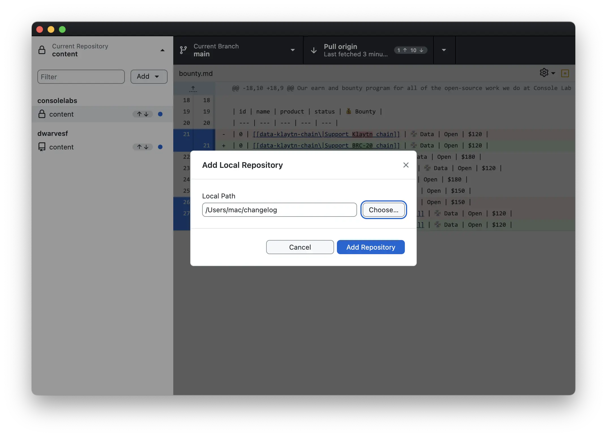
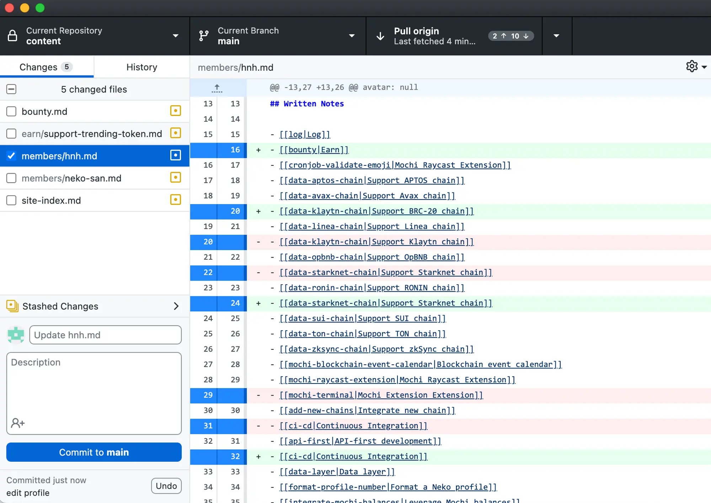

---
tags:
  - content
  - instructions
  - guideline
title: How to push content on note.d.foundation
date: 2024-03-04
description: This is a guide on how to setup your environment and settings to push content to our notes website, note.d.foundation.
authors:
  - minhcloud
menu: memo
type: memo
hide_frontmatter: false
pinned: true
hide_title: false
---

## Set up
Our note.d.foundation site runs with submodules and is pulled through HTTPS as opposed to SSH, for security and easy onboarding.

### Clone the repository
Clone the repository in the terminal by running this command in the Terminal

1. Run the `xcode-select` command:

    ```sh
    xcode-select
    ```

2. Install [`git-credential-manager`](https://github.com/git-ecosystem/git-credential-manager/releases/tag/v2.4.1). For Apple-silicon Macs, download the [gcm-osx-arm64-2.4.1.pkg](https://github.com/git-ecosystem/git-credential-manager/releases/download/v2.4.1/gcm-osx-arm64-2.4.1.pkg) file and run it. Otherwise, select the [gcm-osx-x64-2.4.1.pkg](https://github.com/git-ecosystem/git-credential-manager/releases/download/v2.4.1/gcm-osx-x64-2.4.1.pkg) package.

3. Then clone the repo:

    ```sh
    git clone https://github.com/dwarvesf/note.d.foundation.git
    ```

### Open the folder in the Obsidian
Install Obsidian from their website: https://obsidian.md/

Once you have Obsidian installed, open the folder to where you cloned your repository:


Load the vault to Obsidian:


If you have any troubles, refer to the help page in Obsidian's documentation: https://help.obsidian.md/Home.

### Setup Github Desktop
Download GitHub desktop from their website: https://desktop.github.com/.

1. Once you've installed it, open up and choose the `Current Repository` tab:


2. Add an Existing Repo


3. Choose the folder of the repo that you have cloned above


If you have any issues, refer to setting up GitHub desktop here:

<iframe width="560" height="315" src="https://www.youtube.com/embed/8Dd7KRpKeaE?si=3Vda7G5d1Z1unITr" title="YouTube video player" frameborder="0" allow="accelerometer; autoplay; clipboard-write; encrypted-media; gyroscope; picture-in-picture; web-share" allowfullscreen></iframe>

###  Edit content on Obsidian
#### Create a new post
Making a new post is fairly straightforward. We have a set of templates to help you get started:

1. First, create a new file and name it however you like:


2. We have updated to make it so the metadata/frontmatter for new files will automatically be created.

## Push content on note.d.foundation
### Using Desktop browser
1. Go to the [link](https://github.com/dwarvesf/note.d.foundation)

2. Choose upload file and upload the .md file in the repo folder on your computer

|  |  |
| ---- | ---- |
| ![[How to push content on note.d.foundation-20240304213547278.webp\|300]]| ![[How to push content on note.d.foundation-20240304213659347.webp\|300]] |

### Using Github Desktop
1. Go to GitHub Desktop and open the repo df-content
2. Choose the file that you have created or edited



3. Click commit to main
