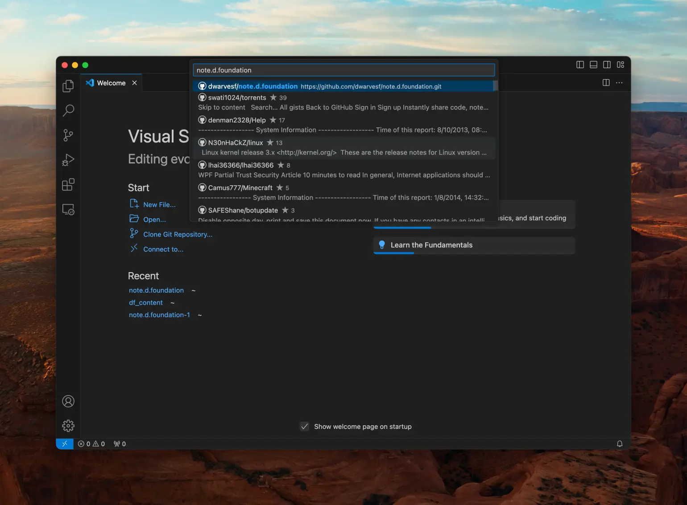
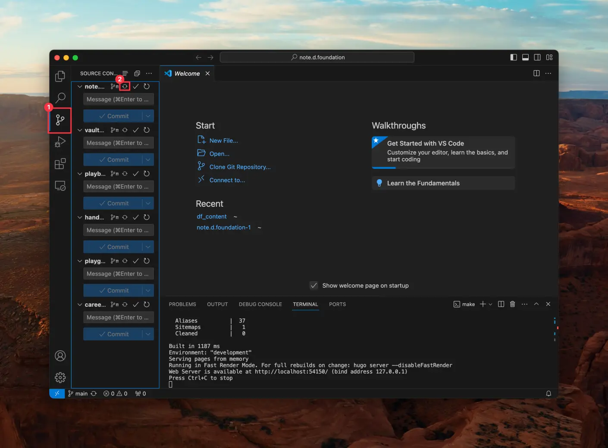

---
tags:
  - content
  - instructions
  - guideline
title: How to set up environment to edit memo
date: 2024-03-14
description: This is a guide on how to setup your environment and settings to push content to our notes website, memo.d.foundation.
authors:
  - minhcloud
menu: memo
type: memo
hide_frontmatter: false
pinned: true
hide_title: false
---
Before you enter the tutorial, please generate your SSH key by following this [instruction](https://g.co/gemini/share/3972239af940). The process includes 3 steps:
1. Create ssh key pair (public, private)
2. Save private key to your computer
3. Submit public key to github

## A. Install the Visual Studio Code
Firstly, you have to install Visual Studio Code, [here](https://code.visualstudio.com/)

## B. Install the Devbox
1. Open the Terminal on VScode
You can use the shortcut `Control + ~`.


Then run this command in the Terminal `curl -fsSL https://get.jetpack.io/devbox | bash`.

## C. Pull the Github Source to your local disk 
You have 2 ways to pull the Github source to the local disk:


### Method 1: Link VScode with your Github account
1. Connect your github account with the VScode
2. Search repo `note.d.foundation` and select to clone it




### Method 2: Using the terminal 
1. Run these 2 commands seperately in Terminal to config the account:
```sh
git config --global user.email "you@example.com"
git config --global user.name "Your Name"
```

2. Run this command in Terminal
```sh
git clone https://github.com/dwarvesf/note.d.foundation.git
```

## D. Setup the environment on your laptop

1. Run submodule update by running these 3 commands in order and seperately:
```sh
git submodule update --init --recursive
git submodule update --recursive --remote
git submodule foreach --recursive 'git checkout main || git checkout master
```

2. Create folder "content" under node.d.foundation folder


3. Run the this command in Terminal `devbox shell` and wait until all files are installed
4. Run the command `make watch-run`

## E. Sync all repo before editting 
Everytime you want to edit or create a post, you have to go to `Source Control` and sync all file. 


