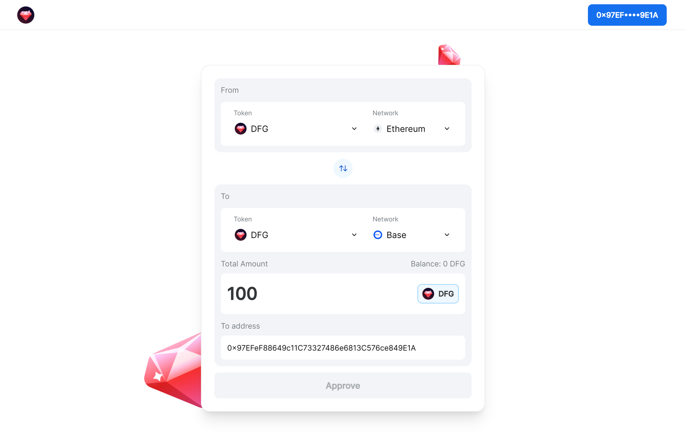
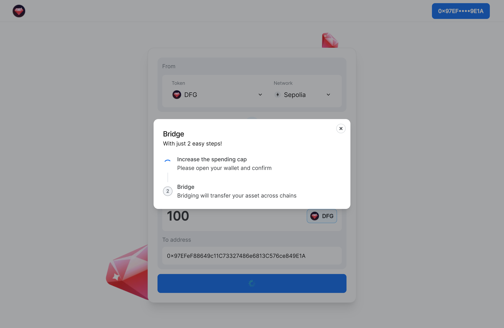
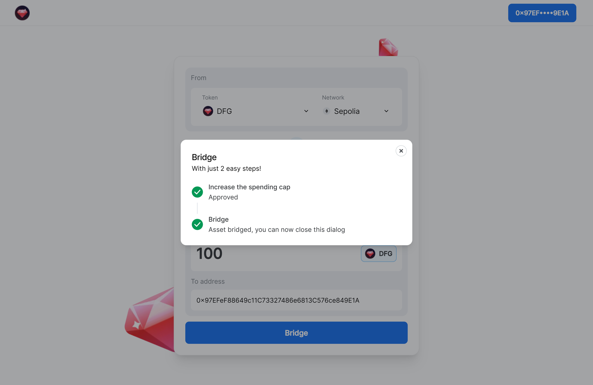
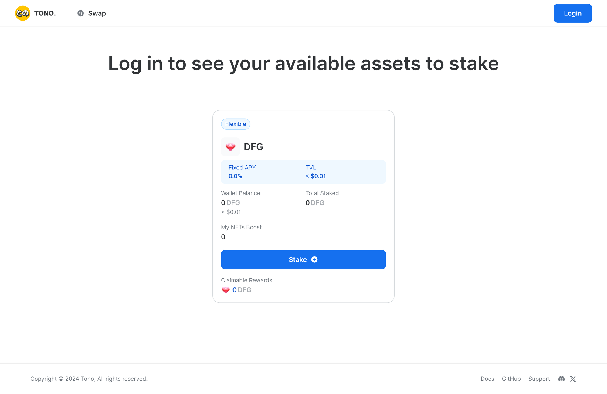
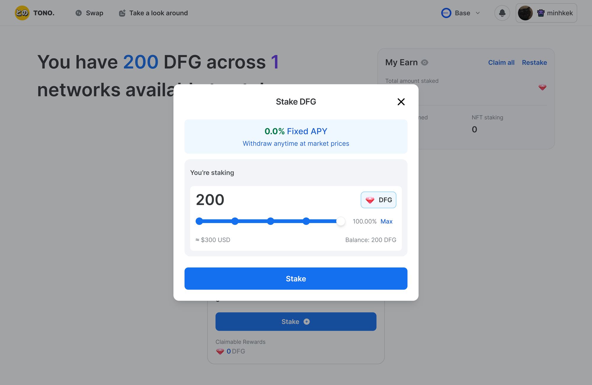
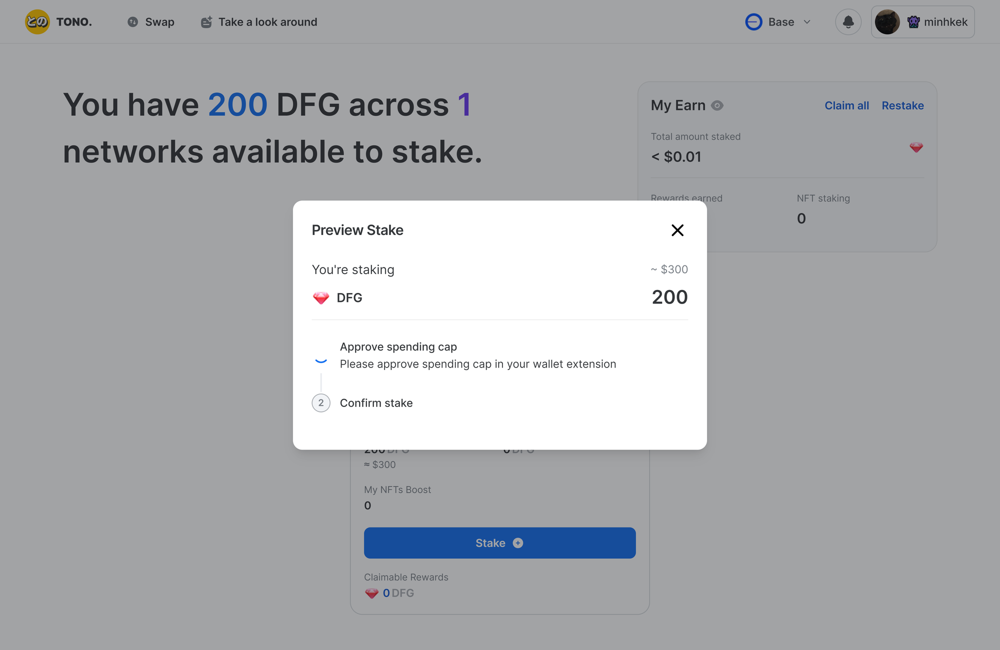

This guide will show you how to use $DFG staking to earn $USDC, cool merch, and more. You'll need a computer with a browser. But first, let's understand why you're doing this:

- $DFG is a token from Dwarves Foundation.
- In the future, Dwarves will give out $DFG tokens.
- You can get $DFG on Ethereum.
- Dwarves made a staking pool on Base.
- Stake your $DFG on Base to get rewards.
- Rewards can be cool Dwarves merch or USDC.
- To stake, move your $DFG from Ethereum to Base.
- Use a bridge to move your $DFG tokens.
- A bridge is a tool that helps you move your $DFG from Ethereum to Base.

**Resources:**

- Use Coinbase Wallet to store your tokens (Check [this guide](https://memo.d.foundation/playbook/community/how-to-setup-crypto-wallet-to-withdraw-icy/)).
- Get ETH to transfer $DFG from Ethereum to Base with Binance P2P (Follow [this guide](https://www.binance.com/en/blog/p2p/binance-p2p-newbie-guide-7428324997079645557)).
- Withdraw ETH from Binance to your Coinbase Wallet (See [this guide](https://www.binance.com/en/support/faq/how-to-withdraw-crypto-from-binance-115003670492)).

## Transfer $DFG from Ethereum to Base for staking using DFG Bridge.

Once you've got Coinbase Wallet set up and some ETH in the tank for gas fees, it's time to bridge your $DFG over to Base for staking.

Here is how it goes:

1. Head on over to [DFG Bridge](https://bridge.d.foundation/), lovingly crafted by Jack, one of our awesome community members. Connect your wallet to the site.
    
    
    
2. Once your wallet is connected, your address will show up in the blue box, fill out these:
- In the "From" tab, select "DFG" for Token and "Ethereum" for Network.
- In the "To" tab, choose "DFG" for Token and "Base" for Network.
- Enter the amount you want to send.
- The address on the Base network should be your connected wallet by default.
    
    
    
3. Once you've filled in those blanks, hit Approve, and confirm a couple of transactions on Coinbase Wallet.
    
    
    
    - **Spending Cap**: The spending cap limits how much cryptocurrency you can spend at once or over time.
    - **Approval**: Each transaction must be approved to ensure awareness and consent, enhancing security and preventing unauthorized or accidental transactions.

4. Then just sit back and wait for your DFG to roll into your Base wallet.
    
    
    

## Time to earn some USDC and merch from staking DFG on Base!
Now it’s time to stake your DFG on Base to earn rewards like USDC or merch with Dwarves Foundation Earning.

1. Head over to [Dwarves Foundation Earning](https://tono.gg/dwarves), and log in similar to connecting to DFG Bridge.
    
    
    
2. Once you’re logged in, if you have your DFG already bridged from Ethereum, you should see your balance just like this
    
    
    
3. Now hit “Stake”, and choose the amount that you want to stake like this:
    
    
    
4. Hit “Stake” again, and confirm your 2 transactions on your Coinbase Wallet
    
    
    
5. And that’s it! You’ve successfully staked your DFG and now you can sit back and enjoy passive rewards from this
    
    
    
6. You can keep track of your earnings with “My Earn” dashboard
    
    
    
And that's it! You now know how to move your DFG for staking from the Ethereum Mainnet to the Base Network and begin receiving rewards. In addition to protecting your coins, staking your DFG opens up chances to gain USDC, awesome merchandise, and other benefits. 

Please feel free to contact us on the [Dwarves Network](https://discord.gg/dwarvesv) Discord server if you need any help or if you have any questions. Have fun staking and relish your winnings!