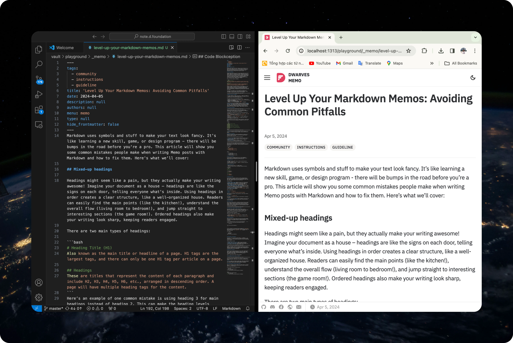
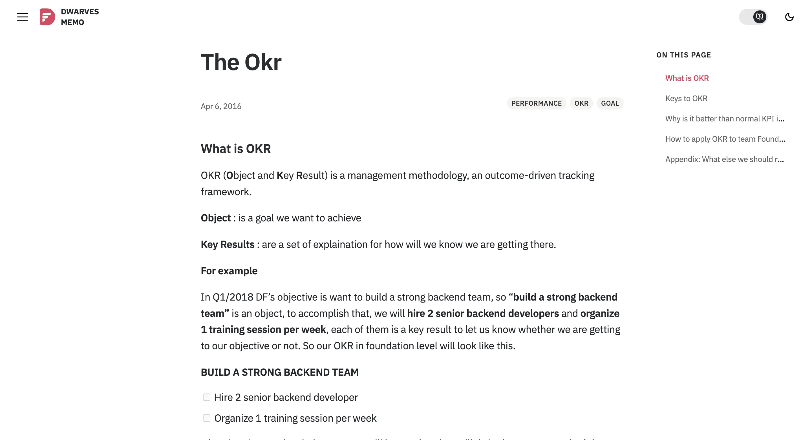
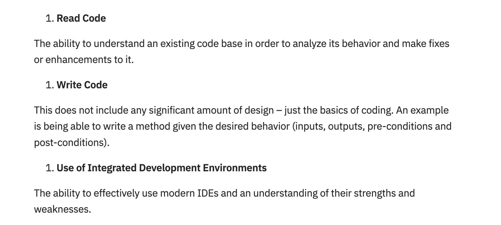
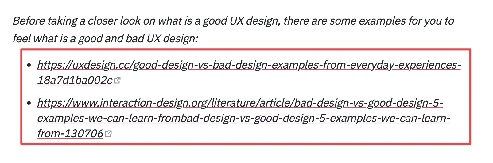
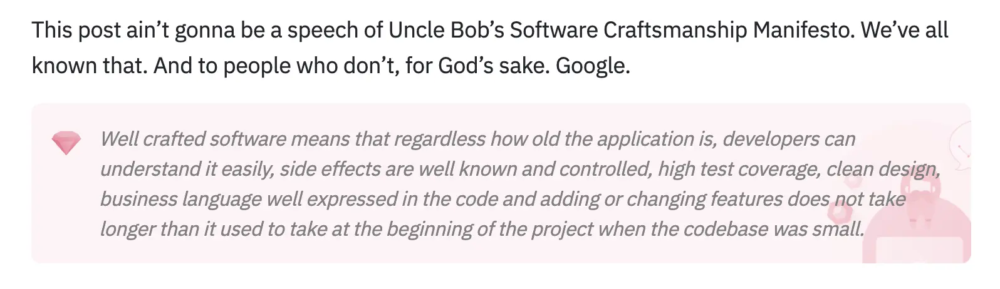

Markdown uses symbols and stuff to make your text look fancy. It's like learning a new skill, game, or design program - there will be bumps in the road before you're a pro. This article will show you some common mistakes people make when writing Memo posts with Markdown and how to fix them. Here's what we'll cover:



## Mixed-up headings

Headings might seem like a pain, but they actually make your writing awesome! Imagine your document as a house – headings are like the signs on each door, telling everyone what's inside. Using headings in order creates a clear structure, like a well-organized house. Readers can easily find the main points (like the kitchen!), understand the overall flow (living room to bedroom!), and jump straight to interesting sections (the game room!). Ordered headings also make your writing look sharp, keeping readers engaged.

There are two main types of headings:

```bash
# Heading Title (H1)
Also known as the main title or headline of a page. H1 tags are the largest tags, and there can only be one H1 tag per article on a page.

## Headings
These are titles that represent the content of each paragraph and include H2, H3, H4, H5, H6, etc., arranged in descending order. A page will have multiple heading tags for the content.
```
Here’s an example of one common mistake is using heading 3 for main headings instead of heading 2. This can make the heading levels unclear and difficult for readers to distinguish between content sections. Additionally, abusing bolding for content sections can also reduce the effectiveness of headings and make them almost "sink" into the content.

To fix this, use heading 2 for main headings and heading 3 for subheadings. This will create a clear hierarchy and make it easier for readers to understand the structure of your document.



**Heading structure for Memos:**

To create a heading in a Memo, you use the `#` symbol. The number of `#` symbols you use will determine the level of the heading. The more # symbols you use, the lower the heading level.

You should follow the following heading structure:

- heading 1: for the main title of the memo (`title:` located at the first line of the markdown)
- heading 2: for subheadings (`##`)
- heading 3: for more detailed headings  (`###`)
- heading 4, 5, 6: for sub-subheadings (`####`...) (optional)

Aside from the main points mentioned, there are a few other **things to keep in mind** when using headings: Headings shouldn't be SHOUTING (all caps) - they should be clear and easy to read. Keep your heading colors consistent throughout your writing, and use different colors only for hyperlinks or notes to make them pop. Finally, skip the numbering or lettering within headings - make them short and clear.

## ToC ignoring headings


Table of content (ToC) acts as a "map" to help readers grasp information in the most clear way. To fully display all headings in "On this page", the following must be observed:

- Use the correct heading level for each section and subsection in the article
- ToC only shows the first two heading levels: `## header 2` and `### header 3` (not showing `# header 1` )
- Use `## header 2` for main sections and `### header 3` for subsections
- Limit the use of heading `#### header 4` to ensure readability of the article
- Avoid using text formatting like `**` or adding links directly within headings can cause ToC errors.

Following these rules will help you create a scientific, easy-to-read Markdown article that fully displays all headings in the ToC of the memo.

Example:

```bash
## Meetings start on time
Paragraph
## Meetings happen in regular hours
Paragraph
## Meetings should have a video option
Paragraph
## Prerequisites for successful meetings
Paragraph
```
Result:


> **Tip:** the outline view in the bottom of the File Explorer is a great way to review your document's header structure and outline in VSCode.

## Nesting list disorder
Nesting list disorder occurs when the numbering in a nested list is incorrect, making it difficult to follow and distinguish between different levels of the list.

There are two main causes of nesting list disorder:

- **Incorrect syntax:** Using incorrect syntax for nesting lists (e.g., using the wrong numbers or symbols) can cause the list to be numbered incorrectly.
- **Manual editing:** Manually editing a list (e.g., adding or removing items) can disrupt the numbering order.



After you've built your fancy list, take a quick minute to double-check it. Scan through and make sure the numbers are counting up (or down) the way they should. A quick proofread can save you a headache later.

For example:

```bash
1. First list item
   1. Ordered nested list item
2. Second list item
   - Unordered nested list item
```

Result:

1. First list item
    1. Ordered nested list item
2. Second list item
    - Unordered nested list item

## Task list glitches

In the process of crafting task lists, it is not uncommon to encounter specific glitches that can hinder their functionality. These glitches can be categorized into two main areas:

**Syntax errors:**

- Missing `-` or `*`: Each line in a task list must start with a `-` or `*`character.
- Incorrect use of `-` and `*`: `-`and **`***`characters cannot be mixed in the same task list.

**Formatting errors:**

- Numbering should be used `#` to number tasks.
- Indentation should be used to distinguish between task levels.

For example:
```bash
## Task List

### Task 1

- [x] Subtask 1
- [ ] Subtask 2

### Task 2

- [ ] Subtask 1
- [ ] Subtask 2
```

## Screenshots that flop

The adage "a picture is worth a thousand words" holds true for screenshots as well. Visuals can be incredibly powerful for conveying information efficiently. However, just like any communication method, there are potential pitfalls to avoid when using screenshots:

- **Display images with incorrect aspect ratio:** Design your images in a horizontal rectangular frame with an aspect ratio of `21:9`, `16:9`, or `4:3`. Avoid using vertical rectangles as it will enlarge the image and affect the layout of your document.
- **Low Resolution:** A blurry or pixelated screenshot can be frustrating and impede understanding. Make sure the screenshot resolution is high enough to clearly.

For extended functionality and catering to diverse needs, you may leverage multiple screenshot applications. For example, I usually use screenshot tools like on Windows (ShareX) and on Mac (Cleanshot) in order to get the best of both worlds on different systems.

[A well-crafted screenshot](https://memo.d.foundation/playground/how-to-take-better-screenshots-on-mac/) can be a powerful tool for presentations, tutorials, and any situation where visual clarity is key. Remember, a thoughtful screenshot can save you time and effort by conveying information more efficiently than words alone.

> **Tip**: You can use [**Backr**](https://getbackr.vercel.app/) tool to set stunning backgrounds and create visuals that grab attention for your Memo posts.

## Buried in links

While links are super helpful, including too many can throw a wrench in your reader's journey. A long list can be visually overwhelming, making it tough to find the key info they're after. Plus, with a bunch of links, it's easy to lose track of which ones they've already clicked. So, use links strategically to avoid information overload and keep your reader focused.



**Use hyperlinks instead of plain text links**

Hyperlinks allow readers to hover over the link to see the destination URL before clicking. This helps them decide whether the link is relevant to them and avoid clicking on unwanted links.

In addition, you should use links sparingly and only link to important and useful information.

References for links support two formats:

- External links: `[text] (http://example.com)`. Shows all links to `http://example.com`.
- Internal links: `[text] (.file.md)`. Shows all links to `file.md`

## Code Blockception

Nested code errors can occur when you use block code within another block code. This can happen when you're trying to format code within a code block, or when you're trying to include code within a blockquote.

To avoid nested code errors, you can use triple backticks ``` in a fenced code block, wrap them inside quadruple backticks ````.

`````plain-text
````
```
Look! You can see my backticks.
```
````
`````

If you're going for a plain-text look, go ahead and use `plain-text`. But if you want to add a little somethin' somethin', you can use code highlighting formats like `javascript`, `bash`, `markdown`,… It's totally up to you!

For example:

````plain-text
```plain-text
Look! You can see my backticks.
```
````

## Horizontal rule overload

Horizontal rules (use three or more stars `***`, hyphens `---`, or underscore `___`) can be a great way to break up your text and make it easier to read. But too many can make your text look cluttered and hard to follow.

Common mistakes to avoid:

- **Double trouble in the title:** Make sure you only use one horizontal rule in your title. Too many can make it look messy.
- **Horizontal rule overload:** Use horizontal rules sparingly. Too many can make your text look choppy and hard to read.


Remember, horizontal rules are a versatile tool that can be used to improve the readability and visual appeal of your writing. When using horizontal rules, be sure to use them consistently throughout your writing and they will be a masterpiece! 

## Blah text in callouts

Callouts are like little spotlights for your writing. They help you shine a light on important information or give your readers some extra insider info. However, when using callouts, you may encounter some common mistakes that can affect the effectiveness and readability of your content.

Here's a closer look at some of these mistakes:

**Not changing the text color for notes**



Using the grey text formatting for your callouts can blend them in with the background, making them less noticeable and defeating their purpose.

**Fix it:** Want your callouts to shout "Hey, look at me!"? Use black or a contrasting color to make them pop against the background. This will help your readers easily identify important information.

**Not using spaces to break for sub-lines**

This is the simplest and most common way to break lines in a callout. Add the `> >` character at the position where you want to break the line in the callout content.

You can break callouts in multiple levels.

```plain-text
> Can callouts break the line?
> > Yes!, they can.
> > > You can even use multiple layers of breaking.
```

Result:
> Can callouts break the line?
> > Yes!, they can.
> > > You can even use multiple layers of breaking.