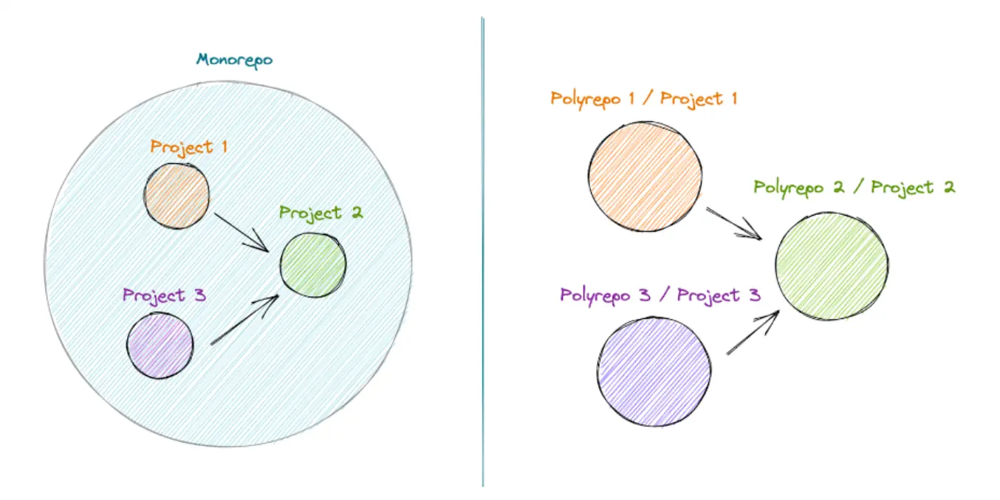

## Demystifying Monorepos: A Recap of Our Recent Sharing Session
During our [recent sharing session](https://www.youtube.com/watch?v=wgKssBAfih8&t=1s&ab_channel=DwarvesFoundation), we delved into the world of monorepos, exploring their benefits, challenges, and the tools available to manage them effectively. This recap aims to summarize the key points of the discussion and highlight some potential business outcomes of adopting monorepos.

## Introduction
A monorepo is a version control strategy where all the code for an organization's projects is stored in a single repository. This centralized approach simplifies code management and fosters greater collaboration across teams.

## Why choose a monorepo?
The motivation for adopting a monorepo primarily stems from the desire for autonomy and to address communication problems often associated with breaking monoliths into multiple repositories.

### Benefits of monorepos include

* Easy code sharing: Allows teams to reuse components and libraries seamlessly.
* Reduced code duplication: Encourages a DRY (Don't Repeat Yourself) approach.
* Cost-effective cross-repo changes: Simplifies refactoring and updating shared code.
* Consistency in standards and tooling: Ensures a unified approach to development across teams.

## Challenges with monorepos
However, monorepos are not without their difficulties:

* Dependencies management: Handling complex dependency chains can be challenging.
* CI/CD pipeline: Maintaining an efficient and scalable continuous integration and deployment pipeline.
* Development time: Potential for longer build times due to the size and complexity of the repository.

## Frontend monorepo tools
Several tools have emerged to help manage monorepos effectively:

* Yarn Workspaces: Provides shared node_modules and yarn.lock, as well as support for dependency symlinking.
* Lerna: Manages semantic versioning and offers a simple CLI interface for building workflows.

Despite these tools, challenges remain, such as handling affected changes upon code updates and issues with task runner queues.

### Modern monorepo solutions
Modern tools like [Turborepo](https://radar.d.foundation/Turborepo-0dd18b38468c4859a8beaae7bf6c511c) and [Nx](https://radar.d.foundation/nx-7abf6ad4f3044541afa649fd21238a80) address these challenges by incorporating local computation caching, task orchestration, and automatic handling of affected changes. They also provide remote caching capabilities for improved performance.

## Conclusion
Addopting a monorepo strategy and leveraging modern tools can lead to improved code management, reduced duplication, and streamlined development processes. In turn, this can result in better business outcomes, such as faster time-to-market, reduced costs, and increased developer productivity.
