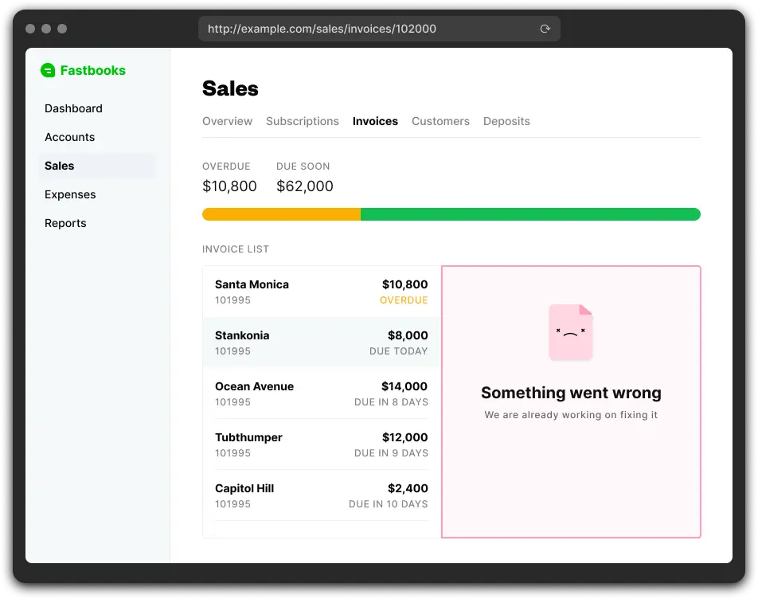

A brief comparison between Remix and Next.js frameworks

## Introduction of Remix
Remix describes itself as:

> Remix is an edge native, full-stack JavaScript framework for building modern, fast, and resilient user experiences. It unifies the client and server with web standards so you can think less about code and more about your product.

Compared to Next.js, which is one of the most React frameworks used for server-side rendering and has been there for a significant time, Remix appears as a new strong competitor. Developers have started to wonder what the difference between these two frameworks is. 

In this post, we will mainly focus on Remix and highlight what makes it unique and where it shines the most.

## How is Remix different from Next.js?
### Page rendering strategies
Despite the same idea of creating websites that are rendered on the server before being sent to the client, Remix and Next.js go with distinct approaches.

Remix doesn't support Static Site Generation (SSG) but it suggests using HTTP stale-while-revalidate caching directive (SWR) as an alternative. The key here is that static routes are cached using a CDN. These routes are then served to users on each visit and automatically revalidated for the next visitor.

### Routing
Both Remix and Next.js follow a file-based routing system.

In Next.js, each file inside the `/pages` directory will be automatically set as a route. 

```javascript
pages/index.js ==> /
pages/users/index.js ==> /users
pages/users/create.js ==> /users/create
```

Remix also does the same but the route directory is `/app/routes`:

```javascript
app/routes/index.js ==> /
app/routes/users/index.js ==> /users
app/routes/users/create.js ==> /users/create
```

Built on top of React Router, Remix shines when it comes to nested routing. It comes with a very powerful route nesting mechanism that can put one or many routes inside another route and those act like children components that can be mounted and unmounted depending on the active URL path. We need to use an Outlet component to render the route hierarchy from the parent routes.

Next.js, on the other hand, comes with its own router and has support for routes nesting but it’s not so easy to do so compared to Remix.

### Data Loading
Next.js supports different ways for loading data on the server-side like `getServerSideProps` and `getStaticProps` based on the type of web app.

Remix has a new concept with two portions:

* `loader` function - used to load data in a component, and a supplementary
* `useLoaderData hook` - used to get access to the data returned by the `loader` function

```javascript
import { useLoaderData } from "remix";

export const loader = () => {
  // fetch data from database or make API calls
  return {data}
};

export default function App() {
 // get access to data
  let {data} = useLoaderData();

  return (
    <div>
      <p>Use Data in component {data}</h1>
    </div>
  );
}
```

### Data Mutation
Next.js doesn't do anything for mutations. Basically, we would have to handle everything from creating a form, fetching data, managing state, adding event handlers, to finally dealing with errors, interruptions, and race conditions.

Data mutations in Remix are built on top of two fundamental web APIs: `<form>` and HTTP. All we have to do is to use a `<Form>` component (works identically to `<form>` with a couple of extra goodies for optimistic UI etc.) and a route function named `action`. When the user submits a form, Remix with call the action for the form and reload all of the data on the page. This ensures that any updates to the data are reflected in the UI.

```javascript
export const action = async ({ request }) => {
  const form = await request.formData()
  const content = form.get('content')
  return redirect('/')
}

export default function App() {
  return (
    <div>
      <Form method="POST">
        <label htmlFor="content">
          Content: <textarea name="content" />
        </label>
        <input type="submit" value="Add New" />
      </Form>
    </div>
  )
}
```

### Error Handling
Next.js define some custom pages for certain status errors like 404 or 500 errors. However, some errors around data and rendering are not supported.

Remix has an error boundary for handling errors. When we create a route component, we can also define an error boundary for catching any errors that occur in the route component. It likes having two components in a route file, with one being the actual route component and one being the fallback when errors happen in the former. One noteworthy thing is when there is an error in a nested component route and this route has no error boundary, the error bubbles up the nested tree until caught by a parent’s error boundary.



## Conclusion
For React developers, Next.js is obviously the prior choice when it comes to server-side rendering for its familiar concepts and larger community. Has been around for a while, it seems like a steady pedestal and is not easy to be replaced in a short period.

Even so, Remix looks like a shiny new thing. It also provides a higher level of abstraction. Routing system might be confusing but it is a remarkable feature too. Other built-in features such as data loading, data mutations, error boundary, etc. actually improve the developer experience.

Overall, Remix is a new framework, and it will definitely become more powerful and widespread in the future.