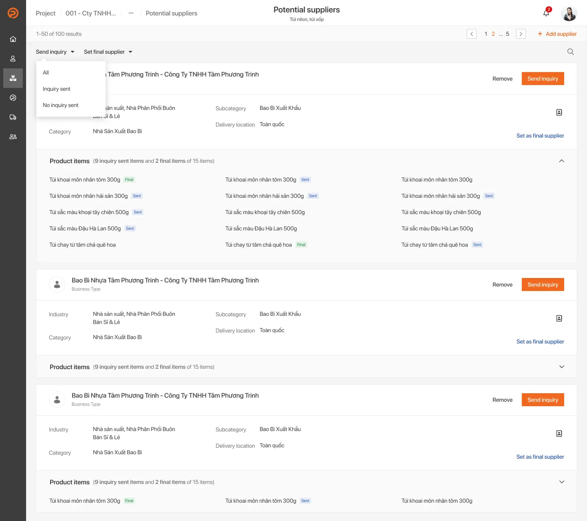

## Intro
It's a given that the Usability Test is one of the most fundamental undertakings in building a product, which assists with approving the product before launching, reducing effort, and money. Notwithstanding, in the Covid-19 pandemic, it's difficult to direct a convenience testing up close and personal. Many agencies, including Dwarves Design, are new to the remote testing methods. During the last Work From Home session, our team had an opportunity to make a remote moderated usability testing, although it was the very first time we try this method, the testing went smoothly and we really had an interesting experiment.

## Our project
### About Purchasing Care
Purchasing Care is one of the market leaders in Purchaser consulting and providing the best services to B2B Purchasing. Pushing ahead, Purchasing Care is hoping to construct a B2B Marketplace to assist undertakings with purchasing and sell with productivity and straightforwardness. This item is worked to give Procurement Support administrations like Vendor Hunt, Purchaser Toolkit, and Suppliers Marketplace.

In this article, we would like to share about the testing of the MVP version of Vendor Hunt's work. It is an operational tool for Purchaser to source suppliers and manages Vendor Hunt projects. For brand new products, they tend to focus on frequently performed tasks (searching, sourcing supplier). These tasks are crucial for the operation of the product (send an inquiry, check the progress of the project).

### Personas

### The problem
* It takes too much time to source suppliers because purchasers have to collect information from many sites.
* Sometimes it's hard to evaluate suppliers by reason of lack of detailed information.
* Purchasers often miss the chance to work with better suppliers due to the shortage of time and resources.

### Our solution
* Provide a search engine, which provides detailed information about most B2B companies in Vietnam. This product also recommends suitable suppliers, based on specific requirements of each product.

* Potential suppliers list to manage suitable suppliers and send inquiries to each or all of them at the same time.

* Management dashboard to track the performance of each employee and the project’s progress. In addition, managers can report expenses to the financial department.

## Method

### Goal
The objective of this testing is to assess the ease of use of the item's interface, that is, convenience, productivity, and client fulfillment. Participants were asked to test this feature:

* Search
* Source supplier
* Send inquiry
* Tracking progress

### Remote Moderated Usability Testing
Moderated usability testing is a usability testing technique that involves the active participation of a trained facilitator or moderator. This method requires expert knowledge of the product being tested. They are in charge of administering tasks, guiding participants, recording behaviors and comments, answering questions, and replying to their feedback about the test – all in real-time.

In remote moderated testing, users and facilitators are in the same "virtual" space at the same time — the facilitator is watching the usability test remotely as it happens, and communicating directly to them via online software.

Moderated sessions allow for back and forth between the participant and facilitator, because both are online simultaneously. The facilitator is in charge of administering tasks, guiding participants, recording behaviors and comments, answering questions, and replying to their feedback about the test – all in real-time. Facilitators can ask questions for clarification or dive into issues through additional questions after tasks are completed.

### Why did we choose this method?
As scheduled, we planned to conduct a traditional usability testing before launching to market. However, due to the Covid-19 pandemic, the participants and conductors are geographically dispersed, we had to do it remotely. Besides, Purchasing Care is a young startup, this method is also a great solution for both our team and client with a limited budget. Although we had never done it before, we decided to give ourselves a chance to practice

### Pros & Cons
**Pros:**

* Cheaper than in-person tests
* Allows for practicality
* It's comfortable, allows to visualize the behavior

**Cons:**

* It's hard to interpret the silences
* Complicated to know when to ask questions
* Body language is lost

## How we did it
### Planning
**1. Pre-session:**

* Prepare questions for the initial session: This session would be simple, focused on the participant's expectations and their daily tasks. We could also include some questions about participants' demographics, lifestyles, or general behaviors.
* Prepare task scenarios.
* Prepare testing instructions and interview questions before and after users complete any task.

**2. Tool:**

* Collaborate with participants: we used Google Hangouts with screen sharing and chat function since this tool was familiar for our clients
* Screen recordings using Quicktime
* Note for document

**3. Environment:**

* Since this testing was carried out remotely, we had to make sure nothing was interrupting us during the session. Beforehand, we had to check our internet speed, micro, surroundings, and we also asked participants to check theirs

### Metric
**Usability metric: How to measure**
To accomplish the mentioned goals, users had to do some tasks to source potential suppliers for a procurement project. These tasks were:
Create a project ⇒ Add new item (product) ⇒ Source suppliers for this item ⇒ Sen inquiry to potential suppliers ⇒ Receive RFQ and choose a final supplier ⇒ Keep repeating until Participants choose suppliers for all items in this project.

**Measure and evaluate tasks by indicators:**

* Percentage of task successful rate (whether participants were able to perform the task well)
* How long participants took a task
* Participants' subjective satisfaction

### Results
**Task successful rates**

Note: S = success, F = failure, P = partial success

**Time-to-task measure**

### Analysis and user feedbacks
There were many things to consider after each session, and it's hard to remember all. Therefore, debriefing at the right time helped us to capture our thoughts, which might be hard to write down. It also helped to think over what a participant showed and what they talked about. Regularly, what they did was the real key.

**User feedbacks 1st time**

* The performance was not consecutive because the flows were quite complex and lengthy. Moreover, the conductor's guidance for each step was not very good.
* There wasn't any interaction between system and users, as a consequence of lacking communication. This inconvenience made users feel clueless about what was happening and what's next.

**2nd time**

* The performance was still not continuous
* Participants were more familiar with most of the steps and CTA at the 2nd time. They completed to-do tasks without any guidance from conductors.
* Overall, it took less time to went through all tasks comparing to the 1st time.

**UI/UX feedback**

* Whenever participants feel lost and clueless about the next steps, they tended to click on other modules on the sidebar, even though they had no idea about the function of them.
* The number of potential suppliers was nowhere to be seen on the Potential supplier’s page.
* There was no response to sending inquiries successfully.
* It's difficult to find the "Select Final Supplier" button, users searched their mail inbox instead of finding the button on the Project page.
* Users were unable to update project status because they couldn't find the place of item selection.

### Lesson learned and tips
Since it was the first time trying moderated remote usability testing, we did make some mistakes. On top of that, we had some lessons learned and tips from our experience and other experts.

* Before the testing session, end participants a document that contains:
* Basic demographic question
* A table of contents
* Task scenarios
* Estimation time

It's much easier for them to figure out the test and prepare their answers.

* **Make a plan** Set specific and clear goals. Be sure all team members agree to the plan. Ensure the subject and focal point of the test are suitable for uncovering answers to the questions at hand.
* Do product testing several times before usability testing. The "bug" affects user experience and the result of performing tasks, it also causes difficulties for moderators.
* In the middle of the test, our product had some problems while participants were doing his task. We had to ask the development team for support. In the meantime, we conducted him to the next task and back to the current task after it was fixed.
* While participants doing their tasks, try to focus on their behavior to find the "point" bringing them to struggle. Concentrate on their gesture, hesitation, what they said while doing tasks... and note them down. Ask them whether they are having trouble and try to complete the task once again.
* We have come to realize that whenever participants felt lost and confused, they often click on other modules unconsciously instead of seeking information on the current one. Don't hesitate to guide the testing back to your planned tasks, cool them down, and redirect them to the struggle point. After that, ask for their feeling and feedback to figure out the problems of the design.
* It might be challenging to know when to ask a question and find the balance between giving participants a signal that you are listening and interrupting them. Be patient and try to guide them step by step. Besides, small talk during the testing help to keep them calm.
* Note down the process of the testing and write a document after that. Make it clear enough for the client, product owner, teammates, and development team to understand users' experience to improve the product.

## Conclusion
Thanks to the usability test, we were able to address the user's trouble. It lets us improve the information architecture and visual hierarchy along with product performance to bring users a better experience. This reduces their effort and time to the minimum, which, in return, should drive more sales.

As we have no idea when the Covid-19 pandemic is over and work from home is strongly recommended, it's the right time to adopt some remote methods in UX design, including Remote Moderated Usability Testing. Although there are some drawbacks, it's still a good solution for our team, client, and test participants
