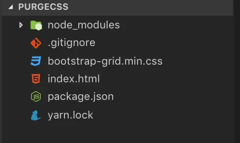
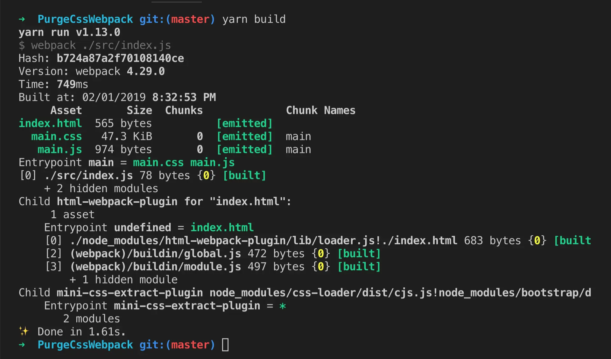

## Introduction
Reducing assets size is one of the most practical ways to speed up your web application. I have a simple use case, lets imagine your HTML file looks like this

```javascript
<!DOCTYPE html>
<html lang="en">
<head>
  <meta charset="UTF-8">
  <meta name="viewport" content="width=device-width, initial-scale=1.0">
  <meta http-equiv="X-UA-Compatible" content="ie=edge">
  <title>Bootstrap</title>

  <link rel="stylesheet" href="./bootstrap-grid.min.css" />
</head>
<body>
  <div class="row">
    <div class="col-sm-4">.col-sm-4</div>
    <div class="col-sm-4">.col-sm-4</div>
    <div class="col-sm-4">.col-sm-4</div>
  </div>
</body>
</html>
```

Now look at

```javascript
bootstrap-grid.min.css
```

![[50067f1125ee42d2d68068bd93443235_MD5.webp]]

Quite huge isn’t it? Thanks to PurgeCss here is the CSS file after being purged will only contain parts of the CSS file (only used selectors), as you can see horizontal scrollbar is not very long:

## Usage
PurgeCSS can be installed with npm package

```javascript
npm i --save-dev purgecss
```

Basically, you run it against your CSS files and your HTML/JavaScript files. It will parse and analyze which CSS content will be used and remove unused CSS content.

PurgeCSS can be used as a CLI. This is our project structure, we gonna need to transform CSS files so we have to download bootstrap distro and get file we want to transform.



CLI command syntax

`purgecss --css <css file> --content <content file to parse css> --out <output-directory>`

Since Purgecss is installed in `/node_modules\` we must run this command through npm script. We use `--out dist` option to store output CSS files in dist folder after transformed. Now change the path of `bootstrap-grid.min.css` in `index.html` to:

`<link rel="stylesheet" href="./dist/bootstrap-grid.min.css" />`

Then create npm script to run purgecss

```javascript
{
  "name": "PurgeCSS",
  "version": "1.0.0",
  "main": "index.js",
  "license": "MIT",
  "devDependencies": {
    "webpack": "^4.29.0"
  },
  "scripts": {
    "build": "purgecss --css bootstrap-grid.min.css --content index.html --out dist/"
  }
}
```

Then run npm run build, you should see new bootstrap-grid.min.css in dist folder with unused CSS content being removed


You can view full CLI options at [https://www.purgecss.com/cli\](https://www.purgecss.com/cli%5C)

Example repository: [https://github.com/PhmNgocNghia/purge\-css\-demo\-cli\](https://github.com/PhmNgocNghia/purge%5C-css%5C-demo%5C-cli%5C)

## Setup using Webpack
Purge CSS can be used together with built tools such as webpack, gulp, grunt,… etc. You can view it’s documentation at [https://www.purgecss.com/\](https://www.purgecss.com/%5C)

I’m going to demonstrate how to integrate with Webpack. This is my simple project which integrate project and Webpack

```javascript
var UglifyJsPlugin = require("uglifyjs-webpack-plugin");
var HtmlWebpackPlugin = require("html-webpack-plugin");
const MiniCssExtractPlugin = require("mini-css-extract-plugin");

module.exports = {
  mode: "production",
  entry: "./src/index.js",
  output: {
    filename: "[name].js",
    path: __dirname + "/dist"
  },
  module: {
    rules: [
      // javascript = babel + uglify
      {
        test: /\.m?js$/,
        exclude: /(node_modules|bower_components)/,
        use: [{ loader: "babel-loader" }]
      },

      // css file: extract to css file with mini extract plugin
      {
        test: /\.css$/,
        use: [MiniCssExtractPlugin.loader, "css-loader"]
      }
    ]
  },

  // uglifyjs
  optimization: {
    minimizer: [new UglifyJsPlugin()]
  },

  // plugin
  plugins: [
    new HtmlWebpackPlugin({
      template: "./index.html"
    }),
    new MiniCssExtractPlugin({
      filename: "[name].css",
      chunkFilename: "[id].css"
    })
  ]
};
```

In my index.js file, I simply import bootstrap grid CSS.

`// Import CSS Grid min CSS`

`import 'bootstrap/dist/css/bootstrap-grid.min.css'`

Here is the build output which includes CSS grid file



To use PurgeCss with Webpack simply install this Webpack plugin:
`npm i purgecss-webpack-plugin -D`

Then add it to plugin section in Webpack config file

```javascript
var UglifyJsPlugin = require("uglifyjs-webpack-plugin");
var HtmlWebpackPlugin = require("html-webpack-plugin");
const MiniCssExtractPlugin = require("mini-css-extract-plugin");
const PurgecssPlugin = require('purgecss-webpack-plugin')
const glob = require('glob')
const path = require('path')

module.exports = {
  mode: "production",
  entry: "./src/index.js",
  output: {
    filename: "[name].js",
    path: __dirname + "/dist"
  },
  module: {
    rules: [
      // javascript = babel + uglify
      {
        test: /\.m?js$/,
        exclude: /(node_modules|bower_components)/,
        use: [{ loader: "babel-loader" }]
      },

      // css file: extract to css file with mini extract plugin
      {
        test: /\.css$/,
        use: [MiniCssExtractPlugin.loader, "css-loader"]
      }
    ]
  },

  // uglifyjs
  optimization: {
    minimizer: [new UglifyJsPlugin()]
  },

  // plugin
  plugins: [
    new HtmlWebpackPlugin({
      template: "./src/index.html"
    }),
    new MiniCssExtractPlugin({
      filename: "[name].css",
      chunkFilename: "[id].css"
    }),
    new PurgecssPlugin({
      paths: glob.sync(`${path.join(__dirname, 'src')}/**/*`,  { nodir: true }),
    }),
  ]
};
```


Full example repository: [https://github.com/PhmNgocNghia/purge\-css\-example\-webpack\](https://github.com/PhmNgocNghia/purge%5C-css%5C-example%5C-webpack%5C)

## Conclusion
With PurgeCSS, our `bootstrap-grid.main.css` file reduce from **47kb** to **601byte**. All unused selectors has been removed. You can view the documentation at [https://www.purgecss.com/\](https://www.purgecss.com/%5C) which contain details instruction and api references.

Not only bootstrap, you can use PurgeCSS with many css libraries such as TailwindCSS, Zurb foundation,... etc.
