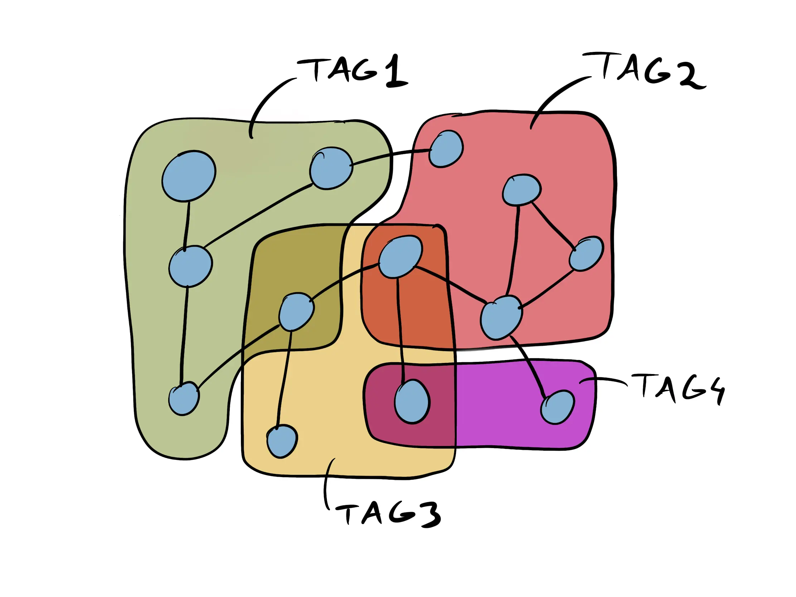
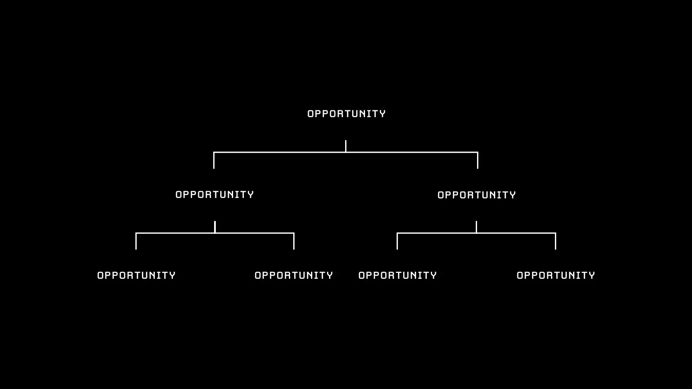

I’m Minh Truong, I've been working as a UI/UX Design for 2 years. I'm currently part of the [Dwarves Foundation](https://dwarves.foundation/) team. My intention has always been to become a better problem solver, with creativity and productivity being my main goals and focus.

Being a self-learned designer, I research and read a lot. One of my all-time favorite articles is [Design Thinking for everyday life](https://medium.com/mytake/design-thinking-for-everyday-life-c19f52352c0f) [by Amira Budi Mutiara](https://medium.com/@amirabdmtr). This piece broadened my perspective about Design Thinking and made me curious about the possibility of using Design Thinking to solve problems in everyday life.

Six months of applying Design Thinking in real life turns out to be the best investment of my time and effort, for all the positive changes I’ve got (and documented). Cue this article.

## The six things I learned from Design Thinking
The hype around Design Thinking started a couple of years back, along with “UIUX Design”. For some of you who haven't got used to the Design Thinking concept, you can [read more about it here](https://www.interaction-design.org/literature/article/what-is-design-thinking-and-why-is-it-so-popular).

Almost everyone knows Design Thinking is a non-linear process for solving problems. Sadly though, hardly anyone has the chance to go through the entire process from beginning to end. We still yet to realize the full effectiveness of Design Thinking.

The same went for me. When I first started using Design Thinking, I could only apply it as a rigid formula. I didn't know how to apply the flexibility of the method. That resulted in only being able to solve obvious problems of the moment, I couldn’t see the bigger picture of the problem I was trying to solve.

In my team, we discuss Design Thinking a lot. Everyone has a different point of view, but we all agree on one thing: if we're mindful about the non-linear, flexible quality of Design Thinking, it could become one of the most effective ways to working and living.

## Keep an open, curious mind

We fear what we don't know. It is a common human thing, to fall into a panic mode when we are faced with newness. When we start or encounter something we're not familiar with, we often feel stuck with not knowing where to start, and gradually, we avoid it.

Things have always existed, we just don't know yet.

What we can, and should, do in this situation: gather as much information as possible. If lucky, the answers might be already out there for us to learn and use them. If not, having information helps us identify and understand things, most importantly from multiple outlooks.

To gather multiple outlooks, we need to keep an open mind of how and where we obtain information. It starts with changing our mindset about information. Information is everything around us. It’s not restricted to academic papers or thick books. It exists in news, videos, even conversations with other people. Keeping this concept in mind prevents us from disregarding information in trivial circumstances.

With information, now we have an idea what we’re dealing with, the panic should be gone, and we have hints on how to deal with it.

## Make sense of information

In "Things that make us smart: defending human attributes in the age of the machine", my favorite author Don Norman, shared:

> “The power of the unaided mind is highly overrated. Without external aids, memory, thought, and reasoning are all constrained. […] The real powers come from devising external aids that enhance cognitive abilities.”

Having a lot of information helps us understand, but without systemizing it, information can be misleading which might get us further away from what we’re trying to solve. We need to convert information into data so we can make sense of it.

Everyone has their own method to organize data. Personally, I’ve found taking notes using the [Zettelkasten](https://zettelkasten.de/posts/your-first-note/) method to be the most effective. “The Zettelkasten note archive is the storage of your knowledge”. The great thing about this method is that we are able to create connections among data. That helps not only remember and process flows of data but also spark new ideas. This process is non-linear and potentially never-ending, as new information keeps being added as notes.

The Obsidian tool was designed based on the Zettelkasten method and deems to be one of the most fitting ones so far. At first, I didn't like writing, but obsidian notes made me come to it naturally. It soon became a habit to collect everyday data, organize, and analyze them.

## Make unbiased decisions

Most of the time, we are offered the power to make decisions. Either we could do this or we could do that. As humans, we perceive things and make decisions based on our personal set of values, including our upbringings, beliefs, cultures… Avoiding bias is a big challenge.

> "That's not about how people elsewhere think, it's about how you think" -- Lena Boroditsky.

Don’t go with the first decision that comes to mind just yet, a little double-checking could go a long way in finding out the most fitted decision.

Is this the right decision? Is there a better decision? Any other options out there that I’m missing?

Relying on knowledge, context, and data to make decisions helps us avoid being biased and arrive at the most suitable decisions which ideally would be easy, take less time, and less effort.

## Make better decisions

Usually, we would think coming to a decision is the end of it. But as designers who solve problems using Design Thinking, we know tracking the effectiveness of our decisions is just as important as making decisions.

> "The greatest originals are the ones who fail the most, because they're the ones who try the most," Adam Grant.

Testing and checking are not a waste of time, they are a way of improvement. Without testing and checking, we would never be able to know how to make better decisions.

## Change. Adapt. Evolve

We live in an era of rapid change, especially in technology. Something we deem work today, might not be anymore tomorrow. Things change all the time, our decisions should too. We should always be aware of what‘s happening around us, so we could align and revolve as quickly as we can.

In addition, it might be a life-changing idea to start seeing problems as opportunities, instead of just problems.

“Problems are connected to goals and opportunities”, so ["stop asking what problem are we trying to solve"](https://blog.prototypr.io/stop-asking-what-problem-are-we-trying-to-solve-588dde745b65), said [Ben Corther](https://bencrothers.medium.com/).

With problems, we tend to stop at providing solutions. With opportunities, it is an open road where we can keep pushing forward for the better.

In fewer words,

Design Thinking definitely can be a way of living. It can be used anytime, anywhere. It doesn’t have to be something we practice just inside the workspace. At first, it might be difficult, but with enough patience and focus, this concept will guide endless opportunities for an efficient life.

## Take away
* Information is everything around us. It’s not restricted to academic papers or thick books. It exists in news, videos, even conversations with other people.
* Data doesn’t have to be scary, as long as we can make sense of it with the right method and the right tool.
* Multiple perspectives allow us to see things at a more complete level. That’s where we discover hidden problems and opportunities.
* There is no final solution to anything. Things change, our solutions should too.

How is your experience with Design Thinking? Join our [Discord](https://discord.gg/Ffarda5FD9) and let us know!

If there are any topics you would like us to cover next, send us a message at [minhtk@dwarvesv.com](mailto:minhtk@dwarvesv.com)

Thank you for taking the time.
