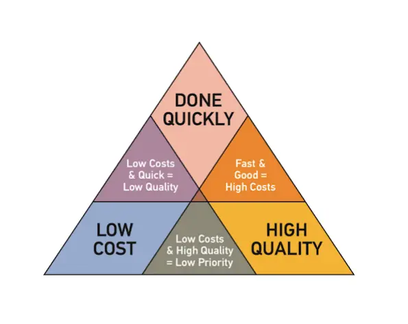
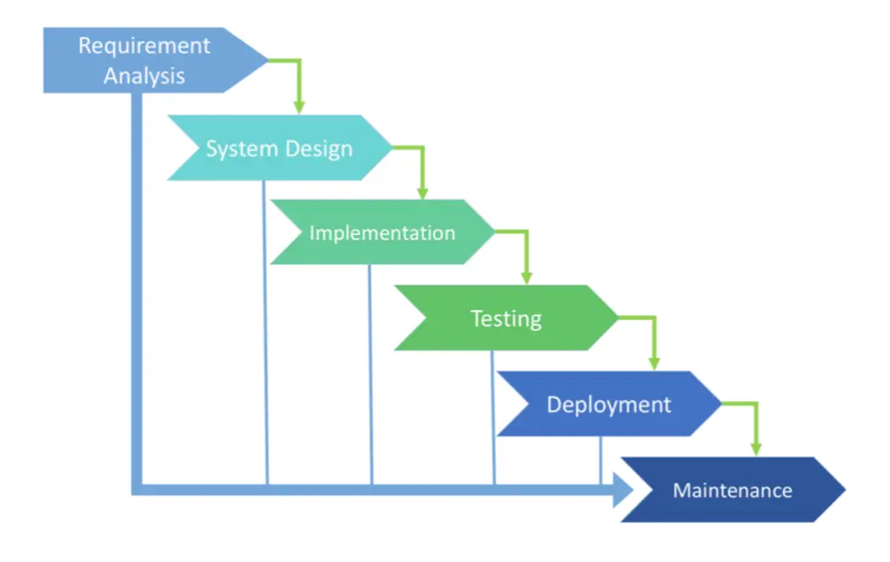
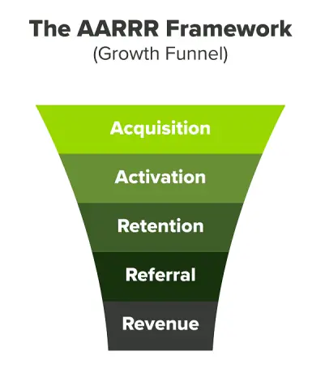
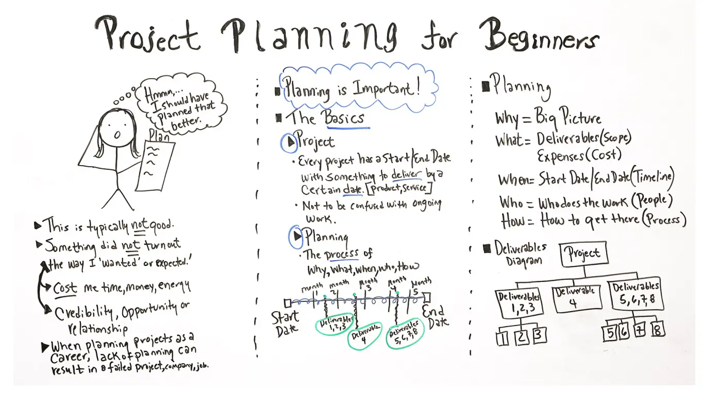
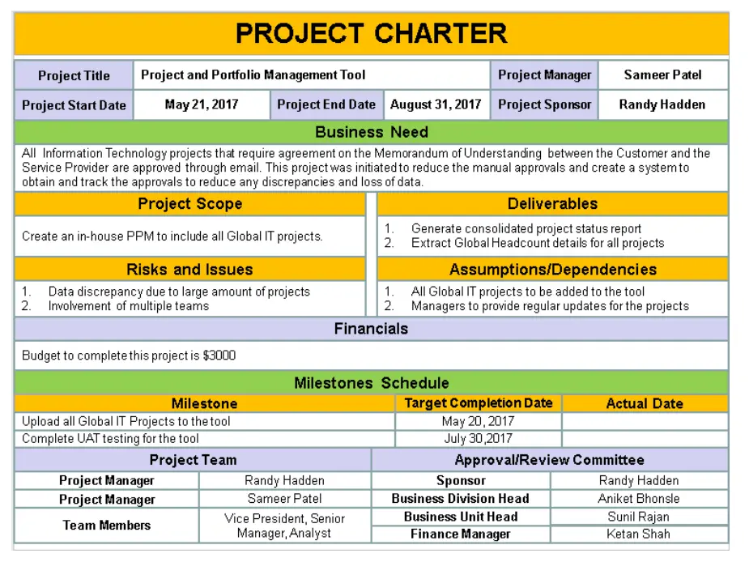

This workshop contains the basic knowledge on Software Development Life Cycle, provides people with a step-to-step guideline and the artifacts which will be created on the way. We don't dive in the details. Instead, we treat it as an overview look on how to build software successfully.

### Table of Content
1. What is Software Project?
1. Software Development Life Cycle
1. SDLC Models

## What is Software Project?
We build software, and we need a planned undertaking. So call software project is “A specific plan or design” or “A planned undertaking”.

### Project Constraints
A software project has a lot of constraints. Cost, scope, quality, customer satisfaction, risk, resource, time, or anything in between.

But the most important ones are

* Quality
* Budget
* Time

### Why does a project fail
With a lot of constraints, the project is easy to fail. We could have plenty of reasons why a software project fails: team politics, overdue payment,... but three of them could be prevented easily with proper methodology, framework

* Unclear/misleading project requirements
* Wrongly defined tech stacks
* The wrong approach, develop practices

### Project success
If it's easy to fail, then what is a successful project?

> The project is complete on time, on budget and have low defects (high quality)

This is just a simple definition of what is a successful project based on 3 important constrains. In the end, we want to build software that "awesome" within time and budget.

But how 🤔

## Software Development Life Cycle
The secret sauce of a successful project lies in the answer to those questions:

* How to perform the step?
* Who is responsible for doing the step?
* Which artifacts will it produce?
* How long will it take?
* Which step should we do next?

So which steps are we talking about?
We're talking about the Software Development Life Cycle, which sounds familiar to all CS, CE folks.
For the rest of us who take a nap in class-time or for those who are new in the field, Software Development Life Cycle (SDLC) refers to a methodology with clearly defined processes for producing software with the highest quality and lowest cost in the shortest time possible.
SDLC provides a well-structured flow of phases that help an organization to quickly produce high-quality software which is well-tested and ready for production use.

In detail, the SDLC methodology focuses on the following phases of software development:

* Requirement analysis
* Planning
* System Design
* Implementation
* Testing
* Deployment
* (Maintenance)

Let's take a look back on what we have learned and how this methodology could guarantee project success.

### Requirement Analysis
“What are the current problems? What are we gonna build?” This stage of the SDLC means getting input from all stakeholders, including customers, salespeople, industry experts, and programmers. Learn the strengths and weaknesses of the current system with improvement as the goal.
Business-oriented is a key in this stage. There are plenty of technique being used **(Lean Canvas, AARRR Framework, Industry Research, User Research, Competitor Analysis, Personas, Problem Statement, User Journey Mapping)** and with a lot of deliverables to analyze requirements and validate the business model that the software aims to empower.

The two most important artifacts of this stage that need to be well-documented is

* **Lean Canvas:** a lean business model which defines problem - solution - market - cost - revenue of a digital product. Lean Canvas needs to be validated before moving to the next stage else we will develop software based on imaginary

* **AARRR Funnel**: after the Lean Canvas is validated, define funnel for each revenue stream. This artifact will be the foundation of the System Design Stage.

Those two will be generated with the agreement between **Product Managers, UX researchers, and Clients.** This stage would take time, but with well-documented artifacts in-hand, we could save a lot of time later on.

### Planning
We need a plan (obviously) after the requirement analysis phase complete.

“What do we want?” In this stage of the SDLC, the team determines the required cost and resources for implementing the analyzed requirements. It also details the risks involved and provides sub-plans for softening those risks.
In other words, the team should determine the feasibility of the project and how they can implement the project successfully with the lowest risk in mind.

> #Why: To manage project constraints :) (or we will fail real damn fast)

We have a validated business model, few funnels of revenue streams. We have things that need to be built. Now we need a plan to build it at top-quality within budget and time.

Product Manager and Technical Architecture need to sit down with Clients to define some sweet things

* **Project Charter** (Product Roadmap, Milestone Release, People in charge...)

* **Work Breakdown Structure** (Job need to be done)
* **Tech Stacks**

Some minor things will be defined at this stage as well such as Communication channel, Tooling..., etc.

### System Design
Based on the produced artifacts (AARRR Funnel, Project scope, Product roadmap...), the foundation of the system will be built at this stage.

“How will we get what we want?” This phase starts by turning the software specifications into a design plan called the Design Specification. All stakeholders then review this plan and offer feedback and suggestions. It’s crucial to have a plan for collecting and incorporating stakeholder input into this document. Failure at this stage will almost certainly result in cost overruns at best and the total collapse of the project at worst.

The list below is just as general as possible but those artifacts are the least we could have after finishing System Design stage

* **Information Architecture Design** **(IA): the** foundation of information which will be presented to connect the user to the content they're looking for when using the software.

* **Software Modeling** (Usecase Diagram, State Machine Diagram, Activity Diagram, High-level Architecture Diagram, ERD...)
* **User flows, User stories, Wireframe**
* **Design System**
* **User Interface, User Interaction Design**

The roles

* UX Designer
* Technical Architecture (Software Engineer)
* Visual Designer

### Implementation
> “Let’s create what we want.”

At this stage, the actual development starts. Every developer must stick to the agreed blueprint. Also, make sure you have proper guidelines in place about the code style and practices.

This is the longest stage of SDLC Process. Work is divided into units or modules and assigned to various Software Engineering. The **project quality** is set by this phase. There're knowledge areas that Software Engineer could dig deeply to improve and understand Software Craftsmanship.

Make it count and share with the team what you have learned recently.

### Testing
“Did we get what we want?” In this stage, we test for defects and deficiencies. We fix those issues until the product meets the original specifications.

In short, we want to verify if the code meets the defined requirements.
Provide stakeholders information about the **project quality** then sign off application deliverable to release it to end-user.

### Deployment
> “Let’s start using what we got.”

Now, the goal is to deploy the software to the production environment so users can start using the product. However, many organizations choose to move the product through different deployment environments such as a testing or staging environment.

This allows any stakeholders to safely play with the product before releasing it to the market. Besides, this allows any final mistakes to be caught before releasing the product.

Job needs to be done

* Setup infrastructure (server, domain, database, ...)
* Automation process (CI/CD)