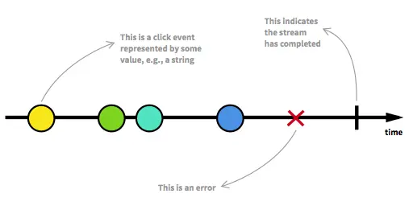

Introduces by Apple in WWDC 2019, Swift UI impressed the technophiles with its convenience, as Apple aimed to help developers conduct code easier and spend more time working on other modified functions. This blog outlines my opinion about SwiftUI, such as how to layout views, handle user input, making a custom view, making a cross Apple platform apps, underlying architecture, integrate with UIKit (the old Apple UI framework). It won't be expanded on an advanced level like fancy animation or proposing any best architecture we should follow. No. Just the basic ones.

# Definition
[SwiftUI](https://github.com/dwarvesf/techradar/tree/master/SwiftUI) is a UI framework that lets developers create apps in a declarative way, *and it also supports multiple Apple platforms (iOS, iPadOS, macOS, watchOS, tvOS), or I can say “farewell UIKit, AppKit, and WatchKit“*. There are minimal code changes when we need to create an app for multiple platforms, as a lot of the same components on SwiftUI can be reused.

SwiftUI came with two companions, which I believe will be the game changers and help developers a lot.

* Xcode Canvas
* Combine framework

## Xcode canvas


Xcode canvas brings us some nice features.

* Building UI with drag and drop style, auto-sync with your code, and vice versa.
* Live preview, this kinda likes the hot reload feature in the Flutter framework, but without simulator since it is a part of Xcode

So, what does this mean?

* There would be no more war between building UI programmatically or Drag n Drop style.
* There would be no more time wasted to debug an explicit screen or now is a component, I guess

## Combine framework


The Combine framework is a tool to help us make an app in a functional reactive programming (FRP) way. The FRP is just a “style“ of programming, which makes our code more declarative and intuitive. Before the Combine framework, iOS developers would use other third-party libraries like RxSwift or Reactive Cocoa to get the power of FRP.

If you have never heard about the FRP, you should definitely take a look at those articles.

* [https://github.com/kickstarter/native-docs/blob/master/learning-rx.md](https://github.com/kickstarter/native-docs/blob/master/learning-rx.md)
* [https://github.com/kickstarter/native-docs/blob/master/learning-rx.md](https://github.com/kickstarter/native-docs/blob/master/learning-rx.md)

## Learn once, apply anywhere
Apple brought up SwiftUI with an important distinction: It's not a multi-platform framework. It's a framework to create apps on multiple platforms.

It might sound confusing. The same thing happens when we first heard of Karl Marx's theory on capitalism. But here's a fact: Many parts of SwiftUI work great on iOS, but aren't available on macOS, or are designed specifically for watchOS and so aren't available anywhere else. Yet, the core of the apps can remain unchanged, but to build great apps that tailored for each Apple's platform, some platform-specific enhancement needs to be made.

## Hello World
There are 3 basic things, which I believe any developer should know when using SwiftUI.

* Inside of DSL SwiftUI syntax, how could Apple achieve that?
* The layout process
* And the State management

### The SwiftUI DSL syntax
```javascript
import SwiftUI

struct ContentView: View {
    var body: some View { // 1
        VStack {          // 2
            Text("Hello") // 3
            Text("World")
                .bold()   // 4
        }
    }
}
```

The first time I look at the above code, it’s kinda like magic to me. I wonder, how they could achieve that.

After researching I found out there are four new features in Swift 5.1 which help us achieve that.

* Opaque return types (1)
* Implicit return (2)
* Function Builder (3)
* View Modifier (4)

And if I explain all those things, this article would be very long, so you guys should check these new features in Swift's official documentation.

### The Layout Process
**The basic one**

```javascript
struct SwiftUIView: View {
    var body: some View {
        Text("Hello World!")
    }
}
```


These are the steps for SwiftUI to layout our UI.

1. **Parent Proposes Size for Child**\
First, the root view offers the text a proposed size – in this case, the entire safe area of the screen, represented by an orange rectangle.

2. **Child Chooses its Size**\
Text only requires that much size to draw its content. The parent has to respect the child's choice. It doesn't stretch or compress the child.

3. **Parent Places Child in Parent’s Coordinate Space**\
And now the root view has to put the child somewhere, so it puts in right in the middle.

**The stack layout process**

Stacks are the primary layout instrument in SwiftUI. The vast majority of layouts can be implemented using stacks. Stacks might seem almost too simple, and they are. But don’t underestimate them. You are going to use stacks *a lot* in SwiftUI. Understanding how they work is probably more important than anything

```javascript
struct SwiftUIView: View {
    var body: some View {
        HStack(spacing: 10) {
            Image(name: "SwiftUI")
                .scalable()
                .frame(width: 80, height: 80) 
            Image(name: "SwiftUI")
                .scalable()
                .frame(width: 80, height: 80)
        }
    }
}
```


There are 3 steps to process the above layout.

1. Calculate space for child view after subtracting internal spacing.
2. Divide the remaining space left equally, and propose available size for their child.
3. All children have sizes. The stack lines them up with the spacing and aligns them according to the specified alignment.

### The State Management
In order to help us manage the state in the app, Apple gave us another power called Property Wrapper. Property wrapper is a new feature in Swift 5.1, which delegates the setter and getter logic of a property to another object.

There are five property wrappers that SwiftUI gives us for default to manage the app’s state.

* @State
* @Binding
* @ObservedObject
* @EnvironmentObject
* @Environment

**@State**

```javascript
struct ProductsView: View {
    let products: [Product]

    @State private var showFavorited: Bool = false

    var body: some View {
        List {
            Button(
                action: { self.showFavorited.toggle() },
                label: { Text("Change filter") }
            )

            ForEach(products) { product in
                if !self.showFavorited || product.isFavorited {
                    Text(product.title)
                }
            }
        }
    }
}
```

**@State** is a Property Wrapper which we can use to describe View’s state. SwiftUI will store it in special internal memory outside of View struct. Only the related View can access it. As soon as the value of **@State** property changes SwiftUI rebuilds View to respect state changes. Here is a simple example.

**@Binding**

```javascript
struct FilterView: View {
    @Binding var showFavorited: Bool

    var body: some View {
        Toggle(isOn: $showFavorited) {
            Text("Change filter")
        }
    }
}

struct ProductsView: View {
    let products: [Product]

    @State private var showFavorited: Bool = false

    var body: some View {
        List {
            FilterView(showFavorited: $showFavorited)

            ForEach(products) { product in
                if !self.showFavorited || product.isFavorited {
                    Text(product.title)
                }
            }
        }
    }
}
```

**@Binding** provides reference like access for a value type. Sometimes we need to make the state of our View accessible for its children. But we can’t simply pass that value because it is a value type and Swift will pass the copy of that value. And this is where we can use **@Binding** Property Wrapper.

**@ObserveObject** 

```javascript
import Combine

final class PodcastPlayer: ObservableObject {
    
    @Published private(set) var isPlaying: Bool = false

    func play() {
        isPlaying = true
    }

    func pause() {
        isPlaying = false
    }
}

struct EpisodesView: View {
    @ObservedObject var player: PodcastPlayer
    let episodes: [Episode]

    var body: some View {
        List {
            Button(
                action: {
                    if self.player.isPlaying {
                        self.player.pause()
                    } else {
                        self.player.play()
                    }
            }, label: {
                    Text(player.isPlaying ? "Pause": "Play")
                }
            )
            ForEach(episodes) { episode in
                Text(episode.title)
            }
        }
    }
}
```

**@ObservedObject** work very similarly to **@State** Property Wrapper, but the main difference is that we can share it between multiple independent Views which can subscribe and observe changes on that object, and as soon as changes appear SwiftUI rebuilds all Views bound to this object.

Remember, we can share **ObservableObject** between multiple views, that’s why **it must be a reference type/class.**

**@EnvironmentObject**

```javascript
struct EpisodesView: View {
    @EnvironmentObject var player: PodcastPlayer
    let episodes: [Episode]

    var body: some View {
        List {
            Button(
                action: {
                    if self.player.isPlaying {
                        self.player.pause()
                    } else {
                        self.player.play()
                    }
            }, label: {
                    Text(player.isPlaying ? "Pause": "Play")
                }
            )
            ForEach(episodes) { episode in
                Text(episode.title)
            }
        }
    }
}
```

As you can see, we have to pass PodcastPlayer object via environmentObject modifier of our View. By doing this, we can easily access PodcastPlayer by defining it with **@EnvironmentObject** Property Wrapper. 

**@EnvironmentObject** uses dynamic member lookup feature to find PodcastPlayer class instance in the Environment, that’s why you don’t need to pass it via init method of EpisodesView. The Environment is the right way of Dependency Injection in SwiftUI. It works like magic.

**@Environment**

```javascript
struct CalendarView: View {
    @Environment(\.calendar) var calendar: Calendar
    @Environment(\.locale) var locale: Locale
    @Environment(\.colorScheme) var colorScheme: ColorScheme

    var body: some View {
        return Text(locale.identifier)
    }
}
```

SwiftUI already has an Environment populated with system-wide settings. We can easily access them with **@Environment** Property Wrapper.

As soon as Locale, Calendar, or ColorScheme of the system change, SwiftUI recreates our CalendarView.

## However
Besides the advanced features for UI processing, SwiftUI still has some downside.

### Limited API Coverage
SwiftUI does not currently have the same broad API coverage as UIKit. For example, if you want to show items in a grid, you would use UICollectionView in UIKit, but SwiftUI has no equivalent.

### Limited Adoption
SwiftUI was only announced at WWDC2019, and is available in iOS 13 devices or later. This immediately means that:

* Almost every app written to date uses UIKit.
* Any app that needs to support iOS n-1 or n-2 (e.g. iOS 12 and iOS 11) cannot even begin to switch to SwiftUI for a year or more.

### Limited Support
UIKit has been around over ten years now, which means:

* Almost every problem you might face has probably already been faced and solved by others
* There are lots of libraries out there that provide extensions and customizations.

### Default Behavior
There are many things Apple gives us by default. This will cause some confusion when we look at the code. Sometimes, I believe that explicit is better than implicit. The default padding in HStack is one example of this.

NoneBashCSSCC#HTMLJavaJavaScriptJSONPHPPowershellPythonRubyTypeScriptCopy

```plain_text
HStack {
    Text("★★★★★")
    Text("Avocado Toast").font(.title)
}
```