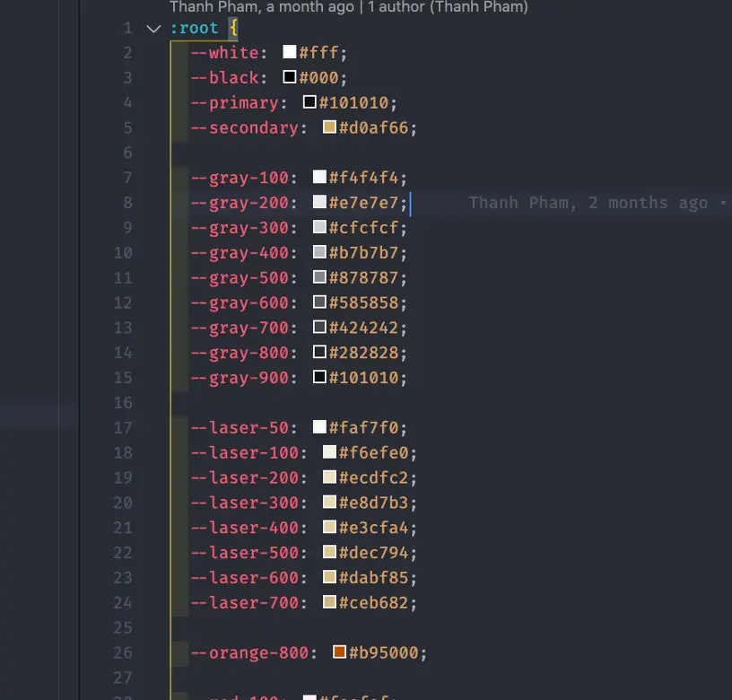

One of the factors that could make or break a project is the process of communication between designers and developers. Designers and developers have their own working “*languages*.”

It’s important to find a protocol in which a mutual language can bridge the gap between designers and developers.  This protocol helps everyone in the team understand the ultimate objective of the project, minimize the guesswork, save time and effort, ensuring the high-quality standard outcomes we promised to deliver to clients.

This article covers practices designers are required to follow at Dwarves Foundation for smooth handovers to developers.

Each convention is written in a compact format so that designers can easily read and follow. New conventions are added over time each time a designer discovers a new problem in the course of working with devs.

* Versions & File Organizations
* Manage releases
* Manage layers
* Practical, context-conscious data
* Naming conventions
* Components
* Colors
* General Figma tips

## Versions & File Organizations

### Manage versions by releases

On the management of Pages in Figma. This is a recommended structure:

* Release [X]: contains all designs delivered to developers according to the product/feature roadmap.
* Each release should provide all user flows required for said release.
* Naming convention for the release is decided by devs, followed strictly by designers.
* Final / Complete: contains the most complete design. The completed design is a full-featured version of the product that will be programmed in the future.
* The Final Page should be kept clean, well-organized, and well-noted.
* The screens should be arranged neatly into a flow.
* Only drafts and designs approved by the clients are allowed in the final page.
* In progress: contains screens that are still in progress and discussing with team members and clients until finalization.
* Draft: Designers’ workspace for idealizing and creating design solutions.
* Archive: Archived UI for reference later.

Devs and the client discuss the design with designers through Figma's comments, only designers can make changes in the Figma files.

### Manage Layers

* Layers are often grouped and named by function or section. For example: hero image, slider, header, footer…
* Asset (illustration, icon, vector ...) needs to be grouped so that devs can export to SVG files by themselves (without any help from designer).

### Practical, context-conscious data
To ensure team members understand the same problem and the provided design solution, each user flow should be presented as a story with practical characters and data.

In complex cases when detailed explanations are needed, designers should have paragraphs (in the form of notes) in the Figma file for developers to read. You can refer to the formula Cause → Consequences → Design Solution.

Example: Hotel room booking website where guests can book a room by the hour. A story told to clarify the design is as followed:

Context: Minh pre-booked room 102 from 19:00 to 20:00

[Because]
* Room 102 is booked from 19:00 to 20:00, Room 102 cannot be booked again during 19:00 to 20:00
* It takes 30 minutes before and 29 minutes after to clear the room, Room 102 cannot be booked from 18:30 to 20:29

[Therefore]
* Room 102 is disabled for booking from 18:30 to 20:30
* [Design Decision]
* Booking time slots from 18:30 to 20:29 will no be shown as available

## Design System File presentation
## How to manage pages and master components using Figma software
Design System is a tool that makes the component management of the project clear and easy. For more details, please see [this example file](https://www.figma.com/file/6CuLQBxwh1QlLp386Ths7h/Blackpink-Example-for-Design-System-File?node-id=83%3A1098).

## Naming Color Style
**Designers at Dwarves name colors based on their function** (Primary, Secondary, Disabled,...) Meanwhile, developers name colors based on light/dark levels with numbers (100, 200, 300...)

* The naming convention for colors at Dwarves: **Flat / BG / Neutral 1 (gray-400)** in which **Flat / BG / Neutral 1** is added by designers and **(gray-400)** is by added developers
* Designers complete the color palette, inform developers to add a suffix to the name of the Color Styles
* When designers make changes to the color palette, designers need to inform developers so they can update their code accordingly.

**Naming Color Style for designer and developer are both convenient in the working process.**
The developer has a way to name the color in the form of numbers (100,200,300 ...). Meanwhile, the designer names the color based on the color's function (Primary, Secondary, Disable….)

## Tips when using the Design System file in Figma
In order to kickstart a new project, we usually reproduce the Design System from previous projects where all the master components have been established and ready for use. All that’s left is to remove unnecessary components and adapt the Design System to the new project.

You should design the UI in the Design System file first, for convenience in creating and perfecting the Master Component. After the final UI is finalized, transfer the design to the UI file.

## Other conventions
Other conventions are added over time each time a designer discovers a new problem in the process of working with devs.
