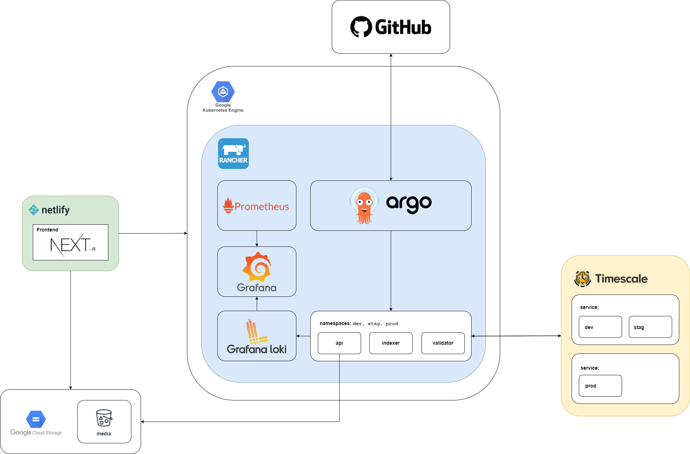

### Description
TimescaleDB is an open-source relational database for time-series data. It is implemented as an extension to PostgreSQL, which means it runs within a PostgreSQL instance. TimescaleDB uses full SQL and is just as easy to use as a traditional relational database, yet scales in ways previously reserved for NoSQL databases. It has two main design elements: hypertables and chunks. Hypertables are PostgreSQL tables that can be queried with standard SQL commands, while chunks are used to store data in a more efficient way.

### What’s better about this method or library
The highest level of granularity of a business operation or model can be broken down into time-series data. The issue with high granularity of data means it comes with a high processing cost of persisting such data.

TimescaleDB extends PostgreSQL to include table designs that are partitioned through “chunks” to lower processing costs and increase throughput of append-only operations.

### What can we do with it
We can use TimescaleDB to facilitate in append-only oprations for required domains. Industries such as blockchain and finance can benefit a lot with TimescaleDB as they help to promote data persistence of events and time-related data without the debt of requiring sophisticated architectures to reach high levels of transactional processing. For instance, companies such as [Wise](https://www.timescale.com/case-studies/wise/) (formerly Transferwise) use TimescaleDB to increase data throughput and read throughput for their analytics.

### How should we adopt it
<!-- child_database cfa596ad-cd45-47cc-841d-32f92aa91c03 -->

---

## Description
TimescaleDB is the open-source extension for PostgreSQL for time-series and analytics. Most of our use cases end up involving some sort of time-series or event-driven data that demands consistent collection and processing speeds.

## Output Goal
* Allow projects to handle moderately data-intensive workloads with teams familiar with PostgreSQL
* Have TimescaleDB be the generally available option in favor of using plain PostgreSQL

## Timeline
* (2022-07-18) - (Tom) Created basic audit pattern with double-entry accounting from journal aggregation with Continuous Aggregates on TimescaleDB:
* [https://polished-voyage-ff0.notion.site/Backend-SQL-Audit-through-double-entry-aggregation-95f1cfb585114a0a922ee4a771560beb](https://polished-voyage-ff0.notion.site/Backend-SQL-Audit-through-double-entry-aggregation-95f1cfb585114a0a922ee4a771560beb)
* (2022-06-25) - (Tom) Created article on merge upsert pattern in TimescaleDB reflecting MStation use cases: 

[Merge Upsert Pattern for TimescaleDB](https://monotykamary.hashnode.dev/a-merge-upsert-pattern-for-timescaledb)

* (2022-04-20) - **[Trial]** (Quang, Tom) Created production, staging, and development TimescaleDB databases for project MStation

* (2021-12-13) - **[Assess]** (Tom) First proposal to project LFW for using TimescaleDB