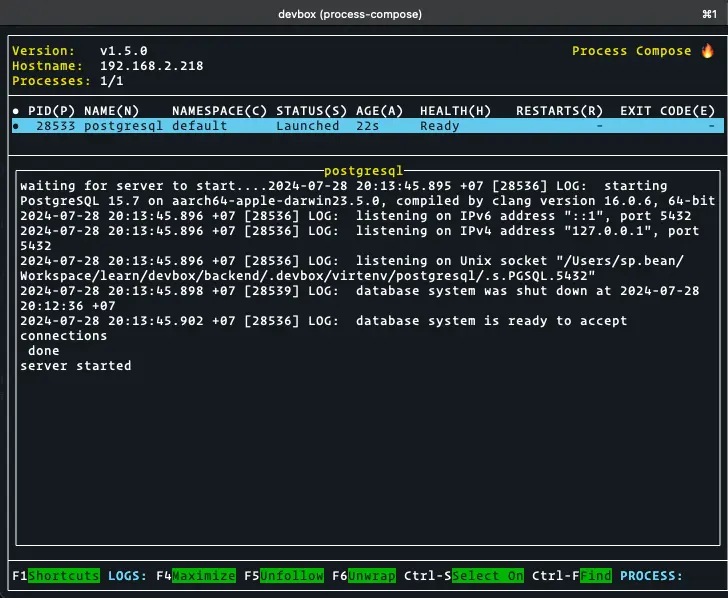

By taking advantage of [Devbox Services](../introduction/¶%20Devbox%20Services.md) and [Devbox Plugins](../introduction/¶%20Devbox%20Plugins.md), we can create a container-less Devbox environment for local development.

Let's go through a Golang Backend Application.

Assume we have a folder named "backend" to store our Golang Backend Application.

Firstly, init Devbox shell. Then we generated `devbox.json` as follows.
```
> devbox init
> ls
devbox.json

> cat devbox.json
{
    "$schema": "https://raw.githubusercontent.com/jetify-com/devbox/0.12.0/.schema/devbox.schema.json",
    "packages": [],
    "shell": {
      "init_hook": [
        "echo 'Welcome to devbox!' > /dev/null"
      ],
      "scripts": {
        "test": [
          "echo \"Error: no test specified\" && exit 1"
        ]
      }
    }
  }
  %
```

Open the shell and add `go` as the main program language.
```
> devbox shell
Info: Ensuring packages are installed.
✓ Computed the Devbox environment.
Starting a devbox shell...

(devbox) > devbox add go
Info: Adding package "go@latest" to devbox.json
✓ Computed the Devbox environment.
Warning: Your shell environment may be out of date. Run `refresh` to update it.

(devbox) > which go 
/Users/sp.bean/Workspace/learn/devbox/backend/.devbox/nix/profile/default/bin/go
```

Now, Golang is installed inside the current shell root as we can see in the output of `which go`. Let init go mod and begin with following Golang code that builds a Golang Backend API to manage a list of Books.

```GO
package main

import (
    "database/sql"
    "encoding/json"
    "fmt"
    "log"
    "net/http"

    "github.com/gorilla/mux"
    _ "github.com/lib/pq"
)

const (
    host     = "your_postgres_host"
    port     = 5432
    user     = "your_postgres_user"
    password = "your_postgres_password"
    dbname   = "your_postgres_db"
)

type Book struct {
    ID     int    `json:"id"`
    Title  string `json:"title"`
    Author string `json:"author"`
}

var db *sql.DB

func initDB() {
    psqlInfo := fmt.Sprintf("host=%s port=%d user=%s password=%s dbname=%s sslmode=disable",
        host, port, user, password, dbname)

    var err error
    db, err = sql.Open("postgres", psqlInfo)
    if err != nil {
        log.Fatalf("Error opening database: %q", err)
    }

    err = db.Ping()
    if err != nil {
        log.Fatalf("Error connecting to database: %q", err)
    }

    fmt.Println("Successfully connected to the database!")
}

func createBook(w http.ResponseWriter, r *http.Request) {
    var book Book
    err := json.NewDecoder(r.Body).Decode(&book)
    if err != nil {
        http.Error(w, err.Error(), http.StatusBadRequest)
        return
    }

    sqlStatement := `INSERT INTO books (title, author) VALUES ($1, $2) RETURNING id`
    id := 0
    err = db.QueryRow(sqlStatement, book.Title, book.Author).Scan(&id)
    if err != nil {
        http.Error(w, err.Error(), http.StatusInternalServerError)
        return
    }

    book.ID = id
    w.Header().Set("Content-Type", "application/json")
    json.NewEncoder(w).Encode(book)
}

func main() {
    initDB()
    defer db.Close()

    router := mux.NewRouter()
    router.HandleFunc("/books", createBook).Methods("POST")

    log.Println("Starting server on :8080")
    log.Fatal(http.ListenAndServe(":8080", router))
}
```

Once we finish installing all Golang packages, we can try running `go run main.go` to see if it works. But the result will look like this.
```
(devbox) > go run main.go
2024/07/28 17:00:10 Error connecting to database: "dial tcp 125.235.4.59:5432: connect: operation timed out"
exit status 1
```

Sure, it does not work because we have no DB in this shell yet. So we need to install one.
```
(devbox) > devbox add postgresql
Info: Adding package "postgresql@latest" to devbox.json
✓ Computed the Devbox environment.
Warning: Your shell environment may be out of date. Run `refresh` to update it.

postgresql NOTES:
To initialize the database run `initdb`.

Services:
* postgresql

Use `devbox services start|stop [service]` to interact with services

This plugin creates the following helper files:
* /Users/sp.bean/Workspace/learn/devbox/backend/.devbox/virtenv/postgresql/process-compose.yaml

This plugin sets the following environment variables:
* PGHOST=/Users/sp.bean/Workspace/learn/devbox/backend/.devbox/virtenv/postgresql
* PGDATA=/Users/sp.bean/Workspace/learn/devbox/backend/.devbox/virtenv/postgresql/data

To show this information, run `devbox info postgresql`
```

After adding `postgresql`, we can see what's happening transparently. [Plugin](../introduction/¶%20Devbox%20Plugins.md) helps us create `process-compose.yaml` and 2 new environment variables `PGHOST` and `PGDATA` to manage our database easily. We can also override the `process-compose.yaml` with your own in the root folder of the project.

By default, we can use `initdb` to initialize the database. But we can also explore `initdb --help` for more advanced options. I will initdb with role `bean` by using following command:
```
(devbox) > initdb initdb --username=bean
```

After initializing the database with above instructions, we have two ways to run all available services:
- To start services daemon: `devbox services start`
- To start services with monitoring: `devbox services up`
  
  
If want to start specific service, use `devbox services start [service]` or `devbox services up [service]`. Then we can create new DB by using `createdb <db_name>` command.
```
(devbox) > createdb bookstore  --username=bean--password
// Then enter your password. If have no additional params to specify host, a new DB called `bookstore` will be created on default localhost and port 5432 with username `bean` and entered password.
// You can also using --help to show more options.
Password: 123456
```

Finally, we have a DB with below configuration.
```
HOST=localhost
PORT=5432
USER=bean
PASSWORD=123456
DB=bookstore
```

Now we can replace all DB connection information in `main.go` and try again. The server can now serve with local Posgresql supported without any running containers
```
(devbox) > go run main.go
Successfully connected to the database!
2024/07/28 20:43:46 Starting server on :8080
```

> Side note: You can also manually custom the default configuration of services in the location where it is installed such as `.devbox/virtenv/postgresql/data/pg_hba.conf` for postgresql.

The rest implementation is all up to you. You can continue the above backend with any services you want. You can try custom your own plugin for Devbox depending on this [instruction](https://www.jetify.com/devbox/docs/guides/creating_plugins/) once you want to support serving other daemons applications that are not supported by Devbox, or define your backend to run as a daemon Devbox service to serve for the web application.

---
#### References
*Running Services | Devbox*, https://www.jetify.com/devbox/docs/guides/services/. Accessed 28 July 2024.

*Using Plugins | Devbox*. (n.d.). Jetify. Retrieved July 28, 2024, from https://www.jetify.com/devbox/docs/guides/plugins/
