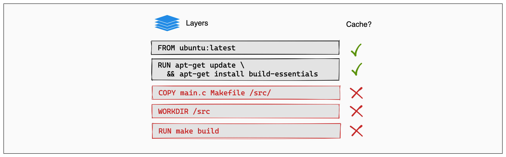
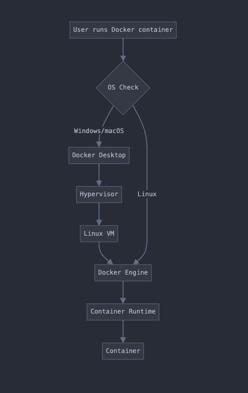
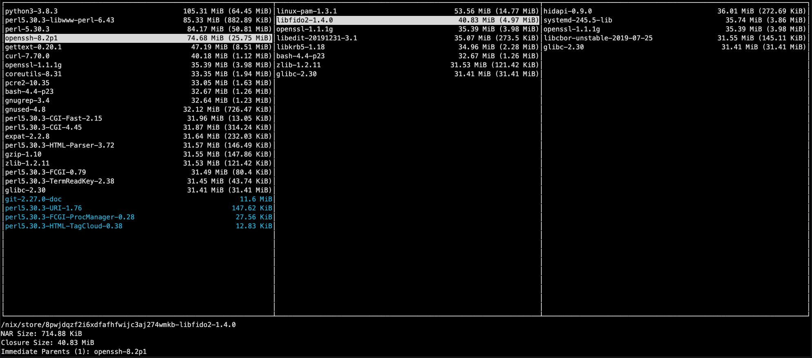

---
tags:
  - devbox
title: "The reason for being"
date: 2024-08-01
description: The reason why we use Devbox
authors:
  - bievh
---

## The Pursuit of Consistency
With the rise of cloud services, we first adapted Docker as a containerization tool to wrap our application into an isolated environment for running on the cloud for production. Then we begin setting up a development environment inside a container or take advantage of docker-compose to run multiple services without installing locally. This helps us share the environment easily, and run the same environment repeatably with minimum changes with just only 1-2 script files.

## Docker's Achilles Heel

### Bad build cache
Docker build is actually not very effective because basically, we need to rebuild the entire environment each time our code is changed when developing. This rebuild process not only affects the image layer where the code is placed but also lets other layer below it is rebuilt. It takes more time and resource to do it.

### Pulling from internet is not stable
The installed application version can be specified in the `apt-get add` script, but its dependencies are not stable. Repositories can be updated, transitive dependencies are changed without changing the main package version. So once we run `apt-get update`, the produced image may not be the same as the previous build.

### Docker is heavy on non-Linux OS
On Windows and MacOS, Docker containers are run on a Linux VM. So we need to split resources from the host machine to serve this VM. It makes our computer become slow.

### How to resolve problems?
The problems can be summed up as slow, asynchronous, and cumbersome when developing locally. We actually can resolve them by using some Docker hack. But we can also do it by avoiding using Docker (or changing your machine if you want). Among a variety solutions, we consider trying using Devbox. What's it?

## Devbox

### Do not build, do not need VM
Powered by Nix which is known as a cross-platform package manager for Unix-like systems with the ability to build any package, or application running natively on your machine with 100.000+ available Nix packages. Devbox will simply scope an isolated workspace, and then install all dependencies to help you run your project. All these dependencies are native to your OS, so just only need to run without any other middleman.

### Consistent dependencies
All packages in the Devbox workspace are actually linked from your local Nix storage, where every application is installed. They are identified by a unique hash and are linked together by a dependency tree. So it will not change over time. So the Devbox environment can be reproduced perfectly and easily to share between teammates with just a script file.

The hash is different between versions of the same application. So we have different versions of a package in our Nix storage. And easily link it to different projects that require different versions of a package.

## Conclusion
Embracing Devbox has not only streamlined our development process but has also fostered a more collaborative and productive team dynamic. As we continue to scale our projects, Devbox's reproducibility and efficiency will undoubtedly remain key factors in our success.
