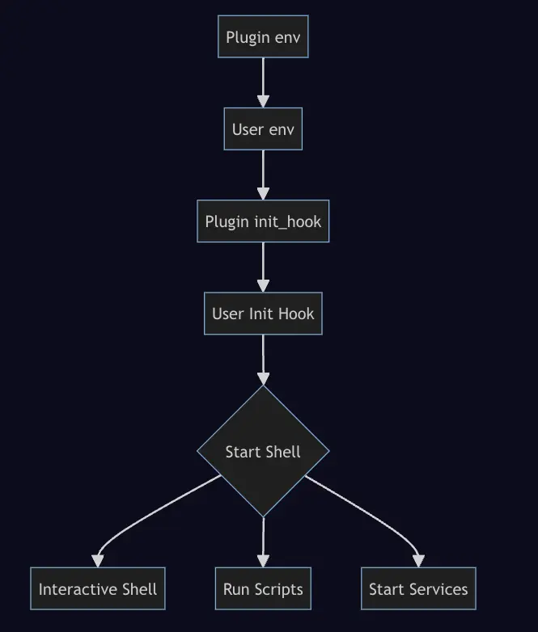

Devbox is built on Nix, but users don't need extensive Nix knowledge to interact with it effectively. Some packages require additional setup to work properly, which is why Plugins were introduced to Devbox.
## The Power of Devbox Plugins

Let's consider an example: installing and using Nginx for your project. With Devbox Plugins:

- A default configuration to run Nginx is automatically provided.
- Environment variables for customizing Nginx are exposed for easy setup.
- Configuration files are grouped and placed in a specific folder for streamlined management.
- All of this happens automatically when you add Nginx to your project.

## Types of Devbox Plugins

Devbox supports two main types of plugins:

1. **Built-in Plugins**: These are pre-implemented in Devbox for popular packages like Nginx, PostgreSQL, and others. They're automatically activated when you add a supported package to your project. For more information, check the [Built-in Plugins documentation](https://www.jetify.com/devbox/docs/guides/plugins/#using-plugins).

2. **Custom Plugins**: These are user-created plugins that follow the [schema provided by Devbox](https://www.jetify.com/devbox/docs/guides/creating_plugins/#plugin-design). Custom plugins can be placed locally or hosted on GitHub.

## Plugin in Devbox Shell Life Cycle
Plugins are activated whenever a developer runs devbox shell, runs a script with devbox run, or starts a service using devbox services start|restart. The lifecycle of a devbox shell with plugins works as follows:



## Plugin structure
```
my-plugin/
├── README.md
├── plugin.json
├── config/
│   ├── my-plugin.conf
│   └── process-compose.yaml
└── test/
    ├── devbox.json
    └── devbox.lock
```
- `README.md` -- Should contain a description of how your plugin works, and what files, variables, and services it adds to Devbox Projects
- `plugin.json` -- This file is a Go JSON Template that defines your plugin. See the sections below for more detail
- `config/` -- This folder contains any support or configuration files required by your plugin, as well as the process-compose.yaml for defining services
- `test/` -- This directory contains an example project for testing your plugin

---
#### References
*Using Plugins | Devbox*. (n.d.). Jetify. Retrieved July 28, 2024, from https://www.jetify.com/devbox/docs/guides/plugins/
*Creating a Devbox Plugin | Devbox*. (n.d.). Jetify. Retrieved July 28, 2024, from https://www.jetify.com/devbox/docs/guides/creating_plugins/
