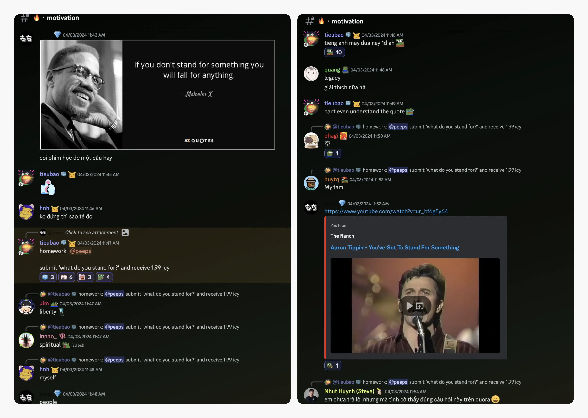
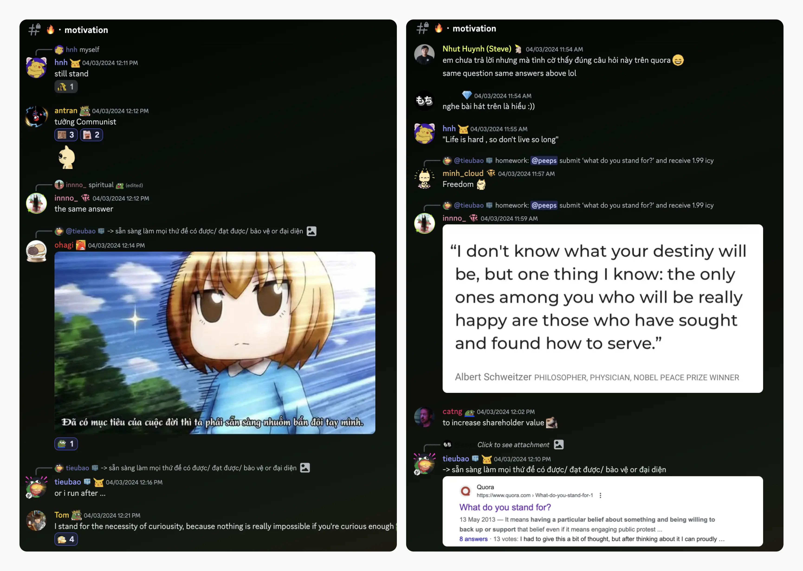

---
tags:
  - weekly-digest
  - remote
  - discord
  - community
title: "#1 What Do You Stand For?"
date: 2024-04-09
description: Our Discord crew is buzzing with energy after our last Friday community call, with folks sharing snapshots of their workspaces, Anna shared the movie quote and catch-up with peeps at lobby, random channels.
authors:
  - innno_
menu: changelog
type: digest
hide_frontmatter: false
pinned: true
hide_title: false
---

### Lock in Your Workspace. Show the World.
Our Discord crew is buzzing with energy after our last Friday community call, with folks sharing snapshots of their workspaces. It's awesome to witness such enthusiasm and engagement. We embrace the digital nomad lifestyle and cultivate a "work hard, play hard" spirit. This ethos keeps us motivated and creates a space where people do their best work and feel like they belong.

No matter who you are, real work happens when you feel your best self. If you want to share your current workplace with us, please do. You are warmly welcome to be part of our community.

### What’s in the #Motivation?
After watching a movie, Anna, our UX designer shared this interesting quote, sparking some serious quality sharing from the team. We've been diving deep into the question, 'What do you stand for?'

We were blown away by the tons of quality sharing from the team, with a range of ideas and perspectives. 

Some stand for the power of curiosity, others for family, and some for the ongoing pursuit of inner peace and freedom from life's distractions. We’re happy to see our tribe embracing their most authentic selves through this open sharing, giving '100% Real' answers.

So, how about you? What do you stand for?

[Jump right into the conversation](https://discord.com/channels/462663954813157376/1214231226282418228/1224942206280929310). And if you've got something worth sharing, we're all ears. 

### What’s around you?
Pay [#random](https://discord.com/channels/462663954813157376/788084358991970337/1225783749988319252), [#lobby](https://discord.com/channels/462663954813157376/907727610417655898/1225767773708222566) channel a visit - where we love sharing our daily things, stories and having fun with peeps. You'll always find something interesting going on here. It's like catching up with friends in a cozy virtual hangout spot and a dose of good vibes. 

Has anyone heard from @bien lately? Hope he's doing alright. And @vincent, did you hear about his plans for his next trip in Europe this summer? Man, I'm already jealous just thinking about it.

Let's keep the conversation going and the good times rolling. See you around next week for a catch-up.

