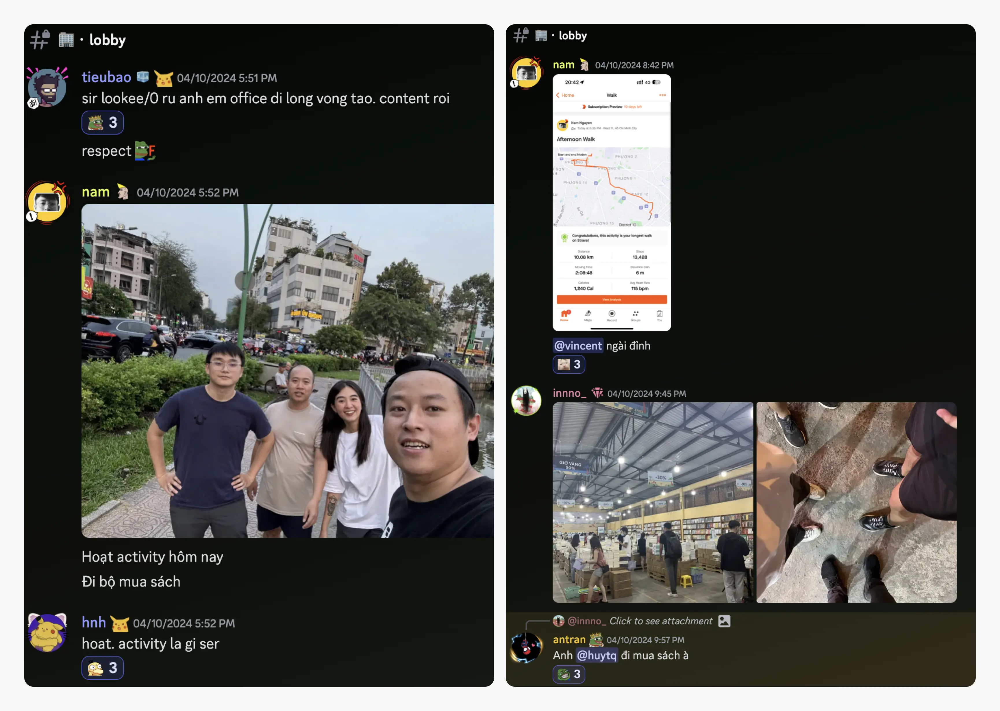
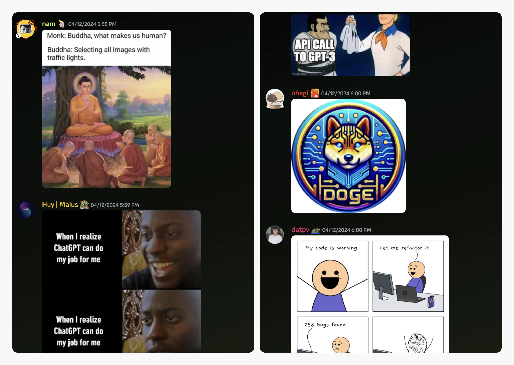
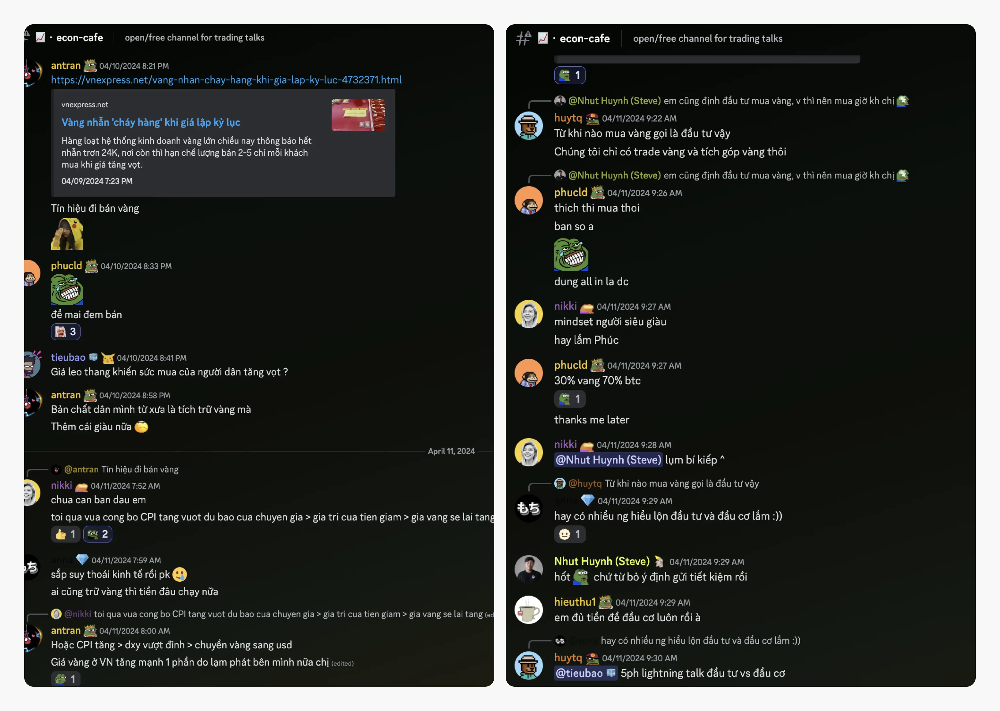

---
tags:
  - weekly-digest
  - remote
  - discord
  - community
title: "#2 Walk Around Learn Around"
date: 2024-04-15
description: There are so many amazingly fun and wonderfully weird things happening on Discord, both last week and of course, today. So let’s dive in with a freshly-brewed “cà phê sữa,” of course.
authors:
  - innno_
menu: changelog
type: digest
hide_frontmatter: false
pinned: true
hide_title: false
---

There are so many amazingly fun and wonderfully weird things happening on Discord, both last week and of course, today. So let’s dive in with a freshly-brewed “cà phê sữa,” of course.

If you’ve stumbled upon this article, you’re welcome to spark activity within our Discord community. So take a peek once in a while and see what’s new, just come in and say ‘hi’ with us.

### A battery charging up your day
Our COO @nikki sparked a lively discussion by snapping a pic of a battery that looked like it had seen better days. Just when we thought things couldn't get any more electrifying, amidst the chaos, the conversation took a twist when the CEO saw 4 billion 6 VND on a random roll-up bread wrapper. Who knew a simple battery could recharge our spirits and spark such lively banter?

### Walk around learn around
Last Wednesday, the Hado office crew @nam, @hieuthu1, @vincent, @innno_ decided to shake things up with an offline WALA session. Our primary goal? A visit to the Nha Nam bookstore to get our hands on copies of "Dune Messiah." Of course, the secondary goal was the WALA itself. Little did we know it would turn into a mini-adventure. Finally, we surpassed the 10km target - a delightful bonus to a fulfilling day of friendship.

### The really career advice - Wait But Why
Once you’re ready to show what you’ve learned, we’re all ears. The sharing from our COO @nikki isn’t just about giving you career advice. It’s a framework that I think can help you make career decisions that reflect who you are, what you want, and what our rapidly changing career landscape looks like today.

It’s also for those who have yet to start their careers, who aren’t sure what they want to do with their lives, or those currently in the middle of their career who aren’t sure they’re on the right path. Press the reset button on your thought process and get some clarity.

### The best AI meme
Scanning through **#⛺・random** is always a blast. With AI in the mix, it's like having a playful friend who keeps surprising you with hilarious memes. Whether it's a meme that makes you laugh or leaves you puzzled, that's all part of the fun. Let the meme odyssey commence.

### Gold prices set new records, interest rates start to rise
The price of gold had been on a wild ride, hitting all-time highs for several days in a row. With all this back and forth, our team got together to chat about investing in gold or stocks, investment goals, and long-term investment strategies. From that convo, we ended up sparking a whole new discussion for OGIF about investing and money talk. That’s cool, right?

### Happy birthday to our awesome pals
Wishing all the best for @fuatto and @tay on their birthdays last week. Here's to another year of adventures, laughter, and unforgettable moment. Cheers to you both, and may your birthdays be as legendary as you are.

