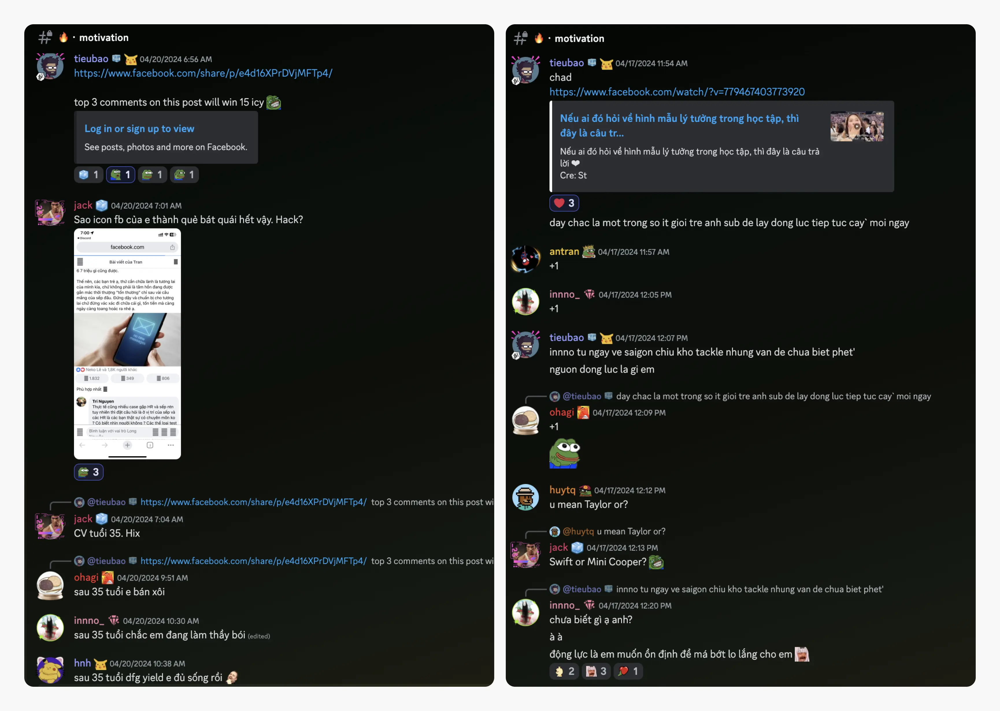
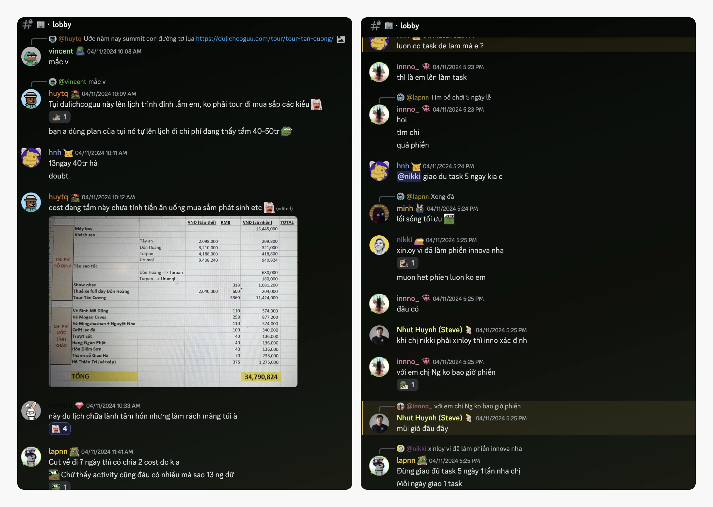
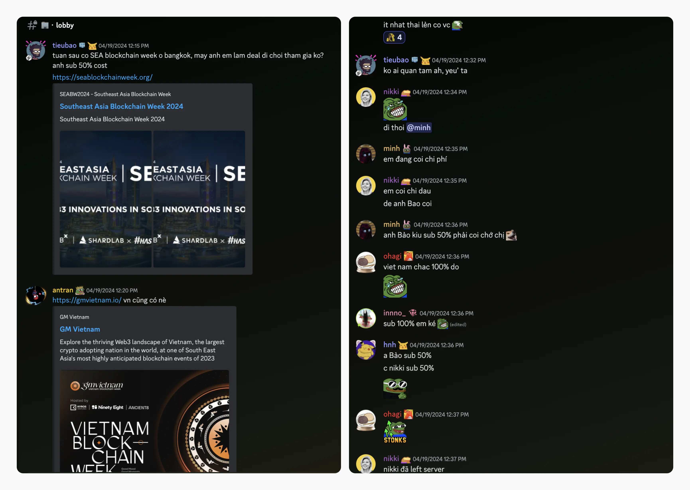
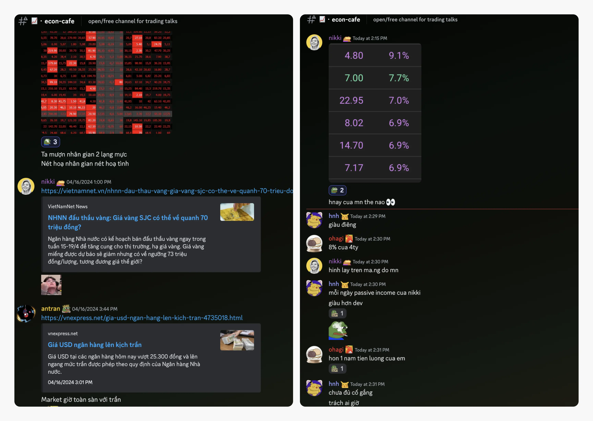
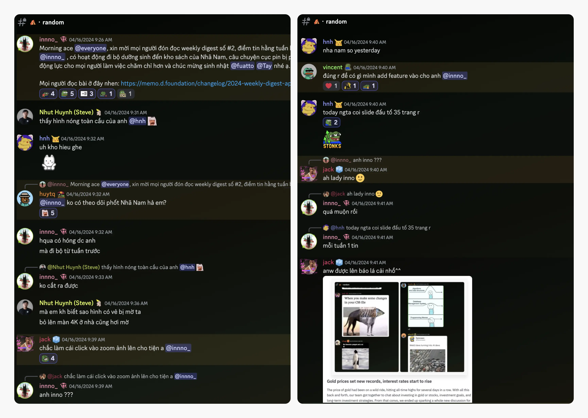

---
tags:
  - weekly-digest
  - discord
  - community
  - motivation
title: "#3 We All Start Somewhere"
date: 2024-04-22
description: Huge news is on the horizon. You absolutely will not guess what we’re about to share. Excitement building, we remember last week like it was yesterday, but what truly counts is that you're here with us.
authors:
  - innno_
---

Huge news is on the horizon. You absolutely will *not* guess what we’re about to share. We remember last week like it was yesterday, but what truly counts is that you're here with us.

If you're up for diving into conversations and discussions like these, we're eagerly awaiting your company.

### We all start somewhere
Starting over in my career after a ten-month hiatus has been quite a journey at 27. But you know what? Instead of dwelling on our greatest fears about where our careers might take us by the age of 35, why not shift the perspective?

Our CEO showcased Khanh Vy as a beacon of inspiration for Gen Z, highlighting her unwavering commitment and diligence. Furthermore, he asked @innno_ what motivates her and urged her to embrace new challenges and endeavors.

Where did you start, or where are you starting from? We'd love to hear your story.

### What are your plans this holiday?
Have you decided where you're headed for your upcoming vacation? It's fascinating to see that some Dwarves members are planning trips to Xinjiang, while others are getting together to enjoy board games and maybe even tackle some tasks (just kidding!).

Whatever you choose to do, make sure you make the most of those precious three days off and recharge for the exciting new working week in May. Wishing every one of you a fantastic and joyful holiday.

### Exciting opportunities await: Southeast Asia Blockchain Event
For the upcoming Southeast Asia Blockchain event happening next week in none other than the beautiful land of Thailand. Our super cool CEO has decided to go all out and sponsor a whopping 50% of the cost for anyone who wants to be part of this extravaganza. How awesome is that?

There are also some events lined up for you at the **#📈・econ-cafe** channel. We attends community events as a group, where we have the opportunity to learn from others' experiences, share our knowledge, and connect with fellow tech enthusiasts in the industry.

### Investment dopamine
Everyone's still buzzing about gold prices and investments. The constant fluctuations in the market keep us informed. 

Also, our COO's passive income really got us talking. It's evident that we're all eager to explore diverse investment opportunities and grasp their role in the wider economic picture. There's always something fresh to uncover and discuss together.

### Our community includes everyone, including you
I just wanted to give a huge shoutout to all of you for the awesome response we got to the weekly digest. Your enthusiasm and engagement seriously made my day. It's so rad to see everyone diving in, sharing thoughts, and sparking cool discussions. 

Keep being awesome, and let's keep the good vibes rolling.

### Dwarves internship program
Lastly, we launched the Internship Program for students to provide training, mentoring, and career development opportunities to shape your software skills and define your career paths.

Interested in joining our Internship Program? We're here to welcome you aboard.

[Shoot us an email](mailto:spawn@dwarvesv.com) with your LinkedIn / CV\
[Join our Discord](https://discord.gg/dwarvesv) of +300 other engineers and designers
