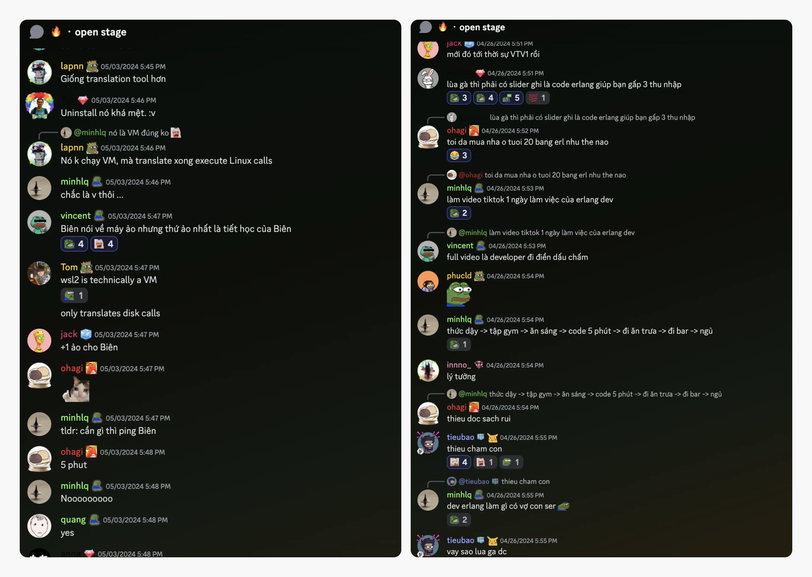
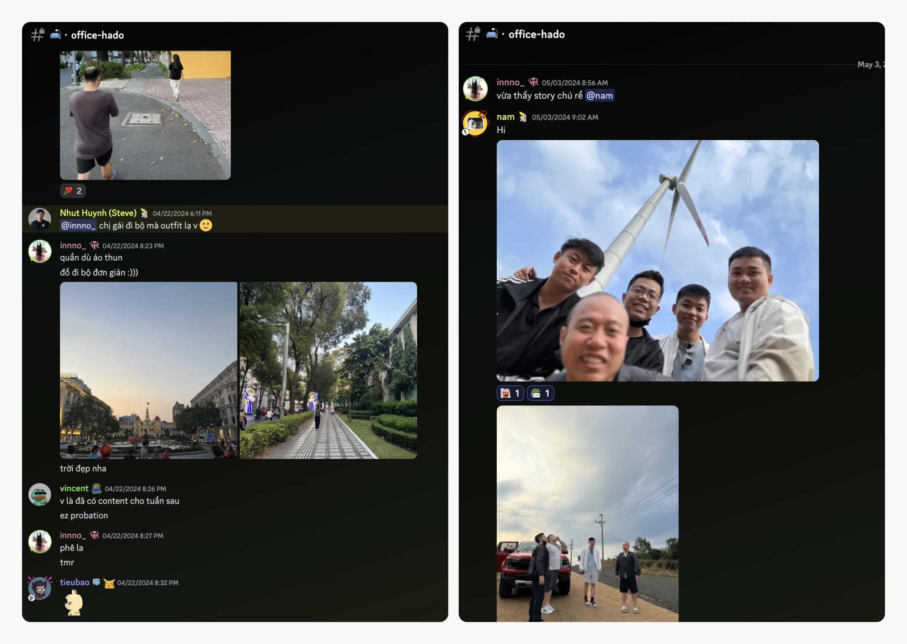
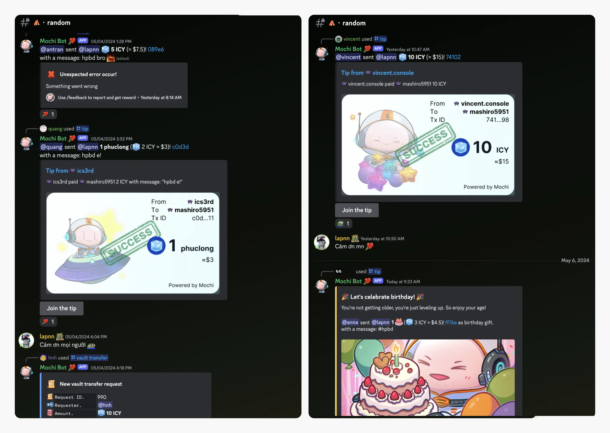

---
tags:
  - weekly-digest
  - discord
  - community
  - team
title: "#4 Finding Your Authentic Tribe"
date: 2024-05-06
description: "Welcome back to the #4 weekly digest after a long holiday. Those Discord channels are still buzzing with active messages. Without further ado, let’s see what I’ve got to share."
authors:
  - innno_
---

Welcome back to the #4 weekly digest after a long holiday. Those Discord channels are still buzzing with active messages. Without further ado, let’s see what I’ve got to share. 

### Come for the culture, stay for conversation
Some of a rapid-fire exchange of memes, hot views, controversial opinions inside jokes, and earned (and occasionally unearned) snark. It's my favorite part when creating weekly digests. There's no better low-effort, high-reward approach to connect with all of my readers.

### Brand new merchandise coming soon
Guess what's hitting the shelves soon? That's right, folks – we've got some fresh merch on the horizon and we're buzzing with excitement.

The operations team's gearing up for another batch of awesome t-shirts and stickers. Get ready to rock some serious style and show off your pride. Stay tuned for the big reveal, because trust us, you won't want to miss out on this.

### TGIF sometime, OGIF all the time
There have been 4 OGIF editions since one month of resumes. To get @everyone aligned and possess the same knowledge base toward our culture. OGIF is a tradition that takes place every Friday afternoon to walk all folks through anything you can share for everyone can learn within 10 minutes.

The talk shall be rendered to be short, interesting, and easy to digest. If you and your team have an idea, we are all excited to see what you will create.

### We’re happy to have you on our team
Welcome @minhkek - BD officially to the team after all their hard work and successful completion of probation. Also, a big shoutout to our newest intern, @datnguyennnx, as he embarks on his journey with the Dwarves team. Keep up the good work, we're here to support you every step of the way.

And let's not forget to celebrate @jack, who's now officially part of our inner circle. Welcome aboard, Jack – here's to many more adventures together.

### Be authentic, find your tribe
Even though the team works remotely, there is always a group for activities such as English, Poker, Board Games, Swimming, and Running. As I'm jotting down this digest, there were certain feelings about the moments walking with my mates or geeking out over a good book with the team. I feel like the Dwarves is a big fam.

And hey, taking a look back at those epic moments like cheering on @nam for his upcoming wedding or reminiscing about that wild road trip to Mang Den for a foodie adventure.

### Let’s spread the cheer to our teammates
Thank you for being such a great team player @thangnt @lapnn. I hope you have a super day and get everything you want. Here's to an epic birthday bash – enjoy every moment, you deserve it.

