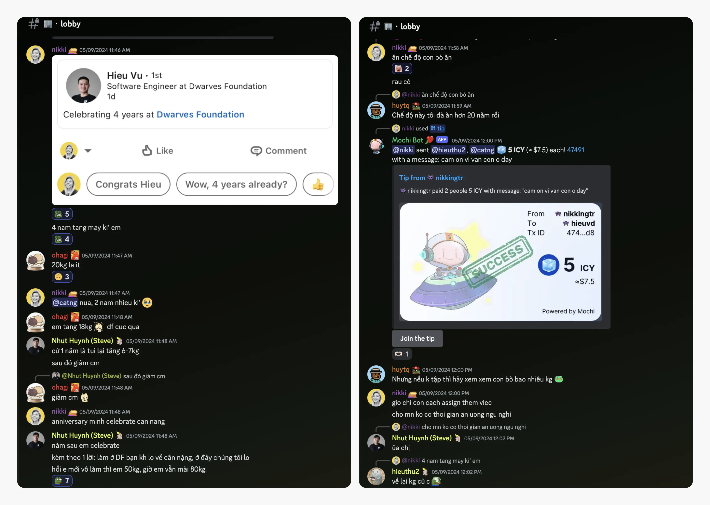
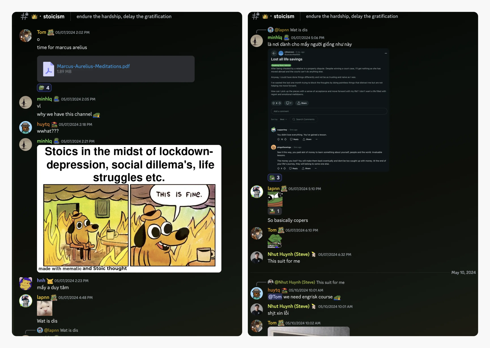
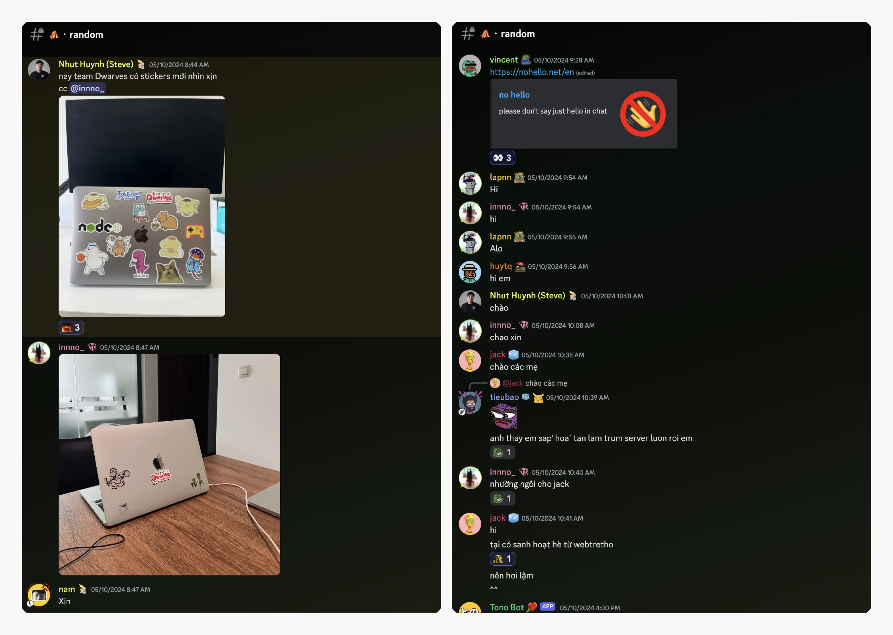
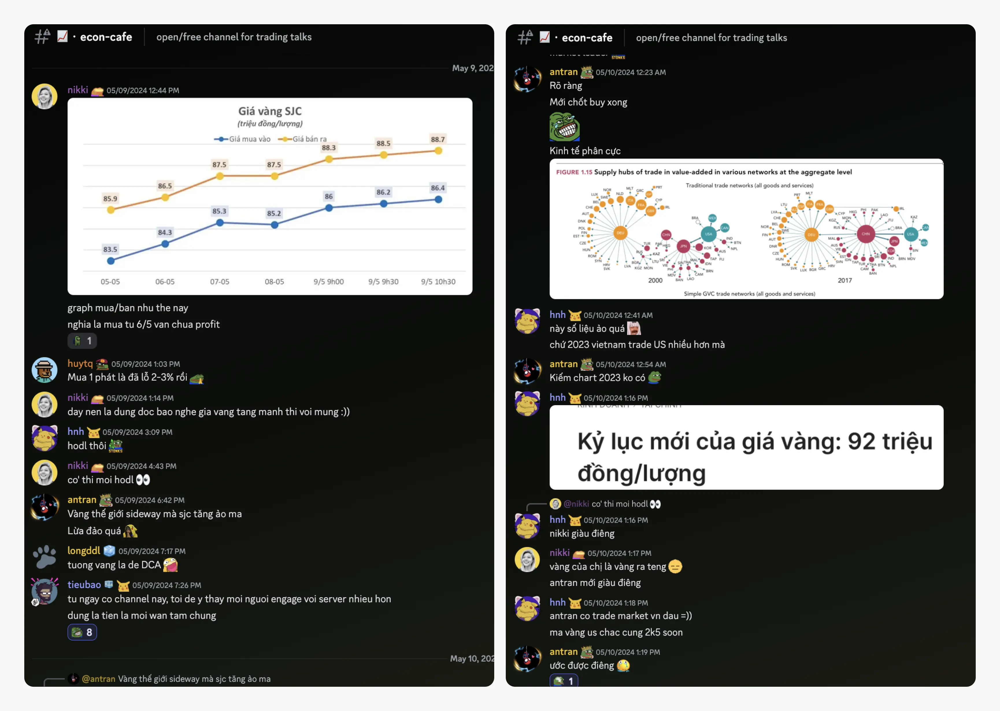
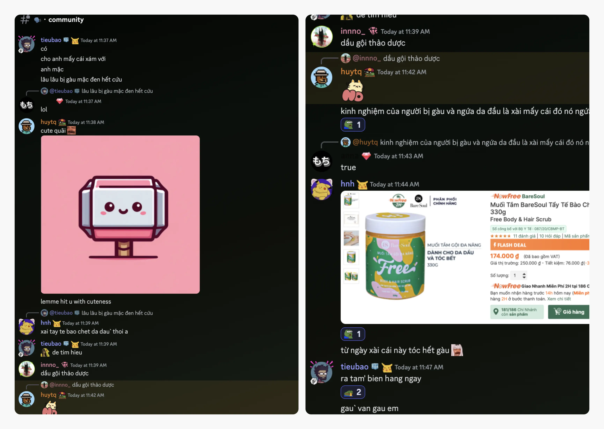

---
tags:
  - weekly-digest
  - discord
  - community
  - team
title: "#5 Endure the hardship, delay the gratification"
date: 2024-05-14
description: "Happy Monday, I’m here again, bringing you a lot of updates. There are big and small things brewing at Dwarves network. As we keep on crafting a better community day by day with you."
authors:
  - innno_
---

Greetings from Saigon, I’m here again, bringing you a lot of updates. There are big and small things brewing at Dwarves network. As we keep on crafting a better community day by day with you. 

And tiny but mighty ones, like new merchandise, are in progress. Let’s get through what’s new! 

### Heading to Echelon X Asia Summit 2024
This May 15-16, our leaders @tieubao, @nikki, and @huytq are gearing up for an exciting adventure at Echelon X, the largest startup summit in Southeast Asia.

Echelon X is an annual tech business conference that gathers inspiring startups and ecosystem players from Southeast Asia and beyond. Get ready to make some waves because Dwarves is about to leave its mark at Echelon X Asia Summit 2024.

### New Merchandise Alert
Last week, the operations team gathered all your awesome input on the design for the t-shirt. Rest assured, every suggestion has been noted, and soon you'll get the chance to vote on the final design. 

The preparation is in progress, and we're thrilled about how it's shaping up.  Cool new gear is on the way, so keep an eye out for the big reveal and happy voting.

### Dwarfing It Up: OGIF (Oh God It's Friday) Tradition
Every Friday afternoon, all members are warmly welcomed to join us on Discord for Dwarves’ casual showcases, taking place weekly at 5 PM. Simply come and hear the people to share their work. We don't want anyone to feel pressured, though. 

All OGIF sessions are recorded. Thank you, Tom for the support. [Click here](https://memo.d.foundation/changelog/3-ogif-office-hours-0419/) if you missed the sessions.

### Cheers to another year on deck
Last Thursday was a blast as we gathered around to celebrate @hieuvd's 4th working anniversary at Dwarves. Let's raise a virtual toast to Hieu for his unwavering dedication in working. Keep shining bright like a diamond, Dwarves fam.

Oh, and speaking of time flying by, here's a quirky tidbit for you: did you know time actually comes with its own weight? Who knew that along with deadlines, we're also carrying around some extra ounces of time on our shoulders? Time to hit the gym, folks.

### Endure the hardship, delay the gratification
One of our endless inspirations behind every channel we created is you. We’ve created the brand-spankin'-new channel **👑・stoicism.** Because who doesn't need a little more stoic wisdom in their lives, am I right?

A while back, I randomly saw this topic on Reddit:

>
> "The ability to discipline yourself to delay gratification in the short term in order to enjoy greater rewards in the long term, is the indispensable prerequisite for achievement."

Who knew stoicism could be so... deliciously rewarding? Catch you on the flip side, wise wanderers.

### Sticker mania: say it with style and Don't just say hello
OK, we hear you, discord crew, who's ready to jazz up their chats with some adorable stickers? The team responded very enthusiastically to the new sticker set. You can snag 'em for yourself at the Hado office, ping @innno for help.

We might use the "Hello" sticker as our default greeting, but why stop there when you can sprinkle a little extra pizzazz on your messages? @vincent has sparked that idea up. Throw in a virtual high-five, a fist bump, or maybe even a funny emoji (because why not?).

### Wall Street wisdom with our COO
Ready to dive into the exciting world of economics and stock trading? Then look no further than our bustling 📈・**econ-cafe** channel, where the discussions are as lively as the stock market itself.

Need advice on market trends, stock picks, or the latest in gold trading? You're in luck. Our very own COO @nikki, is here to drop some serious knowledge bombs and guide you through the maze of financial jargon. Seriously, who needs Wall Street when you've got Nikki in your corner, right?

### CEO SOS: hair help
So, here's the burning question: got any tips, tricks, or magical potions to banish dandruff? Yep, you heard it right. Our CEO @baddeed has been pondering the age-old dilemma of scalp issues. 

We've already had some stellar suggestions roll in. But hey, the more, the merrier. Share your go-to remedies, maybe even some weird hacks if you've got 'em to have our CEO sporting the lushest locks in the biz.

And that’s all for this week's digest, folks. It's my joy building the weekly digest with you - our community members.

I’m here to record the most of every moment, this summer and beyond. Hope you’re enjoying the warmer days - and remember: don’t let anyone [steal your sunshine](https://www.youtube.com/watch?v=E1fzJ_AYajA).