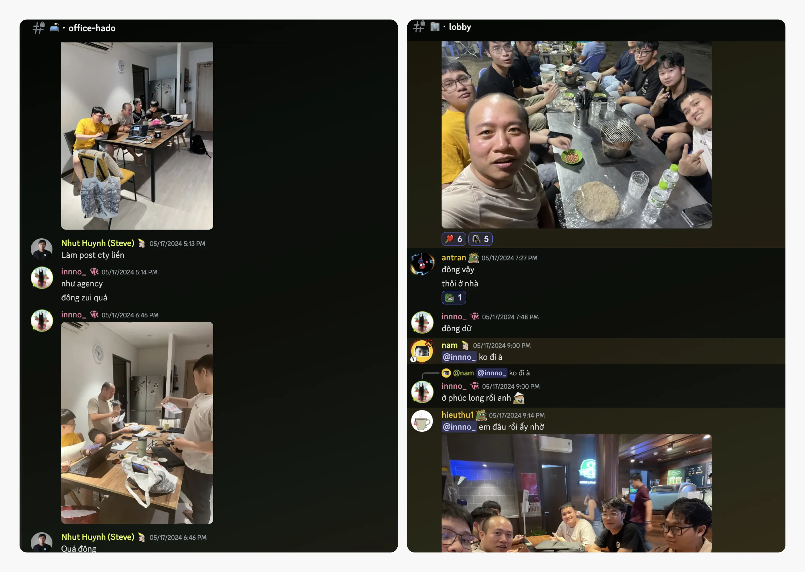

---
tags:
  - weekly-digest
  - discord
  - community
  - team
title: "#6 Come for the conversation, stay for the culture"
date: 2024-05-23
description: "Hi, it’s @innno again. Summer is almost here. But don't worry, this update is all about making your day more comfortable. Now, onto this week’s updates."
authors:
  - innno_
menu: changelog
type: digest
hide_frontmatter: false
pinned: true
hide_title: false
---

Hi, it’s @innno_ again. Summer is almost here. But don't worry, this update is all about making your day more comfortable. Now, onto this week’s updates.

### Get Ready for the Community Meet-Up Extravaganza
Mark your calendars. On Friday 31st May, we’re hosting an offline community meet-up in Ho Chi Minh City. It’s a blend of news, tech topics, food, drinks, and good times – all rolled into one epic event.

Local crew, you know the drill. Out-of-towners, hit up the ⁠🎫・**support-ticket** channel and the ops team will sort you out.

Check out the announcement in **[🚨・red-alert](https://discord.com/channels/462663954813157376/915941020968046612/1239841583843639348)**. Hope to see all of you there.

### ICY Distribution: What We've Got Cooking?
As announced, there are some exciting changes to the team's ICY distribution. We’re adding more activities and more chances to rack up those sweet ICY rewards for everyone.

But wait, there's more. In a heartwarming twist, the team is spreading the love to the tiniest members of our community. That's right, folks – newborn babies are now eligible for a whopping 100 ICY.

Head on over to **[🧊・earn-icy](https://discord.com/channels/462663954813157376/1006198672486309908/1239502938918096960)** for all the deets on this exciting new chapter in ICY distribution.

### Friday Vibes: Let's Unwind and Celebrate
Last week’s OGIF was a real treat, featuring topics like the Factory Pattern, State Machines in Erlang, and the Trading Process. The highlight? @quang on blowing everyone away with his trading prowess. His insights were so impressive that everyone joked about sending him their money to invest. 

In other exciting news, we've had some changes in our operations structure. @hnh has been promoted to the position of Chief of Staff, and @minh_cloud is now our Junior Product Manager and Executive Assistant. Congratulations to both of you.

### Hado Office Buzz: The More, the Merrier
Things are buzzing at HadoHQ these days. We've got a full house with our Saigon regulars @hieuthu1, @innno_, and @vincent holding down the fort, and @taipham gracing us with his presence more often. It's like a family reunion every month.

Last Friday was no exception, with the crew joined by the legendary @thanh.pham, @datpv, @hieuvd and the new intern @datnguyennnx. What a lineup!

It was a well-deserved Friday night feast, enjoying OGIF, grabbing some food and drinks together. Check out those smiles and [good times here and better down the road.](https://www.youtube.com/watch?v=CqOZtLy4tFA)

### Wedding Bells and Roadtrip Thrills
Love is in the air as @lap kicks off the wedding of the year. Huge congratulations to Lap. Speaking of adventures, @vincent's got the travel bug and is curious about Ninh Thuan province. Any hidden gems we should share? @hnh's already got the wheels turning with a Sunday morning road trip suggestion. 

Sounds like an adventure waiting to happen. Who's in?

### Beware of Cyber Bandits
Last Friday night, our very own @nam had an unwelcome surprise—his credit card got hacked, resulting in a loss of 5 million VND. Ouch! While that's no small amount, let's take this as a friendly reminder to all of us to double-check those links before we click and keep a close eye on our bank accounts. Stay sharp, everyone.

### GPT-4o is Now Rolling Out, and Discussions Heating Up
OpenAI's GPT-4o is impressing early adopters with its advanced abilities. Despite its initial release, GPT-4o excels at writing and error detection, boasting an average response time of 320 milliseconds. It even responds with an AI-generated voice, closely resembling human speech.

With its impressive functionality and performance, there might be more changes afoot in the future.

Those stories don't stop here.

As the seasons change and the rain sets in Saigon, here’s to making small moments on Discord a little easier - and more fun.

We’ll see you around on our [server](https://discord.gg/dwarvesv).
