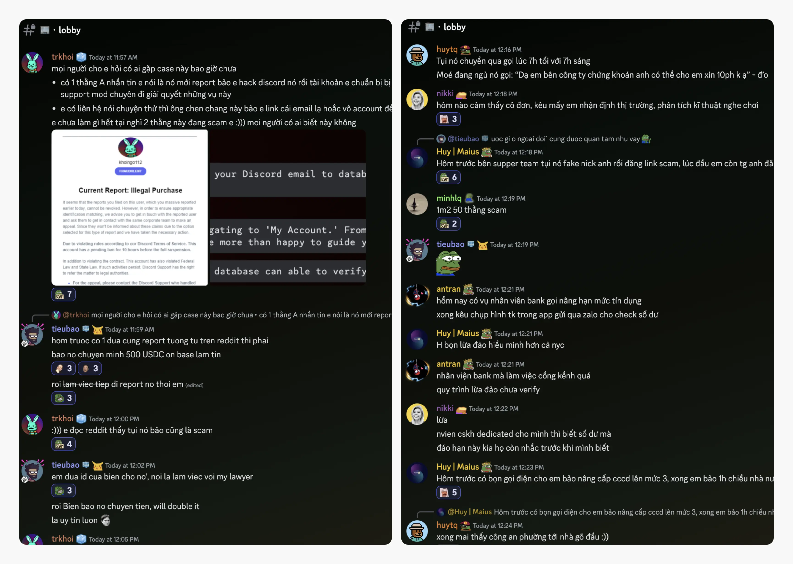
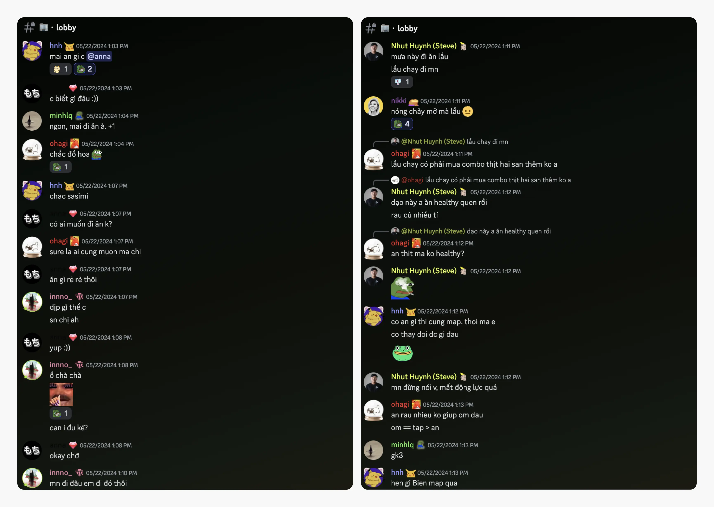
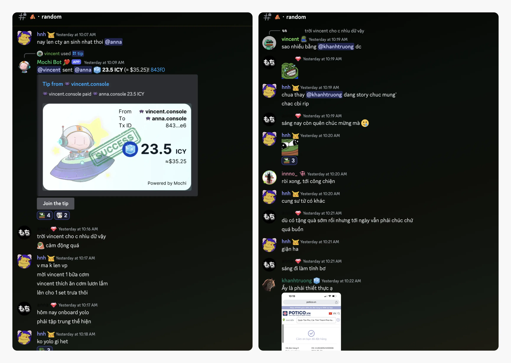
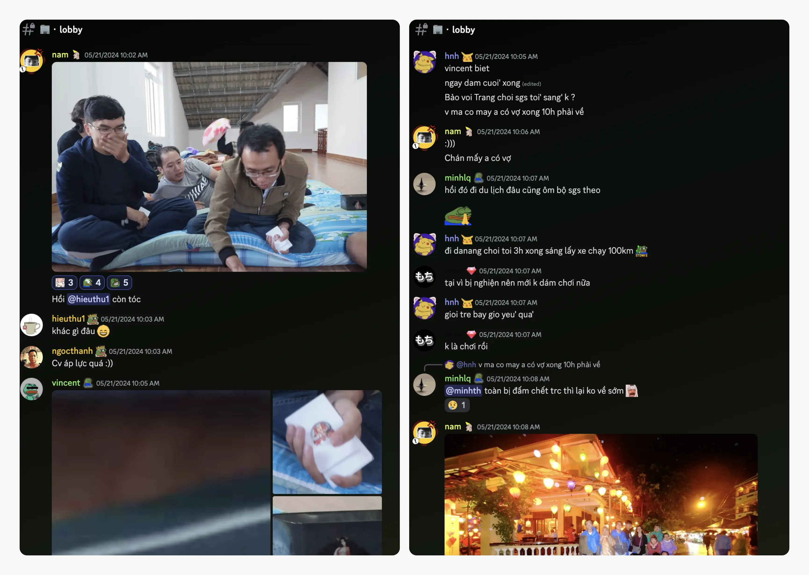
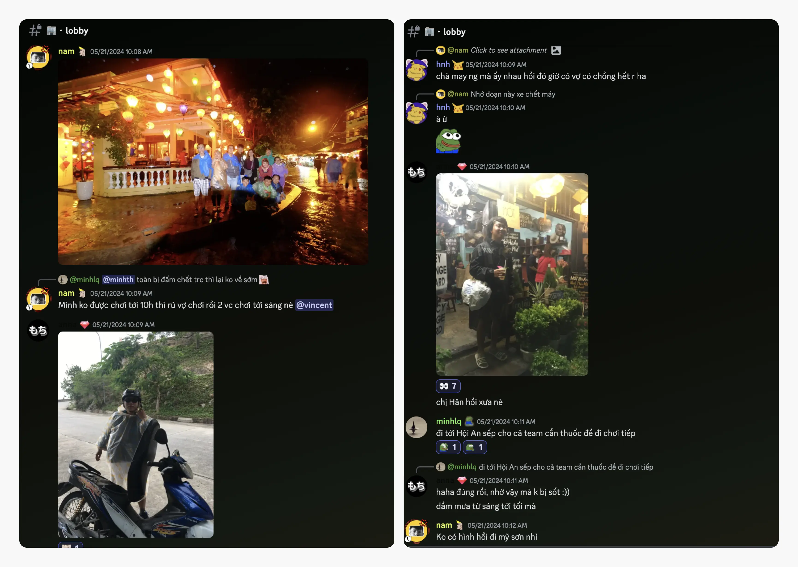
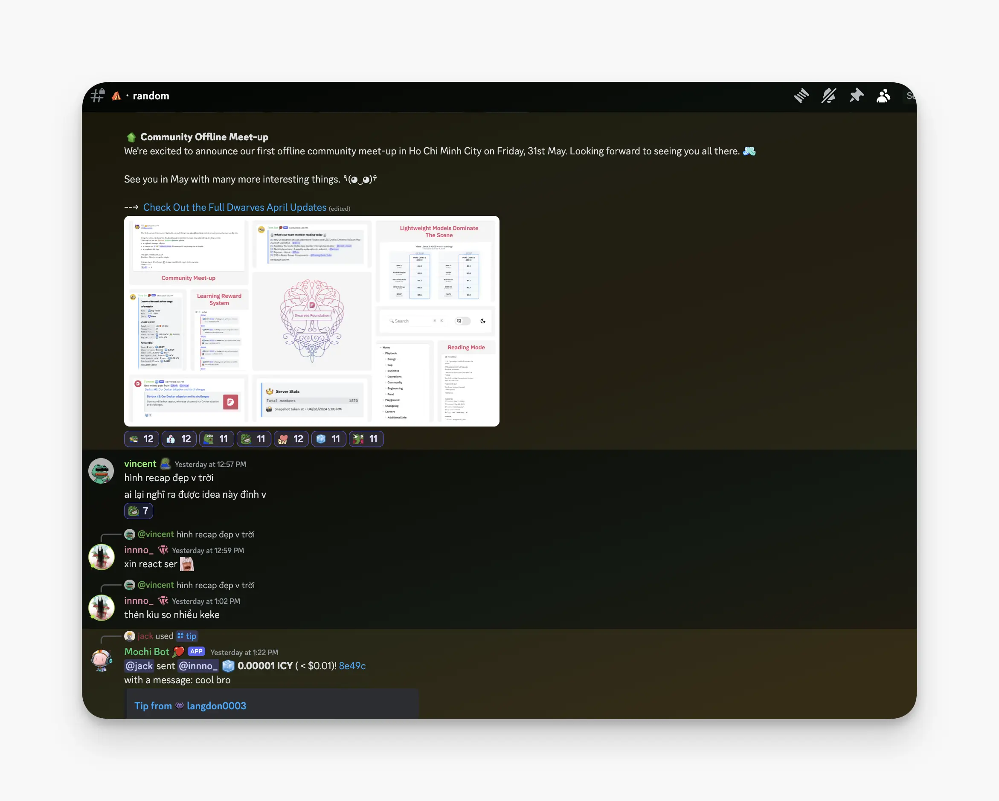
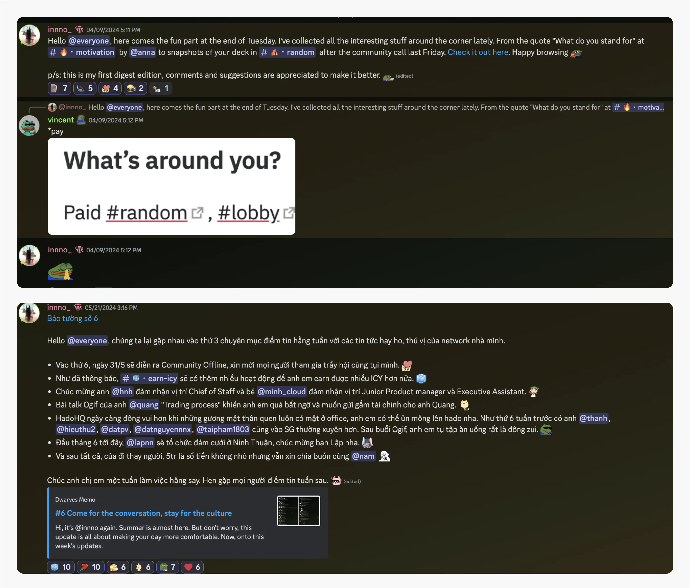

---
tags:
  - weekly-digest
  - discord
  - community
  - team
title: "#7 A Journey Through Time"
date: 2024-05-25
description: "The sun peeks over the horizon, Saturday vibes and good news – the perfect combo. We're about to spice up your weekend with a recap of all the awesome things we whipped up this week."
authors:
  - innno_
menu: playground
type: digest
hide_frontmatter: false
pinned: true
hide_title: false
---

The sun peeks over the horizon, Saturday vibes and good news – the perfect combo. We're about to spice up your weekend with a recap of all the awesome things we whipped up this week.

### Get your geek on: free GitHub Copilot with Open-Source fun
Did you know that contributing to open-source projects on GitHub can earn you a free subscription to GitHub Copilot? @Tom shared this awesome tip with us. Even pull requests and contributions to public repositories count. It's worth checking your GitHub account to see if you already have free access to Copilot.

Open-source contributions help you learn and get access to tools like GitHub Copilot. Whether you're coding solo or collaborating, these resources can make your coding experience better. See how it can benefit you, who knows? Happy coding.

### Discord drama: scams, spammers
@trkhoi brought up a wild situation in the 🏢・lobby. He was accused of hacking Discord and threatened with a ban unless he contacted a fake Discord support "mod”. Classic scam alert.

But he's not alone - seems like everyone's got a story to share. Others reported similar shady encounters, and the plot thickened when we realized many of us have been getting spam calls from telesales lately. Our COO @nikki chimed in with a gem quote.  

Above all, stay smart, stay vigilant, and stay safe out there.

### Cheer to your awesome birthday @anna
Happy birthday to @anna, our amazing designer. The team's been cracking jokes and sharing more happy stories than ever – it's like a never-ending comedy show around here. Here's to you, my beloved sis Anh Tran – may your day be as fantastic as you are.

### A look back: cherishing our collective memories
As one of the newer members of our community, I might not have much to write about this part. Yet, every time I see the pictures the team shared at [🏢・lobby](https://discord.com/channels/462663954813157376/907727610417655898/1242114588863103047), a wave of nostalgia washes over me, filled with enthusiasm and a sense of freedom. 

These pictures show the fun times and amazing places the team has visited together. Every snapshot reminds us of our adventures and the great times we've had.

Keep those stories coming, folks. Each one weaves another vibrant thread into the rich tapestry of our community.

### Monthly community snapshot, now with more
Feast your eyes on this visual delight. Thanks to @vincent for the idea and @nambui for the design flair.

Introducing our new Monthly Community Snapshot, where you can catch up on all the important changes in just one quick glance. What do you think of this visual? We're all ears for your thoughts and feedback.

### Reflecting on our journey: celebrating two months of weekly digests
It's hard to believe it's been almost two months since our first weekly digest. Looking back, I remember feeling both nervous and a bit clumsy while crafting those initial updates.

But over time, as I kept a close eye on each channel, received valuable feedback from @tieubao and @nikki, and wrote and rewrote, my sense of writing grew. I’ve grown more confident in putting together these notes that you read.

I care about this weekly digest, and all of you, a tremendous amount.  I love this community, and I am so grateful you all hear me out every week.

Let's wrap this up with a cheer on top.

Anyway, I'm actively working on the next digest round-up, and it's about a super cool community. Stay tuned.

Onto today's post...