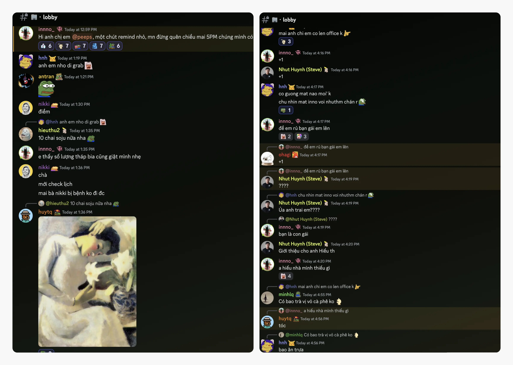
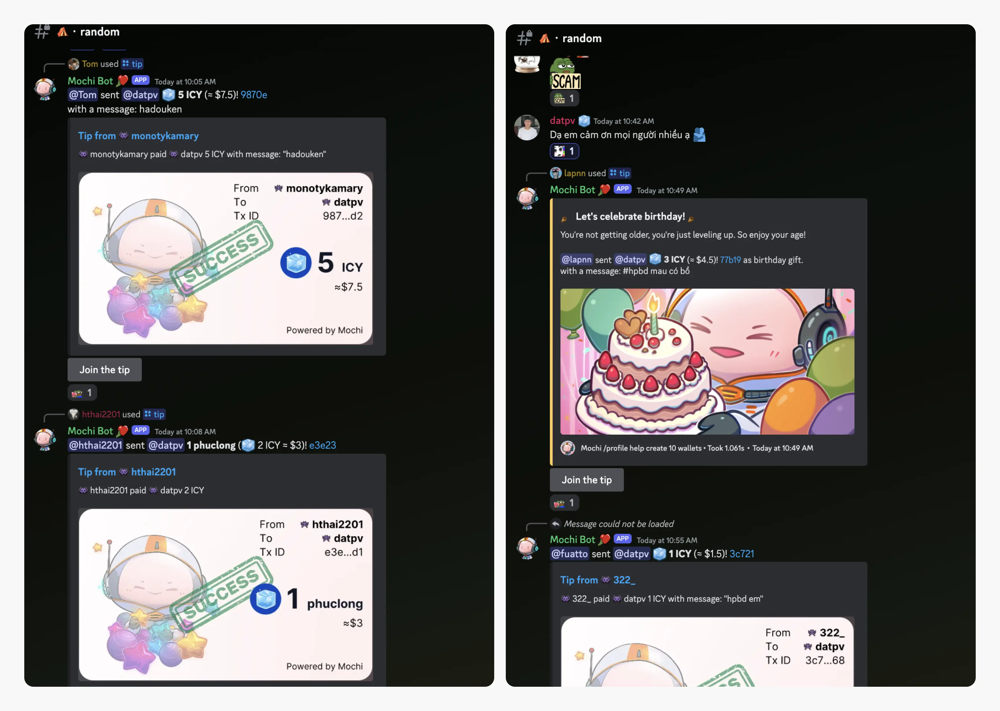
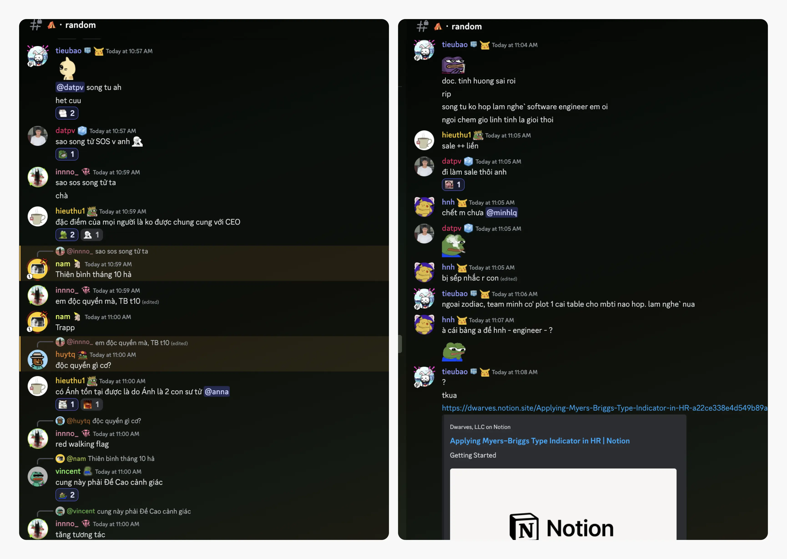
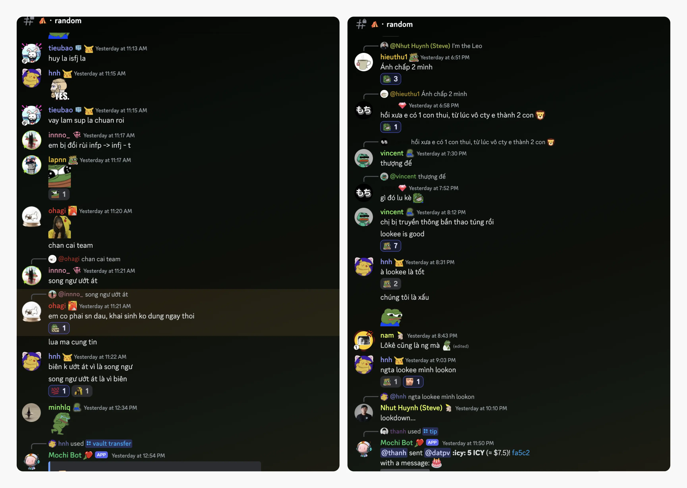
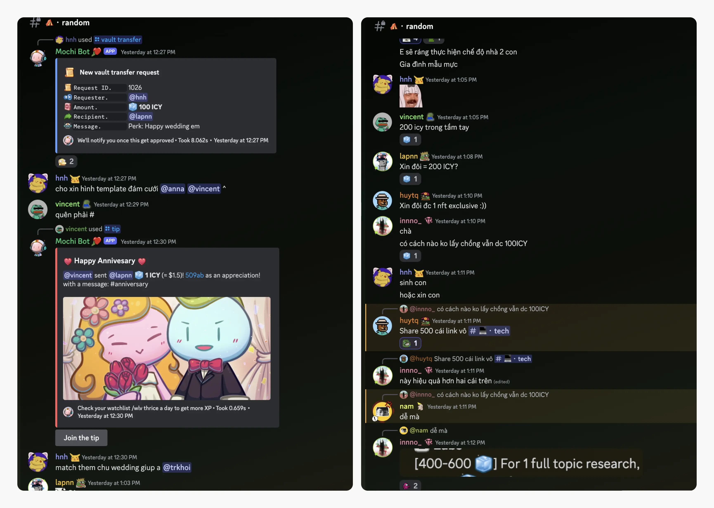
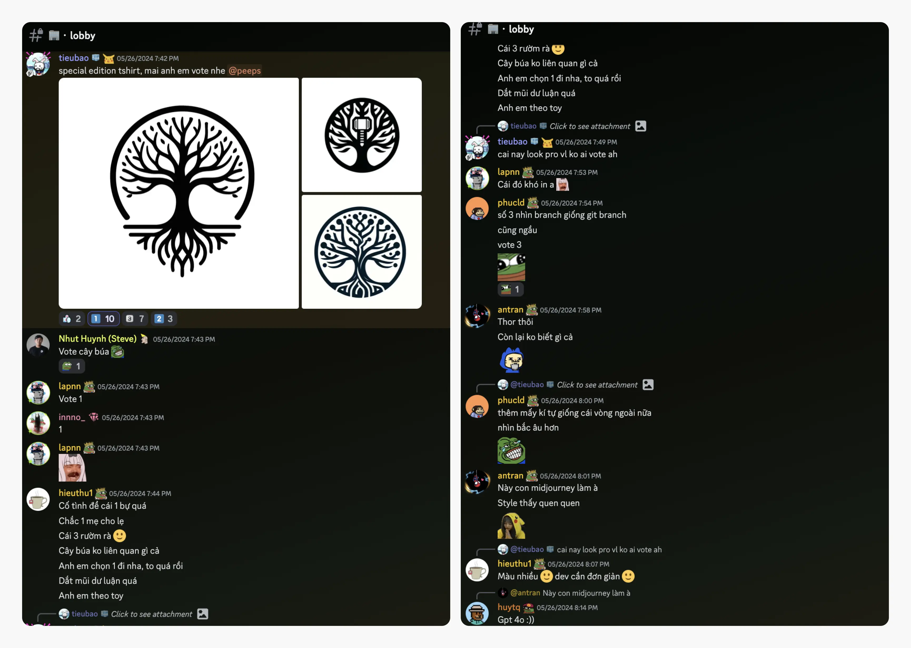
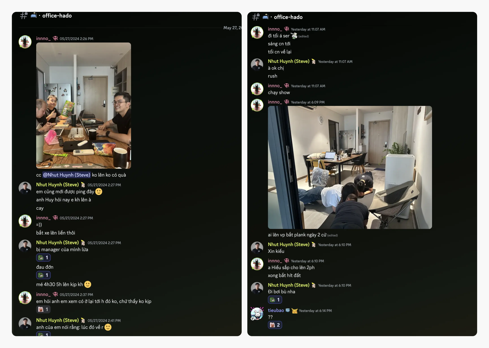
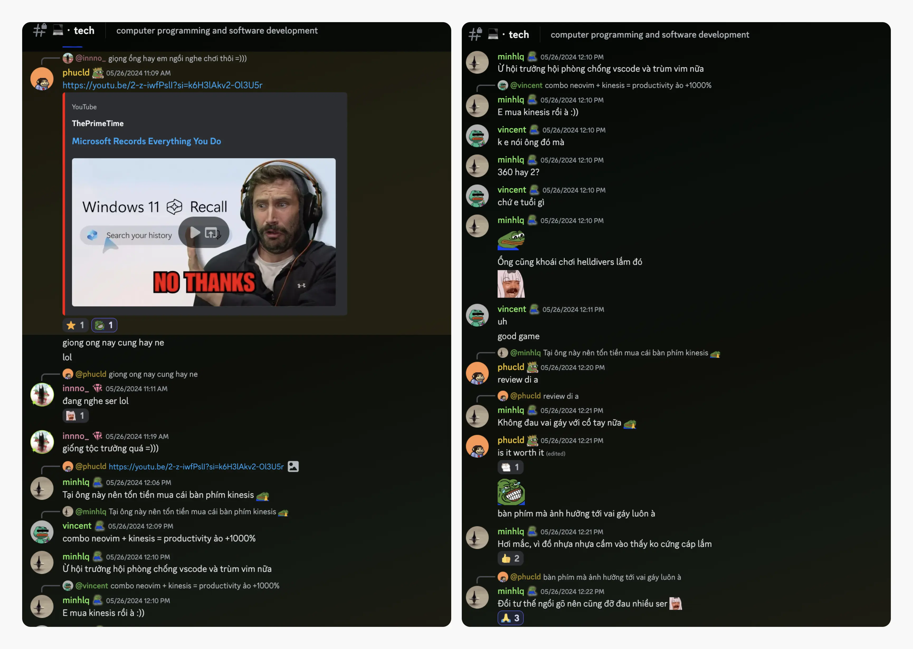

---
tags:
  - weekly-digest
  - meetup
  - community
  - team
title: "#8 Then came the last days of May"
date: 2024-05-31
description: "Here's to hoping for a brighter and better month on this last day of May. We’re in the heat of a community offline meet-up today, gathering to discuss the month’s progress. Everyone's a bit busy arranging their travel to Saigon, a wild place we all call home. So, let’s dive into what we’ve been up to."
authors:
  - innno_
---

Here's to hoping for a brighter and better month on this last day of May. We’re in the heat of a community offline meet-up today, gathering to discuss the month’s progress.

Everyone's a bit busy arranging their travel to Saigon, a wild place we all call home. So, let’s dive into what we’ve been up to.

### Get ready for our big meet-up
The big day is almost here. Our first community offline meet, originally set for April, has been rescheduled to give us more time to prepare.

We’re making sure members from Hanoi, Danang, and other provinces can all fly to Ho Chi Minh City for this event. It might take a bit longer, but I'm sure it'll be worth the wait.

And we’re finally gathering today. I really hope everyone feels comfortable opening up and getting involved. It's going to be a blast catching up with everyone. The more the merrier, right?

### Wishing the happiest birthday to @datpv
I wanted to take a moment to give a big happy birthday shoutout to our friend @datpv.

We're all so glad to have you here and we hope you have the best birthday ever. You always bring so much positivity and fun, and we appreciate everything you do. Have an awesome day filled with all your favorite things. Cheers to another fantastic year.

### Discovering your inner self: zodiac and MBTI
I couldn't help but notice that a lot of us in the community seem to be really interested in astrology and personality typing. I think it's fascinating how these things can say a lot about our traits, strengths, and even potential career paths. [See if you find any match here](https://www.notion.so/Applying-Myers-Briggs-Type-Indicator-in-HR-a22ce338e4d549b89ae8503252688957?pvs=21).

We've all had a laugh about the classic Libra @innno_ indecisiveness, Pisces @bienvh's dreaminess. And Leos? @anna brings that bold, confident energy wherever she goes. But beyond the jokes, there’s so much to learn about ourselves and each other.

Either way, we want everyone to feel celebrated for who they are.

### Yay, it’s wedding time
This Saturday morning, the fam is heading out to Ninh Thuan for Lap's wedding, set to take place this Sunday evening. Sounds like it's going to be a fun-filled weekend - everyone's getting there a day early to do some sightseeing, traveling, and food tours.

The last members will be joining in on Sunday morning. I bet you're all feeling pretty excited (and maybe a little busy) getting ready for the wedding.

Congratulations to the happy couple.

### Our new team t-shirts are coming soon
We've got some quick updates on our team's new t-shirt status. The printing process is in full swing, and very soon, we'll all be sporting our brand-new t-shirts featuring our fresh logo. Get ready to show off your team spirit, folks.

The choice was clear: among the various options, the vast majority of you preferred the logo with the simplest design. A big thank you to @anna for creating such a sleek and stylish design that truly represents us.

Keep an eye out, because soon we'll be stepping out in style as a unified team.

### Gifts from Korea and healthy moves at the HadoHQ
Last week, @huytq took an exciting trip to Korea and didn't come back empty-handed. He brought some gifts for the members. A huge thank you to @huytq for thinking of us and sharing these wonderful surprises.

Also, did you know that sitting too long can lead to back problems? To help us stay active, @hieuthu1 has introduced a couple of plank exercises. These quick routines are perfect for breaking up long hours at the desk.

A healthy team is a happy team.

### Uniting through shared interests
You know, there's something magical about bringing people together around what they love. It might seem simple, but there's actually a lot of thought that goes into it.

Like, someone might join a group because they're into a specific anime, but they might not be into another one. That's where having different servers or "guilds" on our Discord comes in handy. It lets people find their little communities within the bigger one.

This way, everyone can find their perfect fit and connect with others who share their interests. What do you think - do you have any ideas for how we could do an even better job at it?

There’s a fun road ahead to building a better community. [Bye bye bye](https://www.youtube.com/watch?v=Eo-KmOd3i7s), May.

Hope you have a lucky June ahead. We’d be happy to expand this server with like-minded people.

On vous verra sur l’Internet!