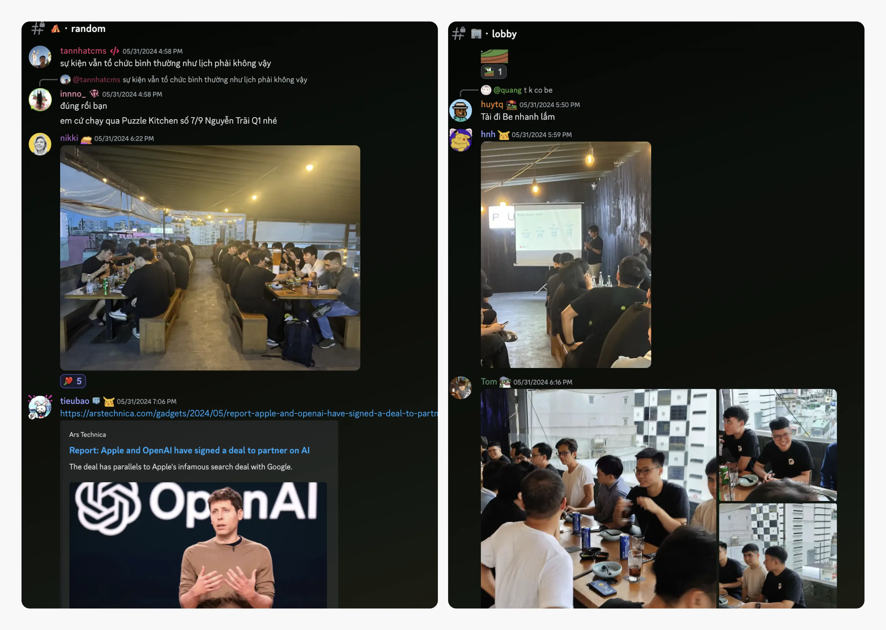
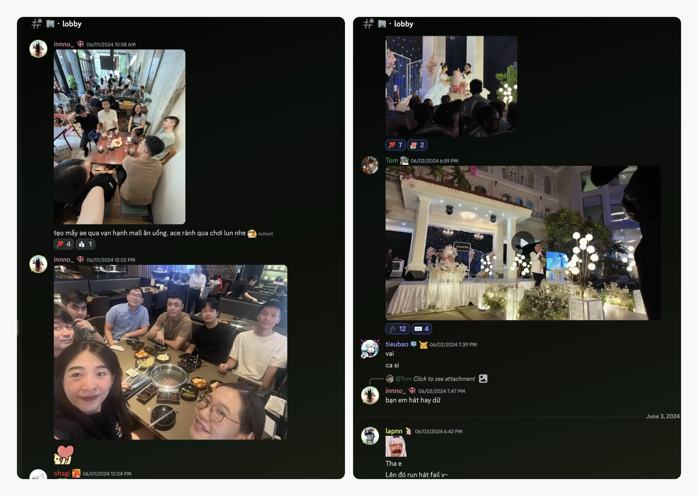
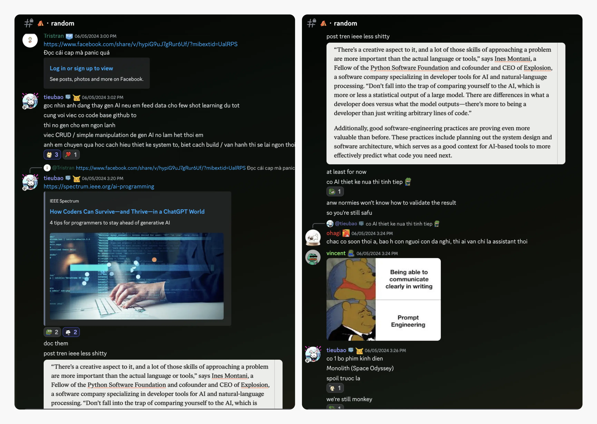
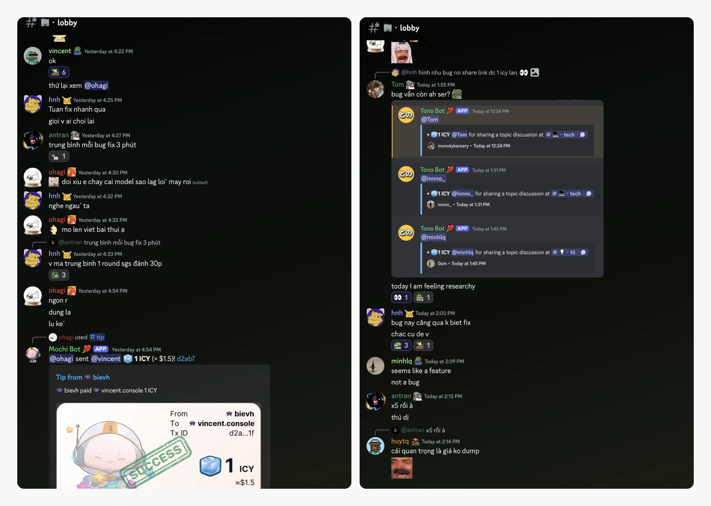
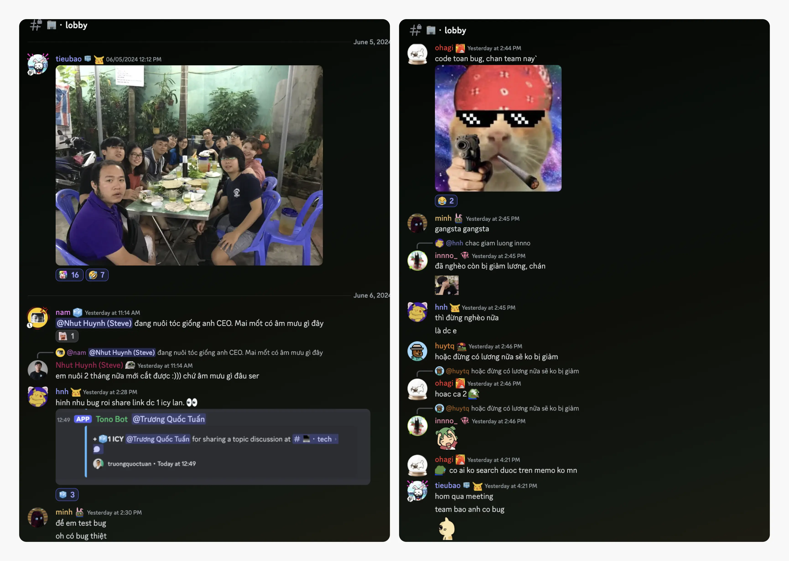
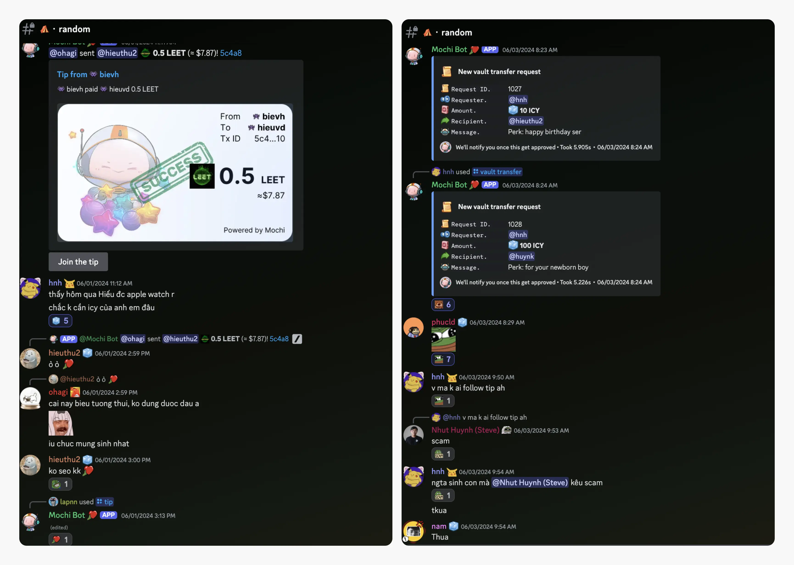

---
tags:
  - weekly-digest
  - meetup
  - community
  - team
title: "#9 A little more speed for summer"
date: 2024-06-08
description: "How quickly the first half of the year speeds up before it slows down. It’s really the second half of 2024 already. Time flies when you're having a blast. Get ready to rewind and relive some of the awesome highlights from the last week, get pumped for the epic things we'll do together before this year is over."
authors:
  - innno_
menu: playground
type: digest
hide_frontmatter: false
pinned: true
hide_title: false
---

How quickly the first half of the year speeds up before it slows down. It’s really the second half of 2024 already. Time flies when you're having a blast. 

Get ready to rewind and relive some of the awesome highlights from the last week, get pumped for the epic things we'll do together before this year is over.  

### What a meet-up, a huge thank you
Big thanks to all who joined our community meet-up last Friday. Even with the rainy weather and long trips from the north, you all showed up and made it a truly unforgettable event.

The energy was incredible, and we couldn't have asked for a better turnout. Let's keep this vibe going strong and get pumped for more fun times ahead. We really appreciate you sticking with us all the way.

### Friendship blooms as we connect and celebrate
After our Friday night meet-up, the excitement persisted. We organized additional activities for those who traveled a long way to join us. Saturday morning we enjoyed lively conversations and laughter at a café before savoring a tasty BBQ. Thanks @haongo1, @anna, @bienvh, @taipham, @thangnt, @hnh, and @minhth for spending your time.

Meanwhile, another group set off for Ninh Thuan to celebrate @lapnguyen's wedding. It's been a week brimming with adventure and camaraderie.

### Thought on the future of software engineering
@tristran shared an article expressing concerns about GenAI's impact on software engineering careers. The article highlighted Microsoft's partnership with Cognition to deploy Software Engineer AI to Azure and the mixed reactions from developers about the world's first AI software engineer, Devin.

@tieubao responded with his perspective on GenAI, offering a more optimistic view:

"In my opinion, if you provide GenAI with enough data and a solid GitHub code base, it can effectively assist you. By letting GenAI handle basic tasks like CRUD operations, developers can focus on mastering complex system design and effective implementation. This shift allows for greater skill development and a promising future in software engineering."

What do you think? How do you see GenAI impacting your career?

You can check out the link @tieubao mentioned for more insights: [AI Programming](https://spectrum.ieee.org/ai-programming).

### More on the engage to earn
Just wanted to drop some cool news your way. We've just updated the rewards in the **💻・tech** channel. Now, every tech link you share will earn you 1 ICY. You won't believe it—some folks thought this was a glitch at first.

We do this to encourage everyone to learn new things, engage with the team, and make sharing even more worthwhile. There are multiple activities going on, and everyone is welcome to join hands. Who knows, you might just become our next ICY millionaire.

### Unique celebrations for special moments
Blast off into another year @hieuthu2. Congrats on unlocking another year of life. Hope your new age is filled with epic loot drops, lovely gift from your girlfriend, super rare achievements, and a health bar filled to the max. 

Welcome to the Storybook Start. Congratulations on the arrival of your little hero @huynk. May your little one level up quickly, with plenty of sleep boosts and diaper loot. Here’s to joyful quests and magical moments ahead.

Wish we could hit rewind and relive [yesterday once more](https://www.youtube.com/watch?v=Aa9YmR8SdeA). Those moments with me and the team were truly special, filled with laughter and joy that we all cherish.

P.S. If you’re feeling nostalgic or just want to catch up on what you might have missed, you can find highlights from our previous edition [right here](https://memo.d.foundation/playground/digest/8-then-came-the-last-days-of-may/). 

Until next time.