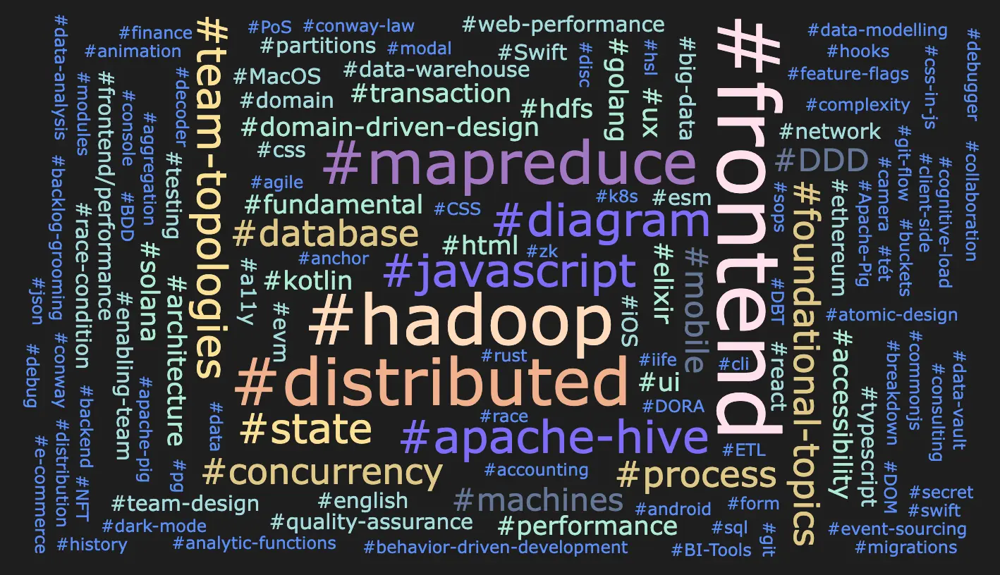
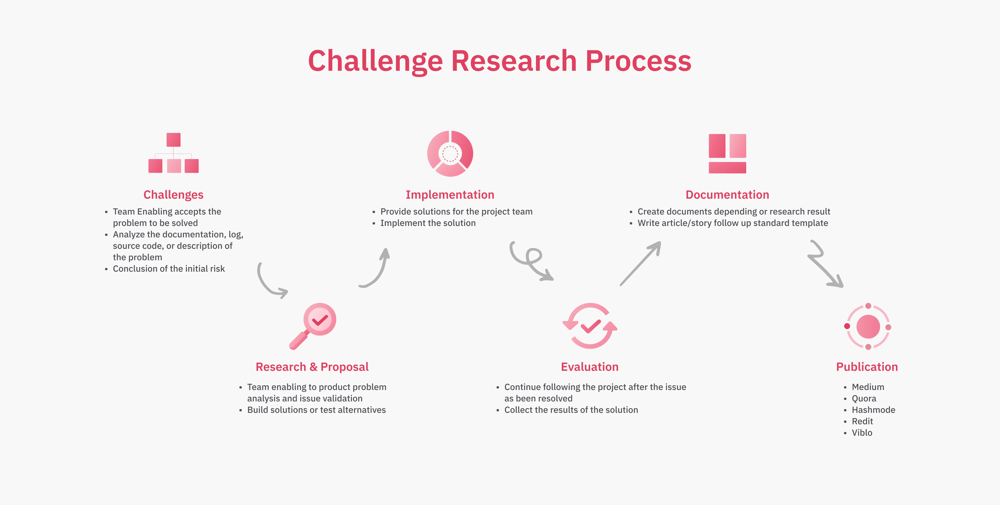

## What is Learning at Dwarves?
>
> At Dwarves Foundation, we believe that learning is one of the most important aspects of any organization. We also believe in creating a culture that fosters learning and innovation.

We want to demonstrate and encourage individual and organizational learning, where both gaining and sharing knowledge is prioritized, valued, and rewarded. Learning is an ongoing process that never ends in our fast-moving industry. The concept of continued learning at Dwarves Foundation has become synonymous with having a growth mindset ,  a belief in your own ability to change or grow through experience or study.

To grow as professionals, so we have built an environment where people feel comfortable asking questions and admitting they don't know everything. We encourage people to seek out opportunities outside their normal day-to-day work, whether that means attending conferences or taking on new projects with other departments within the company.

Not only that, but we also believe that every employee has something to teach others, whether it is through formal instruction or simply by helping others with their work. We are committed to providing the tools, education, and training needed for all employees to be successful in their roles. In addition, we organize many events and activities for our people to express their ideas, share their knowledge, and learn with others:

1. **Monday's radio talk**: a weekly show where people can share their thoughts on a given topic and hear what others have to say as well.
1. **Friday's showcase**: a weekly presentation where people can share what they've been working on lately with the rest of the company.
1. **Brainery**: a collection of learning pieces where we want to build up the 1% improvement habit of learning in public.
1. **R&D Topics**: our hub for research and development to tackle common challenges and an environment to foster continuous improvement and learning.
1. **Dwarves Rewind**: a curated list of trending and starred topics from our Discord and news list reviewing industry changes over every week.

## Brainery

### Inception and Growth

We’ve refreshed and reorganized our Brainery since the start of August 2021 in an effort to involve our company and community members in sharing knowledge.

We were surprised to see that our knowledge graph has grown into something substantial, and we’re excited to see what everyone will be learning in 2023.

### Trending Tags

A summary of some trending tags we see in our Brainery. These tags represent what things our contributors are actively thinking about and researching.

Our company, as well as the industry, is very frontend heavy, so it’s refreshing to see that frontend still has a strong place in our learning endeavors. We’ve been able to hear voices from our backend engineers, our data team, and definitely our community members.

### Newest Contributors

We collect a list of new contributors, those who have contributed knowledge for the first time in our Brainery. A shout-out to **[Thanh Le](https://github.com/thanhlmm)**, who has not only contributed to our second brain, but also contributed to a [Radio Talk Discussion with our team](https://www.youtube.com/watch?v=z37-ZS7cKJ0).

**Discord Contributors**

* **antran**: [202210150019 - Migration Planning](https://brain.d.foundation/%CE%A9+Fleeting+notes/202210150019+-+Migration+Planning)
* **haongo**: [202211141513 - Materialized View Pattern](https://brain.d.foundation/%CE%A9+Fleeting+notes/202211141513+-+Materialized+View+Pattern)
* **hieuvd**: [202211141287 - Go JSON Parsing](https://brain.d.foundation/%CE%A9+Fleeting+notes/202211141287+-+Go+JSON+Parsing)
* **hollow**: [202210162154 - The Best of CSS TLDR](https://brain.d.foundation/%CE%A9+Fleeting+notes/202210162154+-+The+Best+of+CSS+TLDR)

**GitHub Contributors**

* **[chinhld12](https://github.com/chinhld12)**: [Singleton Design Pattern in Javascript](https://brain.d.foundation/Engineering/Frontend/Singleton+Design+Pattern+in+Javascript)
* **[cnhhoang850](https://github.com/cnhhoang850)**: [What Screens Want](https://brain.d.foundation/Design/What+Screens+Want)
* **[huytieu](https://github.com/huytieu)**: [DiSC Personality Types in teamwork](https://brain.d.foundation/Communication/DiSC+Personality+Types+in+team+work)
* **[knguyenuit](https://github.com/knguyenuit)**: [Stateless and Stateful Widgets in Flutter](https://brain.d.foundation/Engineering/Mobile/Stateless+and+Stateful+Widgets+in+Flutter)
* **[leduyhien152](https://github.com/leduyhien152)**: [Liquidity pool](https://brain.d.foundation/Blockchain/Liquidity+pool)
* **[mirageruler](https://github.com/mirageruler)**: [Unexpected pitfalls and some handy patterns with concurrency in Go](https://brain.d.foundation/Engineering/Backend/Unexpected+pitfalls+and+some+handy+patterns+with+concurrency+in+Go)
* **[nguyennh4522](https://github.com/nguyennh4522)**: [Kubeseal & Sops](https://brain.d.foundation/Engineering/DevOps/Kubeseal+%26+Sops)
* **[nnhuyhoang](https://github.com/nnhuyhoang)**: [Full-text search with Postgresql](https://brain.d.foundation/Engineering/Full-text+search+with+Postgresql)
* **[pthung1311](https://github.com/pthung1311)**: [Data race and race condition](https://brain.d.foundation/Engineering/Mobile/Data+race+and+race+condition)
* **[thanhlmm](https://github.com/thanhlmm)**: [Prevent Layout Thrashing](https://brain.d.foundation/Engineering/Frontend/Prevent+Layout+Thrashing)
* **[tienan92it](https://github.com/tienan92it)**: [CSS Container Queries](https://brain.d.foundation/Engineering/Frontend/CSS+Container+Queries)
* **[trkhoi](https://github.com/trkhoi)**: [Software Quality Assurance](https://brain.d.foundation/Engineering/Software+Quality+Assurance)
* **[truong-dwarvesv](https://github.com/truong-dwarvesv)**: [Scale up Application using Jetpack Navigation](https://brain.d.foundation/Engineering/Mobile/Scale+up+Application+using+Jetpack+Navigation)
* **[yyyyaaa](https://github.com/yyyyaaa)**: [Mitigate blocking the main thread](https://brain.d.foundation/Engineering/Frontend/Mitigate+blocking+the+main+thread)

## R&D Topics and Challenges

Research and Development (R&D) came about as a collective department for solving common problems we faced across all of our projects. As an innovative software firm, we found that the foundations surrounding innovative software were also vital to realizing their prospects.

Below are some of the common problems we’ve begun more critical research and exploration on:

### Common problems

* ***Locate on Web and Mobile:*** Have you considered making your application available in various languages, currencies, timezones, etc., to users across the globe? You can boost revenue with this method. With the help of the following research, development, and other efforts, we are currently attempting to present this engine to you as the Common Challenge solution.
* ***Query Database 500M Records, Filter Multiple Table:*** If a day, our database contained 500 million records and despite our customers having to wait five minutes, they were still unable to complete a transaction. How would you approach this difficulty if you were a business owner? We are here to help you find a solution.
* ***Database Connection Concurrency:*** As a Software Engineer, I'm sure you're aware that when working at the Backend level, we must manage any transactions that occur between our services and the database. Sure, have you considered how we can implement it effectively if you need to interact with more than one entity at the same time?

This year, we’ve completed one of our challenges, **Feature Flags**. This was a concern spanning across our DevOps, Management, and Engineering domains. We’re proud to list it as one of our completed challenges:

### Completed challenges

**Feature flags:** Options to enable/disable a feature in the application to help developers have a good experience and improve performance in the development process. We have discovered 3 solutions to resolve this challenge. With a wide range of solutions, we have the ability to serve any usage and project in development life.

* **Solutions and articles:**
* [https://viblo.asia/p/feature-toggle-BQyJK33QJMe#_introduction-0](https://viblo.asia/p/feature-toggle-BQyJK33QJMe#_introduction-0)
* [https://dwarvesf.hashnode.dev/common-challenges-feature-flag](https://dwarvesf.hashnode.dev/common-challenges-feature-flag)
* [https://medium.com/dwarves-foundation/design-a-feature-flag-system-7986b4a080cc](https://medium.com/dwarves-foundation/design-a-feature-flag-system-7986b4a080cc)

### Newest challenges

Here are some of the new topics we’ve added this year that we believe will be pressing challenges we will face very soon:

1. Design an On-Ramp and Off-ramp p2p system for cryptocurrency
1. Design system for layer 2 using ZK rollup
1. Design system for indexing data on-chain
1. Design multisign wallet support for all blockchain

### Keywords for upcoming challenges

Here are some of the keywords we’re on the watch for where we haven’t specified a problem statement but we expect will manifest challenges in the near future.

* zkEVM/zkVM
* Rollups
* Staking
* Ethereum Adoption

## Research Narratives

### Software Design Research Group

We’ve held our Software Design research group for just over a year. Many changes have happened, with Hoang Nguyen, our backend engineer, leading the group. We’ve had quite a lot of topics, some are, but not limited to:

* **Database Normalization** by Minh Luu. An inside look at normalization strategies in databases.
* **Event-sourcing** by Cuong Mai. A simplified but enterprise outlook on managing persistence.
* **Database Partitioning Design** by Hoang Nguyen. A look at vertical scalable practices for PostgreSQL.
* **Sharding Design** by Hieu Vu. A look at horizontally scalable practices for PostgreSQL through a demo on Citus.
* **HyperLogLog** by [Huy | Maius Pay#8518]. An algorithmic solution to a count-distinct problem.

### Closing December 2022

Right before New Year, we were able to finish off the year with some exciting topics:

* **CQRS MODELING**: We've just had an inside look at CQRS modeling and application refactoring presented by Cuong, one of our backend engineers. Domain Driven Design, Event Sourcing, and now CQRS were research topics undertaken by Cuong to understand enterprise-level design patterns better.

* **DOCUMENT DATABASE**: We've also got to see a demo from Khang, our backend engineer, demoing CRUD, indexing, aggregation and other features from a distributed instance of MongoDB for his research on document databases. Khang has gone into great detail of the inner workings of MongoDB and the nuances of a document database.

## Dwarves Rewind 2022

[Dwarves Rewind](https://www.linkedin.com/newsletters/dwarves-rewind-6963734647327375360/) is a reading list serving as a collection of news we aggregate weekly. Tech is a very high-paced industry, and rewind helps to serve as a curated list of trending and high-profile topics that everyone can look back on.

### Trending Topics

Some of our trending topics over the year caught our eye as we see the industry progress.

* **August:** Aptos and Sui Blockchain Platform
* **September:** Grafana Tokio Console Data Source
* **October:** Announcing TypeScript 4.9 Beta, Meta got bumped off world's top 20 companies' list, Tesla’s AI Day, Binance Becomes Second-largest Entity Of Uniswap
* **November:** Kobecon + CloudNativeCon 2022, .NET 7 release, Meta's New AI System 'Galactica
* **December:** Warner Music Group Joins Forces With Polygon, Starbucks Launched Web3 'Odyssey', Gate.io pledges $100M to revive the crypto industry.

### Hottest Topics

The hottest topics that shook the tech industry, from captivating and controversial products to groundbreaking AI, emerged from state-of-the-art tech.

* **August:** Stable Diffusion release, DALL-E release, Github Copilot release
* **September:** Apple Event - Far Out, Ethereum Mainnet Merge, iOS16, Adobe to buy Figma in $20 billion bid
* **October:** Next.js Conf 2022, Acquisition of Twitter by Elon Musk, macOS Ventura 13.0 release, Vercel announces Turbopack, Mass layoffs at Twitter and giant tech firms, Made by Google 2022: Google Pixel 7 & 7 Pros, Aptos Mainnet “Aptos Autumn.”
* **November:** Solana Breakpoint 2022, Github Codebase, GitHub Universe 2022, Introducing Notion AI, FTX Crashed, AWS re:Invent 2022, Schema by Figma 2022,
* **December:** ChatGPT, Orbit 1 NFT, Metaverse, Year in Review, Google in Search 2022

### Thoughts List

On most of our Dwarves Rewind, we list our thoughts and burning questions each week. Here are some of our favorite ones:

**#12:** For iOS 16, will you be able to restore or downgrade your device without losing data across versions? Ethereum will be different, but what does that mean to you?

**#15:** With the introduction of “Matter” standardized home devices, Tesla’s AI Day, how will these Matter devices and AI work together in our homes? What will the future of technology look like overall?

**#17:** All eyes on Aptos Mainet. While Ethereum has taken a major leap forward following ‘the merge’, challengers like Solana are making inroads with much faster transaction speeds. Do you think Aptos is likely to compete with ETH in the near future?

**#18:** What will be the fate of Twitter’s employees once Musk takes the reign?

**#19:** Meanwhile, some Twitter employees have expressed their desire to be laid off and get severance, and some are concerned that disagreeing with Musk means losing their jobs and packages. Does the fear of losing a job motivate employees to do better or make things worse?

**#20:** Since Hey, GitHub! is an experimental tool, it seems it could reduce the amount of interaction required with a mouse and keyboard. The good news is that at the moment, it's only available when coding within VSCode.

**#21:** Generative AI models are trained on copyright-protected data ,  is that legal? The question arises because of how generative AI systems are trained, and worked by identifying and replicating patterns in data, like most machine learning software.

**#22:** What other technologies will AWS feature during re:Invent 2022? A passwordless future integrates two thought-provoking concepts, making logins more dependent on your knowledge than your identity, and integrating a login across platforms. Can it work?

**#23:** It's refreshing to hear good news this crypto winter.

* With the issuance of Soulbound tokens, how will the involvement of Japan’s second-largest bank affect the crypto world?
* Web3 is gaining traction despite the crypto winter. What are the moving factors associated with the sudden rise in interest despite high pessimism?

**#24:** The last week has been abuzz with ChatGPT, for the non-technical friends, it was amazing to see the transcripts. Even though they knew it was an AI (with superhuman response times), they had natural conversations with it as if it were a human. The next step will maybe affect embedded systems. What are the possibilities for the future of AI in IoT?

**#25:** After FTX’s collapse, several cryptocurrency firms have been trying to show that they still hold onto their users' assets. Many people seek auditing companies to give their clients and potential investors third-party assurances.

**#26:** Remember when NFTs were cool and people thought their JPGs were worth millions? All this happened. The immersive internet is already here, in Web 3.0. How much deeper can we go, and how many more phases can we take?
