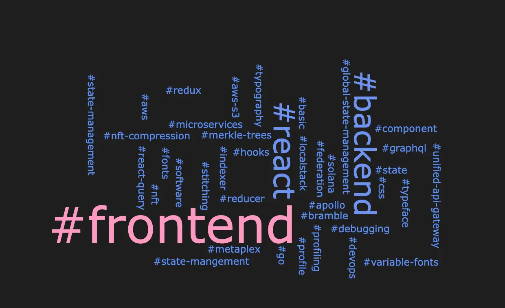
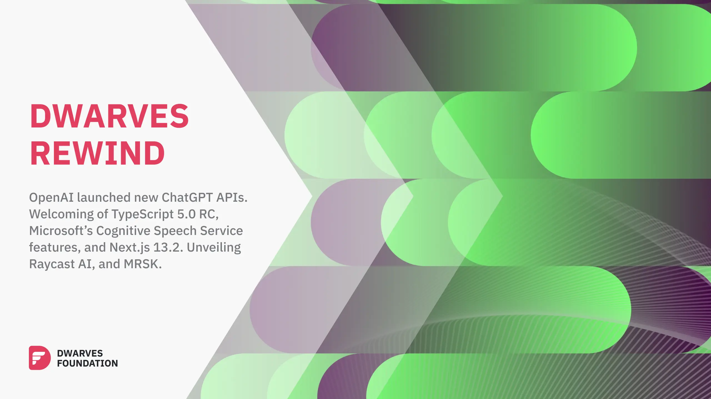

At the intersection of technology and innovation, our engineering team at Dwarves Foundation has been driving change and pushing boundaries. As we continue to navigate the rapidly evolving landscape of software development, we remain steadfast in our commitment to seeking out the latest technologies and practices to deliver exceptional results.

With our eyes fixed firmly on the future, we've cultivated an engineering culture that values continuous learning and collaboration. Through initiatives like our Tech Radar, Brainery, and R&D challenges, we've created opportunities for our team to learn, grow, and share their knowledge with the wider community.

As we look back on the past month, we're excited to share our latest engineering report, which highlights our recent achievements, projects, and insights.

## Tech Radar

March marks a shift in our engineering focus, with an emphasis on "**Scaling up Delivery Performance**" as the driving force behind enhancing our software delivery pipeline. This strategic approach is aimed at expanding our team's capacity to deliver more features and services, without compromising on quality or stability. To achieve this goal, we are adopting techniques such as blue-green deployment and monorepo. However, to truly unlock the power of these techniques, it is crucial that we cultivate a shared understanding of their benefits and best practices across the organization. By instilling a culture of scalability in our engineering team, we not only accelerate our ability to meet the evolving needs of our business but also foster a stronger commitment to delivering value to our end-users through continuous innovation and improvement.

### Blue-green deployment

***Trial***

We recently implemented [blue-green deployment](https://hashnode.com/edit/clfuzxx9z000d0amk95je906q) for the Mochi Bot application, which offers numerous benefits, including zero-downtime deployments and faster, more frequent releases. With two identical environments, only one is live at a time, allowing new versions of the application to be deployed without any disruption to users. This not only improves user experience but also reduces the risk of downtime-related issues.

Our experience with blue-green deployment has been positive, but there are ongoing research efforts to optimize its configuration for microservices and integrate API testing into the process. Despite this, we believe that the benefits of this deployment strategy, including its cost-effectiveness and practicality, make it a valuable addition to our current infrastructure.

### Monorepo

***Adopt***

Using a [monorepo](https://radar.d.foundation/Monorepo-6a57c7c8c7d34d4d8572cd8c2d88fcd6) approach can bring many benefits to teams looking to manage code for multiple projects or modules in a more efficient and streamlined way. This includes managing shared libraries, frameworks, and components across projects, as well as deploying applications more consistently and quickly. Recently, our team in Nghe Nhan faced [challenges](https://dwarvesf.hashnode.dev/from-multi-repo-to-monorepo-a-case-study-with-nghenhan-turbo-monorepo) with managing dependencies and deploying updates across multiple repositories as the project expanded. Coordinating changes between components and maintaining consistency across codebases became increasingly difficult as our engineering team grew. To address these challenges, we decided to migrate to a monorepo structure using [Turborepo](https://radar.d.foundation/Turborepo-0dd18b38468c4859a8beaae7bf6c511c). This decision was prompted by our previous successful experience with monorepo, but to further facilitate adoption and standardize the approach, we also have been working on a template to help our team speed up the process.

### ChatGPT assistance

***Trial***

The software development community has engaged in a conversation regarding the potential risks associated with ChatGPT.

Despite the concerns raised, ChatGPT remains a valuable tool for developers seeking to streamline their workflow and increase efficiency. With its capacity to generate code snippets, offer responses to queries, and swiftly create documents, ChatGPT has the potential to enhance productivity. Nonetheless, it is crucial to bear in mind that the accuracy of its responses may not always be 100%, and extensive research may be necessary before utilizing it for more complex tasks.

Despite the possible challenges associated with ChatGPT, some members of our team have begun integrating it into their workflow, such as within VSCode or Raycast.

### Micro-Frontend

***Assess***

The concept of [micro frontend](https://radar.d.foundation/Micro-Frontend-81e78d9765eb4b83b6e47639d81dc151) has been the subject of ongoing debates regarding its potential benefits for software development. At our team, we acknowledge that every technology comes with trade-offs. Despite the decrease in discussions about micro frontends, we have observed its continued adoption through our work with clients. For instance, in [a recent case study](https://hashnode.com/edit/clfv0twho000909jw1lyuegjj), we investigated the implementation of Micro-Frontend architecture on an e-commerce platform, analyzing its impact on the system's performance and its ability to streamline the integration of new applications. We found that vertically splitting the apps by sub-domains was an effective approach for the client's specific use case, and their adoption of this approach continues to be successful. Moving forward, our team will incorporate the insights and experiences gained from working with clients on micro frontend solutions to evaluate and integrate them into our practices.

### Delivery metrics

***Assess***

Measuring software delivery performance is crucial in the world of software development. One way to gauge team effectiveness is by tracking the number of story points completed and the time it takes to finish them. It is surprising how much project status can be inferred from these numbers, prompting us to ask critical questions and celebrate successes. Our team has also found value in utilizing [DORA metrics](https://radar.d.foundation/DORA-metrics-6b555bcdb782480e80504ff122d6f4c7), which provide further insight and facilitate the development of new practices to enhance productivity.

It is essential to remember the ultimate intention behind any metric and use them as tools for reflection and learning. Keeping this in mind will help teams stay on track and continuously improve their software delivery performance.

## Brainery

### Growth and Direction

We have been shifting our focus towards **Meaning, Mastery, and Autonomy**, (MMA). We are aiming to create a culture where our everyone can find purpose and fulfillment in their work, where they can develop their skills and talents, and where they have the freedom and responsibility to make decisions.

This has reflected in our Brainery, where we see much more concise writing from our contributors on areas for work delivery, high-level system concepts, and foundational knowledge.

### Trending Tags

A summary of some trending tags we see in our Brainery. These tags represent what things our contributors are actively thinking about and researching. For this month, we still see a strong focus on frontend, but we also see trending tags related to backend and DevOps with more focus on foundational topics such as API, state management, and algorithms.

### Top Contributors and Notes

Every month, we collect a list of top contributors, those who have contributed knowledge to our Brainery for this month. We consolidate our writer’s articles with their GitHub account at our Brainery’s [Latest Notes](https://brain.d.foundation/Latest+Notes).

We also make sure to give recognition on our [Discord](discord.gg/dfoundation) server, so be sure to catch up with us there!

* [leduyhien152](https://github.com/leduyhien152) - [When should we use useReducer instead of useState?](https://brain.d.foundation/Engineering/Frontend/When+should+we+use+useReducer+instead+of+useState%3F)
* [mirageruler](https://github.com/mirageruler) - [GraphQL in microservices - Unified API gateway](https://brain.d.foundation/Engineering/Backend/GraphQL+in+microservices+-+Unified+API+gateway)
* [ngolapnguyen](https://github.com/ngolapnguyen) - [Variable Fonts](https://brain.d.foundation/Engineering/Frontend/Variable+Fonts)
* [nguyend-nam](https://github.com/nguyend-nam) - [Testing AWS services locally with LocalStack](https://brain.d.foundation/Engineering/DevOps/Testing+AWS+services+locally+with+LocalStack)
* [thangnt294](https://github.com/thangnt294) - [Profiling in Go](https://brain.d.foundation/Engineering/Profiling+in+Go)
* [trankhacvy](https://github.com/trankhacvy) - [Metaplex NFT Compression](https://brain.d.foundation/Blockchain/Metaplex+NFT+Compression)
* [zlatanpham](https://github.com/zlatanpham) - [Tackling Server State complexity in Frontend Development](https://brain.d.foundation/Engineering/Frontend/Tackling+Server+State+complexity+in+Frontend+Development)

## R&D Topics and Challenges

Research and Development (R&D) came about as a collective department for solving common problems we faced across all of our projects. As an innovative software firm, we found that the foundations surrounding innovative software were also vital to realizing their prospects.

Below are some of the common problems we’ve begun more critical research and exploration on:

### Common problems

* **Multi-tenancy**: With the need for personalized development for each customer of software as a service services, the system design and application architecture need to be designed intelligently to optimize costs as well as efficiency. results, data security. The real multi-tenancy problem is encountered a lot and depending on the system, it will be implemented in different ways. We will offer total solutions to help customers have the best cost and efficiency.
* **Distributed Concurrency over a single database**: Concurrency control is a crucial aspect of developing applications that can handle multiple user requests simultaneously. It is not uncommon for multiple users to access the same data at the same time in SQL, such that it requires concurrency control techniques over the whole application.
* **zkEVM layer 2**: The overall design of zkEVM layer 2 blockchain follows the State Machine model and thus emulates the Ethereum Virtual Machine (EVM) and **high performance and scalability**, with the aim of providing the same user experience as in Ethereum. In addition to enabling ERC20 token payments and transfers, users can now run Ethereum smart contracts on it.

This year, we’ve completed two of our challenges, **Query Database 500M Records** and **Locale on Web and Mobile**. This was a concern spanning across our DevOps, Management, and Engineering domains. We’re proud to list it as our completed challenges:

### Completed challenges

Query Database 500M Records, Filter Multiple Table: Querying larger datasets invites performance issues and complexity. Our research elaborates techniques for optimizing queries through caching strategies and approaches in cluster architecture.

* **Locale on Web and Mobile:** Locale is a rather subtle issue that encompasses many aspects required for a multilingual application. Our research expands on database designs for multilingual apps, approaches to continuous translation, and a frontend guideline for internationalization (i18n).
* **Solutions and articles:**
  * [https://dwarvesf.hashnode.dev/optimizing-queries-for-big-database](https://dwarvesf.hashnode.dev/optimizing-queries-for-big-database)
  * [https://medium.com/dwarves-foundation/optimize-query-for-big-database-c7b6952326af](https://medium.com/dwarves-foundation/optimize-query-for-big-database-c7b6952326af)
* **Solutions and articles:**
  * [https://dwarvesf.hashnode.dev/i18n-frontend-guideline](https://dwarvesf.hashnode.dev/i18n-frontend-guideline)
  * [https://dwarvesf.hashnode.dev/continuous-translation](https://dwarvesf.hashnode.dev/continuous-translation)
  * [https://dwarvesf.hashnode.dev/database-designs-for-multilingual-apps](https://dwarvesf.hashnode.dev/database-designs-for-multilingual-apps)

### Keywords for upcoming challenges

Here are some of the keywords we’re on the watch for where we haven’t specified a problem statement but we expect will manifest challenges in the near future.

* Rollups
* Staking
* Ethereum Adoption
* Access control management
* Security design and DevSecOps
* AI augmentation

## Research Narratives

### Software Design Research Group

We’ve held our Software Design research group for just over a year. This month we have shifted our focus to more on topics and concerns for small and medium enterprises, most commonly concerning security, access control, and database models and mechanisms. This includes, but is not limited to:

* **Hierarchical Database Model** - Investigates database modeling for hierarchical data types, such as an employee organization tree, and what approaches are most suited as a balance between correctness, performance, and ease of upgradability.
* **Explicit Locking In SQL DBMS** - An approach on using explicit locks as a concurrency mechanism to handle application control flow with SQL databases.
* **HashiCorp Vault** - A presentation on what HashiCorp Vault is, why we need it, and a demo session on how to make a basic secret resource to be augmented and consumed in the Vault agent injector on Kubernetes.
* **Role-based Access Control (RBAC)** - A battle-proven approach to restricting system access to authorized users. A presentation and discussion on what it is, how it can be modeled, and what use-cases that often arise that demands the need for access systems such as RBAC.

## Dwarves Rewind March 2023

[Dwarves Rewind](https://www.linkedin.com/newsletters/dwarves-rewind-6963734647327375360/) is a reading list serving as a collection of news we aggregate weekly. Tech is a very high-paced industry, and rewind helps to serve as a curated list of trending and high-profile topics that everyone can look back on.

### Trending and Hot Topics

Artificial intelligence is still a very trending and hot topic, especially with the advent of GPT-4 and Microsoft’s aggression on integrating AI tech. Some of the trending topics this month are:

* How GPT-4 can generate realistic and engaging content for various domains and purposes, such as marketing, education, entertainment and more.
* How Microsoft is leveraging AI to enhance its products and services, such as Bing, Office 365, Azure and Windows 11.
* How OpenAI has launched new APIs and plugins to augment ChatGPT to other levels of productivity.

Of course, there are still more notable updates on the front for frontend development, with the introduction of Next.js 13.2, as well as blockchain solutions for transaction scalability.

### Thoughts List

On most of our Dwarves Rewind, we list our thoughts and burning questions each week. Here are some of our most recent ones:

**#27:** We are not sure what Google is going on about since they literally shut down their rival gaming service to xCloud. But Nvidia is different because you use their cloud streaming service to stream games that you actually own from other PC platforms, what we can see can why Nvidia may not actually oppose the deal.

**#28:** Everyone is using ChatGPT. Since its launch, more than 100 million people have signed up for the app and set a record for the fastest-growing user base. As for whether chatbot will kill a job in the future, the way AI is implemented and how society adapts to its integration will ultimately determine its net impact on employment.

**#29:** If tech companies won't make as much money from selling links via search results, will they try to sell information gleaned from our interactions with search chatbots? But we all know it is an important space to keep an eye on to see how marketers can leverage it for their brands and how they utilize these features to better connect with their customers and users.

**#30:** zkEVMs is a scaling solution that allows blockchain networks to process transactions on Layer 2. The launch of the zero-knowledge Ethereum Virtual Machine beta mainet is viewed by many as a significant turning point, as it will bring huge improvements to cryptography and blockchains.

**#31:** Artificial intelligence is going mainstream. We want to hear from you about what's getting your attention in the field, so share your thoughts in the comments below and let us know which AI topic has piqued your interest the most.

**#32:** The release of Next.js 13.2 has brought some changes to the way Route Handlers work. While it's positive that Route Handlers no longer need if statements for each method type, some users find the new app directory structure somewhat inconvenient. The mixing of the API folder with other items in the app directory can make it challenging to find a specific route.
