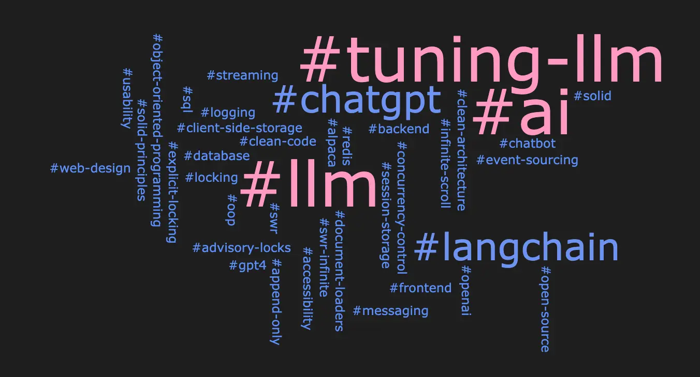
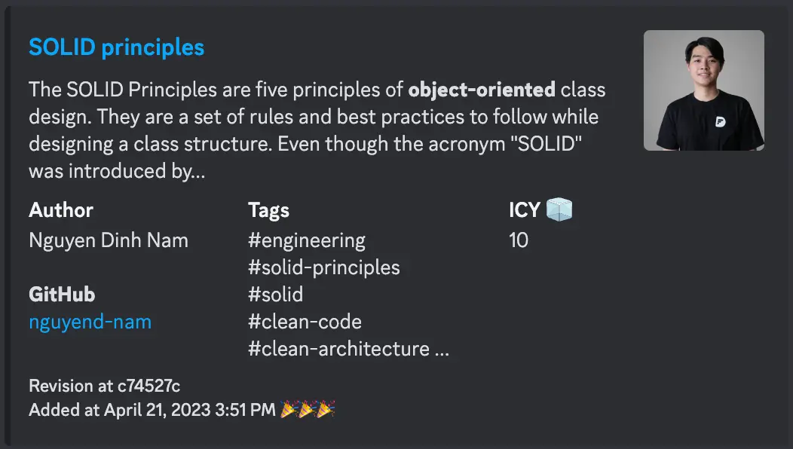
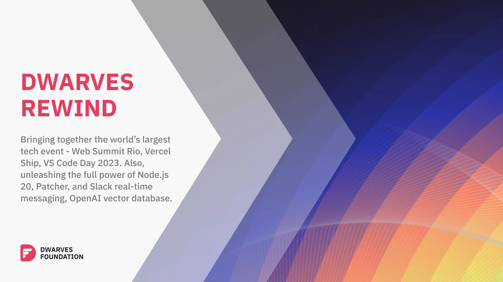

The technological landscape is vast, brimming with opportunities for exploration and growth. As we stand on the brink of May, we pause to reflect on our journey thus far and chart our course forward. In this month's report, we bring you the fruit of our endeavors and the promise of our vision.

## Tech Radar

As we advance into a new phase, our engineering team is setting its sights on a new strategic focus - "Exploring Large Language Models (LLM)". This shift, at the heart of our product development and business intelligence initiatives, aims to enhance our ability to work with AI-driven language models, allowing us to offer improved user interactions, more personalized product suggestions, and better business understanding. In tandem with this, we are implementing a robust automation framework leveraging Codecept and Playwright, to automate tasks, refine workflows, and maintain high-quality standards.

Concurrently, we're assessing the potential of Radix UI to help us develop highly intuitive, accessible user interfaces. While these advancements in automation and UI development play a vital role, our primary emphasis remains on the exploration of LLMs, a venture we believe will bolster our position at the cutting edge of technological innovation. Our May journey embodies our commitment to continual learning, delivering exceptional value to our users, and meeting our business needs with agility and innovation.

### Large Language Models

***Assess***

In our exploration of [large language models](https://radar.d.foundation/Large-language-model-LLM-60d7f1372aef4e60ae12894bdbafa473) (LLMs), such as GPT-3/GPT-4/ChatGPT, Poe, and Claude, we recognize the vast potential these models hold. As we continue to refine our interactions with these models, we aim to harness their capabilities to generate accurate outputs. While we have delved into model fine-tuning, the current costs prevent us from achieving the desired results. However, we remain optimistic about future developments and maintain our focus on utilizing foundation models rather than training our own, considering the high infrastructure costs and the need for quality data. We remain committed to identifying and capitalizing on opportunities to develop useful software applications built upon the power of LLMs, dedicating our energy to learning and expanding our expertise in this promising domain.

### LangChain

***Assess***

We have recently begun exploring the [LangChain](https://radar.d.foundation/LangChain-181262b7994c4b108ecf559411dc988e) framework in our AI application development workflow. Designed specifically for building applications that leverage large language models (LLMs), LangChain offers a suite of features like prompt management, chaining, data augmented generation, and agent systems for action sequencing, which collectively streamline the AI development process. As we integrate LangChain into our workflow, we have observed its potential for improving the management and utilization of LLMs, enhancing our interaction with language models, improving the generation of contextually relevant responses, and providing better control over AI behavior. This addition has broadened the spectrum of AI applications we can build, encompassing everything from customer service chatbots and content generators to advanced data analysis systems. However, we are still in the assessment phase, incorporating LangChain into smaller, non-critical projects to fully understand its capabilities and limitations.

### Prompt engineering

***Assess***

[Prompt engineering](https://radar.d.foundation/Prompt-engineering-9739ebfed76f4cff901cb46155d0bf23) is an innovative field within generative AI, aimed at enhancing the outputs of large language models like ChatGPT. We strive to make AI responses more human-like and contextually precise by crafting meticulous prompts. Using prompt engineering, we can improve AI chatbots' effectiveness across various applications and customize AI behavior to meet specific industry needs. It also serves as a tool to test AI limits and contribute to its continuous improvement. Our adoption strategy involves educating our teams about prompt engineering, fostering an environment that supports learning, and gradually integrating it into our AI systems to learn and adapt based on the results.

### Codecept

***Assess***

Recently, we have assessed [Codecept](https://radar.d.foundation/Codecept-a64f02c731ff4be59a914f1e4ab6de1d) as a powerful testing framework for efficient and effective end-to-end (e2e) testing. With Codecept, we can automate testing and easily manage and debug complex scenarios. Some key advantages include multi-tasking capabilities, simplicity in test writing, support for multiple test frameworks, lightweight modular structure built on CodeIgniter, and detailed reports and logs for effective debugging. With Codecept, we are able to conduct functional testing, acceptance testing, API testing, cross-browser testing, and benefit from comprehensive test reporting. As we adopt Codecept, we see it as the monorepo for Automation Testing, suitable for all projects due to its support for various testing frameworks like WebDriverIO, Playwright, and Cypress. By building an automation framework based on Codecept, we are already implementing it in several internal projects, providing a solution to the challenges of creating project-specific frameworks.

### Radix UI

***Trial***

In our continuous pursuit of effective and accessible UI development, we have adopted [Radix UI](https://radar.d.foundation/Radix-UI-13e49d353df1486ca02fbacfd1765f14), a modular and highly customizable library of pre-built components. Its compatibility with other libraries, such as TailwindCSS, enhances our ability to maintain consistent styling across our applications. The library's modular design allows us to construct unique, highly flexible UIs by combining and customizing small, focused primitives. By integrating Radix UI into our workflows, we are able to efficiently develop responsive and accessible user interfaces without the need to design components from scratch. Our adoption of Radix UI was driven by our commitment to enhance accessibility, replacing [HeadlessUI](https://radar.d.foundation/Headless-UI-53cb40046020450594f46a4cb030ef2e), which presented significant accessibility challenges. We have successfully implemented this migration in our [NextJS boilerplate](https://github.com/dwarvesf/nextjs-boilerplate/pull/23), and we're excited about the new possibilities that Radix UI unlocks for us.

## Brainery

### Growth and Direction

We have been shifting our focus towards **Meaning, Mastery, and Autonomy**, (MMA). We are aiming to create a culture where our everyone can find purpose and fulfillment in their work, where they can develop their skills and talents, and where they have the freedom and responsibility to make decisions.

This has reflected in our Brainery, where we see much more concise writing from our contributors on areas for work delivery, high-level system concepts, and foundational knowledge.

### Trending Tags

A summary of some trending tags we see in our Brainery. These tags represent what things our contributors are actively thinking about and researching. For this month, we see a stronger focus on LLM and AI topics, but we also see trending tags related to backend and frontend with more focus on foundational topics such as web-design, OOP, SOLID, etc.

### Top Contributors and Notes

Every month, we collect a list of top contributors, those who have contributed knowledge to our Brainery for this month. We consolidate our writer’s articles with their GitHub account at our Brainery’s [Latest Notes](https://brain.d.foundation/Latest+Notes).

We also make sure to give recognition on our [Discord](discord.gg/dfoundation) server, so be sure to catch up with us there!

* [monotykamary](https://github.com/monotykamary) - [Working with langchain document loaders](https://brain.d.foundation/Engineering/AI/Working+with+langchain+document+loaders)
* [monotykamary](https://github.com/monotykamary) - [Workaround with OpenAI's token limit with Langchain](https://brain.d.foundation/Engineering/AI/Workaround+with+OpenAI%27s+token+limit+with+Langchain)
* [nguyend-nam](https://github.com/nguyend-nam) - [SOLID principles](https://brain.d.foundation/Engineering/SOLID+principles)
* [nguyend-nam](https://github.com/nguyend-nam) - [Retain scroll position in infinite scroll](https://brain.d.foundation/Engineering/Frontend/Retain+scroll+position+in+infinite+scroll)
* [R-Jim](https://github.com/R-Jim) - [Redis streaming](https://brain.d.foundation/Engineering/Redis+streaming)
* [vhbien000](https://github.com/vhbien000) - [Database Locking](https://brain.d.foundation/Engineering/Backend/Database+Locking)

## R&D Topics and Challenges

Research and Development (R&D) came about as a collective department for solving common problems we faced across all of our projects. As an innovative software firm, we found that the foundations surrounding innovative software were also vital to realizing their prospects.

Below are some of the common problems we’ve begun more critical research and exploration on:

### Common problems

* **Payment system**: Navigating the evolving fintech landscape, our task is to design an innovative payment system that is secure, scalable, and user-friendly. It should facilitate diverse transactions across various platforms and regions, integrating with existing financial infrastructures while remaining flexible to emerging technologies such as cryptocurrencies and AI analytics. The system must robustly manage cybersecurity risks and regulatory compliance. The system's success will hinge on its reliability, usability, scalability, security, and ability to drive customer satisfaction in a competitive fintech market.
* **Recommender system**: Our research focuses on the pivotal role vector databases play in recommender systems, facilitating efficient searches by representing items as vectors. This feature amplifies AI systems' capability to provide personalized recommendations. Our goal is to discover strategies to optimize these databases, enhancing user experiences across digital platforms like social networks, streaming services, and e-commerce sites. Our success hinges on contributing valuable insights and innovations in this key area of AI recommender systems.

### Completed challenges

**Distributed Concurrency over a single database:**

Concurrency control is a crucial aspect of developing applications that can handle multiple user requests simultaneously. It is not uncommon for multiple users to access the same data at the same time in SQL, such that it requires concurrency control techniques over the whole application. Our team has completed this challenge and is currently wrapping up write-ups on the topics.

**Solutions and articles:**

* [https://dwarvesf.hashnode.dev/managing-dataflow-and-sql-database-with-concurrency-control](https://dwarvesf.hashnode.dev/managing-dataflow-and-sql-database-with-concurrency-control)
* [https://dwarvesf.hashnode.dev/lessons-learned-from-concurrency-practices-in-blockchain-projects](https://dwarvesf.hashnode.dev/lessons-learned-from-concurrency-practices-in-blockchain-projects)

### Keywords for upcoming challenges

Here are some of the keywords we’re on the watch for where we haven’t specified a problem statement but we expect will manifest challenges in the near future.

* Access control management
* Security design and DevSecOps
* AI augmentation
* Prompt Engineering
* Design Payment System
* Vector Database

## Research Narratives

### Software Design Research Group

We’ve held our Software Design research group for just over a year. This month we are continuing our focus to more on topics and concerns for small and medium enterprises, most commonly concerning security, access control, and database models and mechanisms. We have also begun to investigate more frontend and AI topics. This includes, but is not limited to:

* **Explicit Locking In SQL DBMS** - An approach on using explicit locks as a concurrency mechanism to handle application control flow with SQL databases.
* **Role-based Access Control (RBAC)** - A battle-proven approach to restricting system access to authorized users. A presentation and discussion on what it is, how it can be modeled, and what use-cases that often arise that demands the need for access systems such as RBAC.
* **Load balancer** - A load balancer involves hardware and software that distributes network traffic across multiple servers to ensure that no single server is overwhelmed with traffic. This helps to improve the performance and reliability of applications, websites, and other network-based services.

## Dwarves Rewind May 2023

[Dwarves Rewind](https://www.linkedin.com/newsletters/dwarves-rewind-6963734647327375360/) is a reading list serving as a collection of news we aggregate weekly. Tech is a very high-paced industry, and rewind helps to serve as a curated list of trending and high-profile topics that everyone can look back on.

### Trending and Hot Topics

Artificial intelligence is still a very trending and hot topic, especially with the advent of GPT-4 and Microsoft’s aggression on integrating AI tech. There has also been some hot annual events this month, with some of the trending topics this month being:

* Andrew Ng & OpenAI Free Prompt Engineering Course: Renowned artificial intelligence (AI) experts, Andrew Ng from [DeepLearning.ai](http://deeplearning.ai/) and Isa Fulford from OpenAI, have teamed up to offer an exciting new course on prompt engineering, titled “ChatGPT Prompt Engineering for Developers“. The course, which is completely free, aims to help developers better understand the prompts design and implementation for various use cases.
* Visual Studio Code Day 2023: VS Code Day is Microsoft's annual event, where you'll learn how to elevate your development workflow using the latest and most outstanding features of VS Code.
* Generative Agents: Interactive Simulacra of Human Behavior: LLMs just hit a major milestone with the release of the new "Generative agents" paper. By using LLMs, generative agents were able to simulate human-like behavior in an interactive sandbox inspired by The Sims.

### Thoughts List

On most of our Dwarves Rewind, we list our thoughts and burning questions each week. Here are some of our most recent ones:

**#33:** For sure, GPT-4 long way to go, things are going to change. In general, when selecting a technology for our frontend tech stack, the foremost question we ask is: "Has this technology achieved a certain level of stability and maturity?". They all are associated with the relative ease of development and our ability to stay ahead of the competition.

**#34:** It is now possible to build AI-powered applications without having to spend months or years learning the ins and outs of machine learning. LLMs have some general embedded knowledge, but they mainly operate on the context that you give them via prompting.

**#35:** Node.js is improving at a rapid pace, and software is always evolving. We know that the JS community generally suffers from "If it hasn't been updated in the last year, it's probably broken and not modern enough" syndrome, but some software actually ends up being "finished" and good enough for the task at hand.

**#36:** As with any new technology, it's not without knots. While we acknowledge that prompting skills will continue to play a role, we expect that the ability of LLMs (Language Model Models) to adjust to "bad" prompts will surpass our capacity to effectively instruct them.
