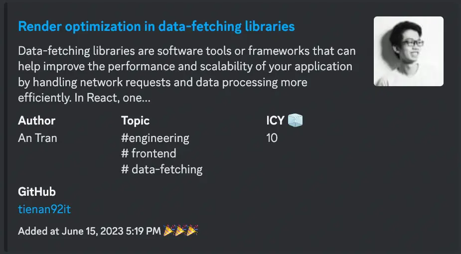
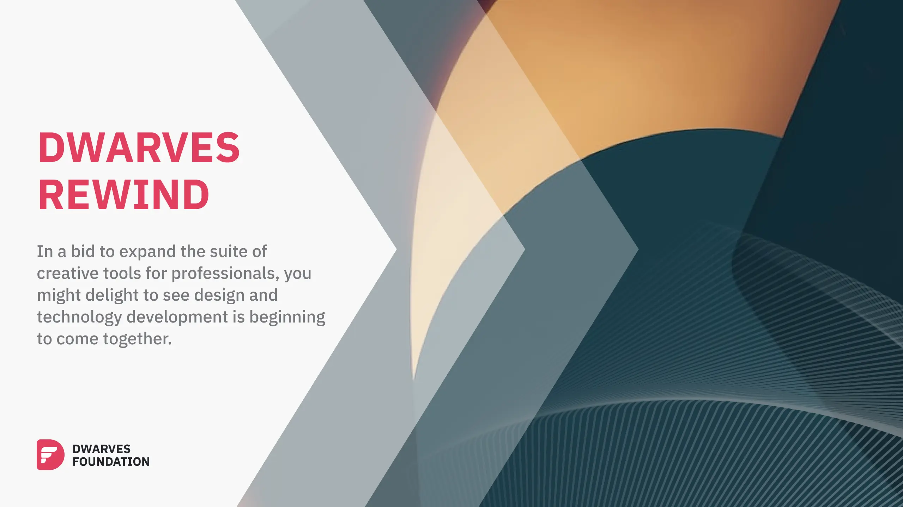

As we usher in the month of June, we embrace the ever-changing landscape of technological innovation, recognizing that every twist and turn propels us forward into a world of limitless possibilities. We continue to chart our course through this vast expanse, driven by a mission to remain at the forefront of our industry and deliver unparalleled value to our clients. In this month's report, we reflect on our achievements and share our visions for the future, focusing on a central theme: "**LLM in Production**".

## Tech Radar

Our engineering team strides into June with a sharp focus on realizing the operational potential of Large Language Models (LLM). Our progress in May has bolstered our confidence in the immense capabilities these models hold, and now we shift our attention towards bringing these tools to life in real-world applications. Alongside this primary pursuit, we also keep an eager eye on the integration and exploration of reinforcement learning from human feedback, and continue our assessments of technologies like prompt engineering, Vector Database, React Server Component, and Zod. As always, we strive to adapt and evolve with the fast-paced technology landscape, and remain steadfast in our commitment to delivering exceptional value to our users and addressing our business needs with agility and innovation.

### Large Language Models

***Assess***

Our exploration into **[large language models](https://radar.d.foundation/Large-language-model-LLM-60d7f1372aef4e60ae12894bdbafa473)** continues with renewed vigor this June. As we delve deeper into their potential applications through various experiments, we're broadening our understanding of their capabilities. The broad range of uses for these models in real-world applications continues to impress us, further reinforcing our focus on this domain.

However, with these new developments come new challenges. We're working diligently to ensure that these models can handle a variety of use cases when integrating them into real products. Key hurdles we're addressing include ensuring the accuracy of the generated content, keeping latency low for real-time interactions, and managing the costs associated with running these models.

While these challenges present a steep learning curve, they also provide us with the opportunity to innovate and optimize. By addressing these issues head-on, we're not just seeking to make effective use of large language models, but also to refine the way we interact with them, leveraging their capabilities to their full potential while managing the operational challenges. As we move forward, our focus remains on making these models work for us and our users, striking a balance between potential and practicality.

### Reinforcement Learning from Human Feedback

***Assess***

We are starting to explore **[Reinforcement Learning from Human Feedback](https://radar.d.foundation/Reinforcement-Learning-from-Human-Feedback-ea2a96254aa845d68b03053e6cf1b454)** (RLHF). This technique, which involves training models using feedback from human interactions, has the potential to make our AI systems more responsive and user-centric. Our aim is to understand the dynamics of RLHF and integrate this approach into our AI applications, thereby enhancing the precision and relevance of our models' outputs.

### Prompt engineering

***Trial***

As we continue our journey with **[Prompt engineering](https://radar.d.foundation/Prompt-engineering-9739ebfed76f4cff901cb46155d0bf23)**, we are exploring [self-refinement prompts](https://brain.d.foundation/Engineering/AI/LLM%27s+Accuracy+-+Self+Refinement) that allow an existing model to improve its own output, enhancing its effectiveness over time. Despite its benefits, we're mindful of potential vulnerabilities, particularly from adversarial prompts via techniques like prompt injection, which could pose risks to LLM applications. To mitigate these risks, crafting well-structured prompts is still an effective defense tactic. Our commitment remains to leverage and enhance prompt engineering to create safer, more efficient, and contextually precise AI systems.

### Vector Database

***Assess***

Our experimentation with the **[Vector Database](https://radar.d.foundation/Vector-Database-dcf2259eb65d4b81a84c4882a8f0c0d6)** reveals new dimensions for its application in our work. As the database can assess the semantic similarity of words and suggest similar text, it serves as an ideal companion for our large language models (LLMs). By harnessing a Vector Database, we can augment LLMs, such as the GPT-4 model, with long-term memory. This augmentation goes beyond model training to include data from our vector database, allowing us to fine-tune and customize prompt responses with more context derived from relevant documents. Techniques like [query caching](https://brain.d.foundation/Engineering/AI/LLM+query+caching) further leverage the Vector Database's capabilities, accelerating the performance of our LLM applications at a lower computation cost. These advancements are not only streamlining our workflows but also enriching the outcomes, promising exciting developments as we move further into the integration of Vector Database.

### React Server Component

***Assess***

As we evaluate **[React Server Components](https://radar.d.foundation/React-Server-Component-68a4a526527f44c0997b084e96b99e47)**, their flexibility stands out. Diverging from the traditional client-side rendering approach of Single-Page Applications, RSCs allow us to decide where to render components based on their purpose. By deconstructing the page into smaller components, it becomes clear that many non-interactive elements can be rendered on the server as Server Components. This approach not only improves performance and reduces the bundle size but also enhances the initial page loading time, a crucial factor in user experience. As we progress, our focus is on harnessing the potential of RSCs to build fast, efficient, and user-friendly web applications.

### Zod

***Trial***

**[Zod](https://radar.d.foundation/Zod-f166f3a065f949f58b5936b34236ca3c)** is a robust, TypeScript-first schema declaration and validation library. Its primary strength lies in the elimination of duplicative type declarations, as Zod allows developers to declare a validator once, from which it automatically infers the static TypeScript type. It also offers a concise, chainable interface, and functional approach emphasizing parsing over validation. Despite its high functionality, Zod is remarkably compact with zero dependencies and compatibility across Node.js and modern browsers. Its immutable nature ensures that methods like `**.optional()**` return a new instance, and it's equally capable with plain JavaScript. With its notable advantages, we're exploring Zod as a potential replacement for [Yup](https://radar.d.foundation/Yup-9045f94c344c4c1e9b4b941cd43fb50d), seeking to incorporate this developer-friendly tool into our workflows.

## Brainery

### Growth and Direction

As we proceed in our journey of knowledge and skill enhancement, our Brainery continues to bloom with exciting ideas and valuable insights. Our contributors have exhibited an increased proficiency in delivering concise writings, covering work delivery, practical concepts, and foundational knowledge.

This month, we are thrilled to highlight our concentrated exploration of knowledge from our ongoing projects, notably our Quant Trading project - Nghenhan. This project-oriented focus has empowered our contributors to delve into practical applications and contribute from their hands-on experiences.

### Trending Tags

The trending tags of this month offer a fascinating snapshot of our contributors' current research interests and thought processes. It's been particularly interesting to see the ongoing focus on LLM as we continue to bring it into production, with various insightful notes shedding light on its inner workings.

In parallel with the AI-centric discussions, we have also seen increased exploration into frontend techniques, including scroll animations and novel patterns for working with React and GraphQL. These discussions underline our commitment to staying at the forefront of tech innovations while deepening our understanding of core concepts.

The tags for June include: `#nghenhan #` `llm` `#ai` `#caching` `binance` `q-learning` and more.

### Top Contributors and Notes

Our community continues to thrive due to the collective effort of our talented contributors. Each month, we acknowledge their contributions in our Brainery's **[Latest Notes](https://brain.d.foundation/Latest+Notes)** section, linking their GitHub accounts for further reference.

We also value and encourage our community's interaction on our **[Discord](https://discord.gg/dfoundation)** server. It's a great space to stay updated, engage in lively discussions, and catch up on the latest from us. Be sure to join us there!

Here are some noteworthy articles that were shared in our Brainery during June:

* [LLM's Accuracy - Self Refinement](https://brain.d.foundation/Engineering/AI/LLM%27s+Accuracy+-+Self+Refinement) by [thanh](https://github.com/zlatanpham)
* [Q Learning](https://brain.d.foundation/Engineering/AI/Q+Learning) by [ngocthanh](https://github.com/thanhpn)
* [Deploy Branch with Vercel CLI](https://brain.d.foundation/Engineering/DevOps/Deploy+Branch+with+Vercel+CLI) by [chinhld12](https://github.com/chinhld12)
* [Foundation model](https://brain.d.foundation/Engineering/AI/Foundation+model) by [thanh](https://github.com/zlatanpham)
* [LLM query caching](https://brain.d.foundation/Engineering/AI/LLM+query+caching) by [thanh](https://github.com/zlatanpham)
* [Render optimization in data-fetching libraries](https://brain.d.foundation/Engineering/Frontend/Render+optimization+in+data-fetching+libraries) by [antran](https://github.com/tienan92it)
* [Reinforcement Learning](https://brain.d.foundation/AI%2FReinforcement%20Learning) by [ngocthanh](https://github.com/thanhpn)
* [A Fragment Colocation Pattern with React & Apollo GraphQL](https://brain.d.foundation/Frontend%2FA%20Fragment%20Colocation%20Pattern%20with%20React%20%26%20Apollo%20GraphQL) by [lapnn](https://github.com/ngolapnguyen)
* [Scroll-driven animations](https://brain.d.foundation/Frontend%2FScroll-driven%20animations) by [khacvy](https://github.com/trankhacvy)
* [Applying Mock Service Worker (MSW) for Seamless Web Development](https://brain.d.foundation/Engineering/Frontend/Applying+Mock+Service+Worker+(MSW)+for+Seamless+Web+Development) by [hthai2201](https://github.com/hthai2201)
* [Vim REPL Driven Development](https://brain.d.foundation/Engineering/Vim+REPL+Driven+Development) by [Thanh Nguyen](https://github.com/thanhnguyen2187)
* [Utilizing Cached Table for Binance Kline API Data Processing](https://brain.d.foundation/Backend%2FUtilizing%20Cached%20Table%20for%20Binance%20Kline%20API%20Data%20Processing) by [minhth](https://github.com/thminhVN)
* [Update highest and lowest symbol prices in real time](https://brain.d.foundation/Backend%2FUpdate%20highest%20and%20lowest%20symbol%20prices%20in%20real%20time) by [minhth](https://github.com/thminhVN)
* [How Discord Stores Messages Part 1 - From MongoDB To Cassandra](https://brain.d.foundation/Engineering%2FHow%20Discord%20Stores%20Messages%20%20Part%201%20-%20From%20MongoDB%20To%20Cassandra) by [fuatto](https://github.com/fuatto)
* [Redis Rate Limiter](https://brain.d.foundation/Backend%2FRedis%20Rate%20Limiter) by [@minhtuan](https://github.com/Tuanpm31)

## R&D Topics and Challenges

Innovation remains at the forefront of our operations at R&D. Our focus for June has been redefined with a continued interest in the fintech landscape and the introduction of new pivotal themes such as Go compiler optimization and reinforcement learning.

### Research Topics

* **Payment System**: This month, our exploration in the fintech domain continues as we delve into common design patterns like the command pattern and thread-safe scale. We are also investigating the double-entry ledger system, a time-tested method in accounting that can potentially add robustness to our payment system design. The objective remains to create a solution that is secure, scalable, user-friendly, and adaptable to evolving financial technologies.
* **LLM's Accuracy**: As part of our commitment to advance AI technologies, we're venturing into testing techniques like Reinforcement Learning from Human Feedback (RLHF). Our exploration focuses on enhancing the accuracy of Language Models, especially Large Language Models (LLMs). This field promises a broad range of applications, from personalized recommendations to sophisticated natural language processing.
* **Go Compiler Optimization**: Our new topic for the month revolves around Go language compiler optimizations. We aim to deeply understand how Go source code gets transformed into efficient machine code, exploring techniques to maximize the execution speed and efficiency of our Go applications.

### Future Challenges

In addition to our focused research areas, we're also keeping an eye on several emerging topics that may pose challenges or opportunities in the near future. These include:

* Deep Q-Learning
* Time series database
* Adversarial prompt engineering
* Self-hosted LLMs
* Live Chat implementation

As we continue our research and development journey, we strive to stay ahead of technological advances, providing innovative solutions that drive our projects and the wider software industry.

## Research Narratives

### Software Design Research Group

This month, our Software Design Research Group has continued to explore pressing topics for SMEs, with a particular interest in microservices architecture and back-of-the-envelope calculations.

Key discussions this month included:

* **Microservice Architecture Design Patterns** - We examined various patterns in the microservice architecture domain. Our focus was on their uses, benefits, and challenges, equipping us to better implement this increasingly popular software development approach.
* **Back-of-the-Envelope Calculations** - We delved into how these rough calculations can validate design decisions, guide resource management, and even influence business decisions. Our discussions shed light on the value of approximations in dealing with software design complexities.

These insights continue to broaden our understanding of both traditional and emerging software design concepts, equipping us to better tackle real-world challenges.

## Dwarves Rewind June 2023

[Dwarves Rewind](https://www.linkedin.com/newsletters/dwarves-rewind-6963734647327375360/) is a reading list serving as a collection of news we aggregate weekly. Tech is a very high-paced industry, and rewind helps to serve as a curated list of trending and high-profile topics that everyone can look back on.

### Trending and Hot Topics

This month covers a recap of the Apple WWDC Event, a visual low-code backend builder, and a technical deep dive into a simplified version of React Server Components. It also discusses design trends and technology revolution insights from Config 2023 - Figma's Annual Conference and WWDC 2023. Updates include new scene types in Swift UI and features in Visual Studio 2022 version 17.7. There have also been some hot annual events this month, with some of the trending topics this month being:

* We're sure the rumors have been spread all over the Internet. So as stated in the thumbnail, this week [#DwarvesRewind](https://www.linkedin.com/feed/hashtag/dwarvesrewind) comes with a short recap of the Apple WWDC Event, a visual low-code backend builder, and technical deep dive for a very simplified version of React Server Components.
* It's packed with big ideas about how we should interact with the design trends, and the technology revolution after Config 2023 - Figma’s Annual Conference, WWDC 2023. Discover new scene types in Swift UI and what's new in the release of Visual Studio 2022 version 17.7.
