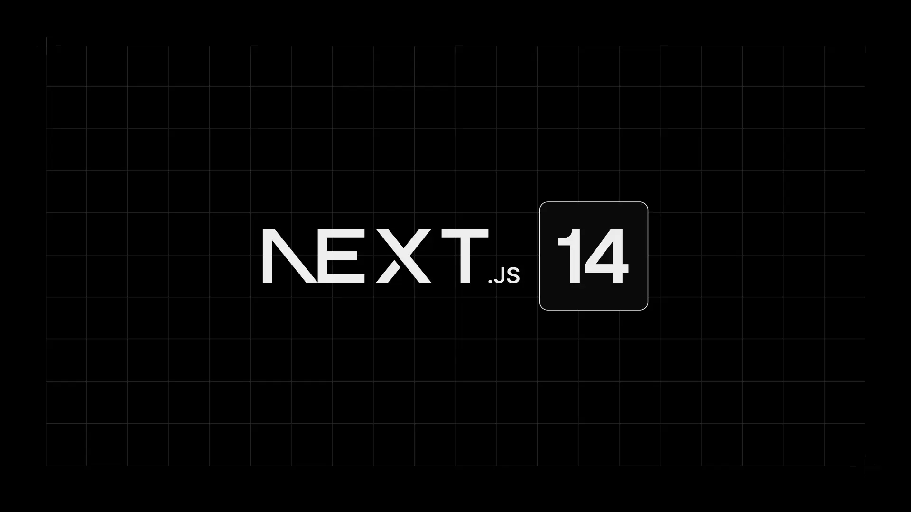
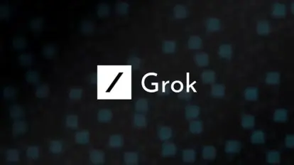

As we step into the exciting opportunities of October, we are at a crucial point in the ever-changing world of technology. Our adventure until now has been for the most part very exciting, with a strong focus on 'Full-stack engineering’ Now, we shift our attention to a topic that is prolific and always true: **Open-source**.

Open-source has always been the foundation for many hobby projects, learning experiences, startups, and enterprises. It has stayed true to the idea for the rights to use, study, change, and distribute the software and its source code to anyone and for any purpose - originally helping to fix bugs and later accelerating state-of-the-art tech and AI.

## Tech Radar
Step into the latest edition of the Dwarves Foundation Tech Radar Report, where we shed light on the technologies steering our engineering team's growth and success. In this report, we illuminate the technologies shaping our path forward, from evaluating new methodologies to embracing tools that amplify our efficiency.

This month has been the month of trying out new and existing tech. We’ve been more eager to get more hands-on to better understand how our tech and research can apply to our projects and our everyday lives.

### Type-safe Server Client Development
***Trial***

Addressing type safety in JavaScript applications, we're trialing an automated OpenAPI Spec generation from server code to ensure consistent data types between client and server. This method, documented via Swagger, enhances development efficiency and reduces errors.

We've implemented a boilerplate for backend and frontend, demonstrated in our [Next.js boilerplate pull request](https://github.com/dwarvesf/nextjs-boilerplate/pull/38), and are integrating type safety into [our developer training programs](https://www.youtube.com/watch?v=OdwQ7upO1AI).

The next phase involves transitioning our internal tool, Fortress, to a type-safe framework, as outlined in the ["Migrate Fortress to use Type-safe approach"](https://earn.d.foundation/Migrate-Fortress-to-use-Type-safe-approach-fb2d4d8551bb44c48be18140026be5fb) proposal. This move is set to enhance application reliability and showcase the benefits of type-safe practices in our operations.

### AI-aided development
***Trial***

In the software industry, the exploration of rapidly evolving AI tools for code writing support is becoming increasingly common. This month, during our Frontend Development Course 2023, we saw a lot of promising projects from both our community and our in-house engineers in creating tools like code reviews at a project scale and automation of CV matching, worthy of a small startup. We see a very clear future of what AI can do for us and how it will be integrated within our everyday lives.

Tools built from frontend training courses:
* Code reviewer - [https://github.com/tranduybau/df-final-project](https://github.com/tranduybau/df-final-project)
* Resume AI - [https://github.com/khoatruong19/df-frontend-final](https://github.com/khoatruong19/df-frontend-final)

### DuckDB
***Assess***

[DuckDB](https://radar.d.foundation/DuckDB-569aeec23bf34e418daf949228c37d30) is an embedded database management system that is designed for analytical query processing. Despite recent advances to hardware scaling and database software for data lakes and data warehouses, most workloads and use-cases fall within or below 10GB in size. This means analytical workloads can use DuckDB in lieu of a data warehouse to scope reports and analytics, without the hassle between operation and analytics teams. DuckDB may become an invaluable tool, especially as our workloads don’t reach the scale necessary for use of a data warehouse for our needs.

### Devcontainers
***Trial***

[Devcontainers](https://radar.d.foundation/Devcontainers-eb3d3ded511d4843851f4ceab643e7d9) are a feature of Visual Studio Code that allow developers to use a container as a full-featured development environment. A **devcontainer.json** file in your project tells VS Code how to access (or create) a development container with a well-defined tool and runtime stack. This container can be used to run an application or to separate tools, libraries, or runtimes needed for working with a codebase. Workspace files are mounted from the local file system or copied or cloned into the container. Extensions are installed and run inside the container, where they have full access to the tools, platform, and file system. Developer experience is a growing need in the industry as well as for our use-cases, to bridge the gap to foster full-stack engineers and onboard them as quickly as possible. We’ve implemented this on many of our internal projects, as well as our public GitHub boilerplates:
* [Frontend Next.js Boilerplate](https://github.com/dwarvesf/nextjs-boilerplate) - Our boilerplate we’ve used throughout the years as well as our main helper for our frontend course of 2023. We’ve updated it to help generate request/response code from OpenAPI and Swagger standards.

## R&D Topics and Challenges
Innovation continues to drive us forward at R&D. For the month ahead, we're expanding our scope to encompass emerging trends in development productivity, user interface design, and engineering paradigms.

### Research Topics
* **Elixir** - Our team has been focusing on expanding our expertise on new as well as current tech. Apart from Go, Elixir has been our second go-to programming language that we want to make more generally available for our engineers and community.

* **Rust** - Rust has been the de-facto language for workloads that require raw performance without requiring to understand the nuances of memory management. We’ve used Rust over the years for projects like Web3 and would love to expand our journey for more systems and embedded related programming.

* **WASM** - Web Assembly (WASM) has been on and off in the industry, but has proven to be relatively resilient due to it’s output being very close to machine code, offering high performance with low complexity. WASM has been an emerging technology for serverless use-cases as well as embedded databases on the web.

* **Aspect-Oriented Programming** - AOP is a programming paradigm to help separate cross-cutting concerns by being more modular and introducing behavior without modifying much of the code. This approach we’ve used lightly for feature flagging, but see much more potential use for this programming paradigm.

* **Passwordless** - Passwordless authentication, such as passkeys, have been a growing topic for us and the industry as a whole. The notion that the procedure for logins no longer require a password makes software interactions much quicker and more secure as a result.

### New Tools
* **Google Analytics 4** - GA4 in the recent year has been taking over UA tags ever since its deprecation. We’ve realized there are much more use-cases we can apply with GA4 that isn’t limited to it’s default analytics. This is exciting for us as we can model and clean event data to aggregate on Google Analytics.

- **Passwordless** - Passwordless authentication, such as passkeys, have been a growing topic for us and the industry as a whole. The notion that the procedure for logins no longer require a password makes software interactions much quicker and more secure as a result.

- **IFramely** - IFramely is an embeddable library that helps developers handle different types of URL embeds in a unified way. It provides a simple and consistent API for embedding various types of content, such as videos, images, and rich media, from different sources. iFramely takes care of the complexities of parsing and rendering embedded content, allowing developers to focus on the user experience and integration of external content into their applications. It supports a wide range of platforms and services, making it a versatile tool for content embedding.

As we persist in our R&D voyage, we endeavor to remain at the forefront of tech progress, delivering creative answers that propel our initiatives and the broader software sector.

## Dwarves Rewind October 2023
[Dwarves Rewind](https://www.linkedin.com/newsletters/dwarves-rewind-6963734647327375360/) is a reading list serving as a collection of news we aggregate weekly. Tech is a very high-paced industry, and rewind helps to serve as a curated list of trending and high-profile topics that everyone can look back on.

.webp)

### Trending and Hot Topics
* **[Next.js releases version 14](https://nextjs.org/blog/next-14)** - Despite the major version update, Next.js has been very careful of introducing any breaking changes or new APIs. Next.js has been a much hotter topic seeing how as it treads closer to server-side rendering, it bares much resemblance to PHP and old-school server-rendered apps.

  

* **[X releases Grok, a new state-of-the-art LLM](https://x.ai/)** - Elon Musk has been giving a lot of hints in the past of Twitter (now called X) releasing a Large Language Model to compete with OpenAI’s ChatGPT. Benchmarks seem very promising, and there is a great deal of hype within the industry for private access to this new LLM.

  
