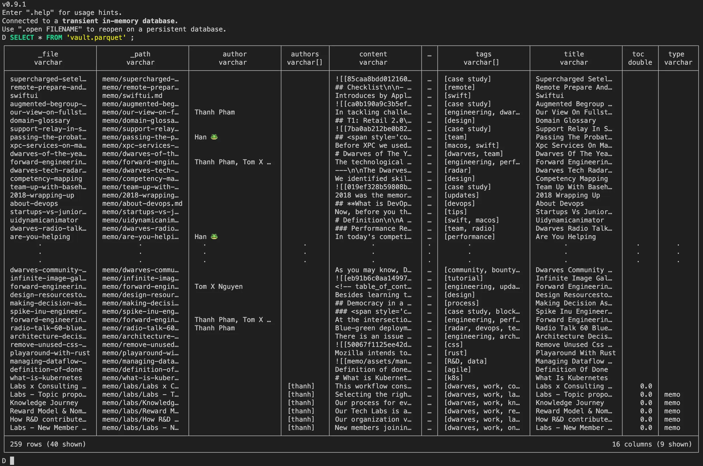
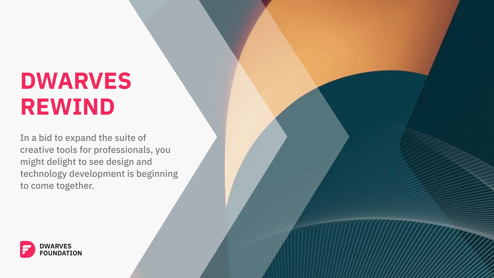

**This month**, we have focused on revamping how we learn, familiarize, and work with tech. We are excited to announce that we have updated our Forward Engineering to better reflect the feedback and insights from our Labs team, Operations Team, and Consulting Team.

This is to hopefully provide you with a more comprehensive publication that not only keeps you informed about the latest technologies and where they are applied, but also foster collaboration and innovation within our organization. We hope you find this edition of Forward Engineering informative and give you a better idea of what we’re doing. As always, we welcome your feedback and encourage you to share your thoughts on the content.

## Tech Radar

### Rust

***Assess***

|          |                                                                         |
| -------- | ----------------------------------------------------------------------- |
| Tags     | `#memory-management` `#systems-language` `#backend` `#embedded-systems` |
| Domain   | `Embedded Systems` `Networking and DNS` `Security` `Fintech`            |
| Projects | `...`                                                                |

Rust, the programming language, has been on our radar for quite some time, primarily in the context of developing compiler tooling – a niche that sparked only modest interest within our team. However, our perspective shifted significantly after engaging in [a community project](https://github.com/webuild-community/spacebot) aimed at creating a Rust-based game server. This experience opened our eyes to Rust's impressive capabilities. Our developers have come to greatly appreciate the language's speed, safety, and performance.

Furthermore, we've observed that Rust continues to evolve, increasingly supporting a wider array of applications, notably in web development and artificial intelligence. This evolution has motivated us to delve deeper into the language. Our initial steps involve comprehending Rust's concurrency model, which is pivotal for our community project. Simultaneously, we are eager to explore new facets of Rust, expanding our understanding and application of this powerful language.

### Building UI Library Practices

***Trial***

|          |                                                    |
| -------- | -------------------------------------------------- |
| Tags     | `#ui` `#ux` `#best-practices` `#frontend` `#react` |
| Domain   | `Web3` `Fintech` `Frontend`                        |
| Projects | `consolelabs/web-foundation` `mochi-web`           |

In the present fast-moving business world, both startups and established enterprises are tasked with the rapid development and maintenance of multiple web applications. Despite the availability of numerous mature UI libraries, there is a persistent demand for UI solutions tailored to specific organizational needs. Through our extensive client work, we have created several unique UI packages. Recognizing the value of these developments, we are now transitioning towards creating our own [open-source UI library](https://github.com/consolelabs/web-foundation), specifically designed for building our internal applications.

This move towards an open-source framework, however, presents a distinct set of challenges compared to closed-source development. Essential factors such as comprehensive documentation, efficient release workflows, and modular design for tree-shaking components require careful consideration. Our journey has been rich with lessons learned, which we are eager to transform into best practices for both our team and the wider community.

### DuckDB

***Trial***

|          |                                                                                                                          |
| -------- | ------------------------------------------------------------------------------------------------------------------------ |
| Tags     | `#data` `#data-analysis` `#data-engineering` `#database` `#embedded-database` `#columnar-storage` `#sql` `#data-science` |
| Domain   | `Data Science` `Embedded Systems` `Business Intelligence` `Machine Learning` `Research`                                  |
| Projects | `dwarvesf/memo.d.foundation` `consolelabs/log.console.so`                                                                |

DuckDB is an in-process database management system designed for analytical query processing. It is easy to install and use, with no separate server software to maintain, and it runs completely embedded within a host process. DuckDB provides extensive support for complex SQL queries, window functions, and transactional guarantees through Multi-Version Concurrency Control (MVCC). It has been on our radar for some time, and we’ve been taking great care to see what use cases we can apply DuckDB on.

DuckDB is fast and has great data analysis capabilities, optimized for aggregations, joins, and complex queries on large datasets. It is free, well-tested, and stable, offering comparable performance to specialized OLAP databases while being easier to deploy.

### Parallel Processing

_***Trial****

|        |                                                           |
| ------ | --------------------------------------------------------- |
| Tags   | `#data` `#data-science` `#parallel-execution`             |
| Domain | `Data Science` `Data Processing` `Fintech` `Ride-sharing` |
|Projects|`dwarvesf/notion-export-markdown` `dwarvesf/note-algolia-scraper`|

Parallel processing is a computing technique that enables multiple streams of calculations or data processing tasks to occur concurrently through numerous central processing units (CPUs) working together. It is commonly used in scenarios where complex tasks and computations need to be performed, and it offers several advantages in various fields, including manufacturing and data processing.

We’ve also recently demoed the benefits of parallel processing in one of our DuckDB demos, that includes processing in parallel dozens of parquet files over HTTPFS (150mb each) and using a map-reduce style to output a taxi trip visual report in seconds.

## Labs Roadmap

In a recent collaborative discussion between key members of the Labs and Consulting teams, we’ve made decisive strides in pinpointing key topics and potential projects for development. Each topic is paired with specific challenges to ensure we engage deeply with the technology, understanding its practical applications. The focal point for the coming month is WebAssembly (WASM), alongside a range of exciting use-cases we plan to implement and demonstrate.

### Upcoming Research

#### WebAssembly (WASM)

_PICs: An Tran*

WASM is a technology that allows running code written in multiple languages on the web at near-native speed. The challenges in using WASM for these applications may include optimizing performance, managing memory efficiently, and ensuring compatibility across different web browsers:

- [[self-host-ai-model-on-the-browser|Self-host AI model on the browser (e.g. OCR for security cams, private browser chatbot…)]]
- [[data-processing-and-visual-infographics-through-duckdb-wasm|Data processing and visual infographics (through DuckDB-WASM)]]
- [[implement-a-rust-game-through-wasm|Implement a Rust game through WASM]]

#### Passwordless Authentication

_PICs: An Tran*

An Tran has also discussed passwordless authentication, which involves allowing users to access systems without entering traditional passwords. The use-case challenges we hope to include are:

- [[demo-biometrics-on-the-web-through-external-device-connection|Biometrics on the web (through external device connection)]]
- [[Labs Roadmap (Nov 23 update)|QR code based login]]
- [[demo-magic-links|Magic Links]]

#### Artificial Intelligence (AI)

_PICs: Tom Nguyen*

The challenges in this context may involve ensuring the real-time nature of the updates, managing the computational resources required for such updates, and addressing potential privacy and security concerns related to real-time knowledge updates.

- [[realtime-memory-knowledge-updates-rag-updates|Realtime memory knowledge updates (RAG updates)]]

#### Multi-Party Computation (MPC)

_PICs: Huy Nguyen*

Huy Nguyen has discussed applying MPC for authentication in the context of web3 console. MPC allows multiple parties to jointly compute a function over their inputs while keeping those inputs private. The challenges may include ensuring the security and privacy of the computation, managing the communication overhead in multi-party settings, and addressing the complexity of implementing MPC protocols in web applications.

- [[applying-mpc-for-authentication-for-web3-console|Applying MPC for authentication for web3 (Console)]]

#### Building UI Library Practices

_PICs: Thanh Pham*

Thanh Pham has written about Mochi UI, which likely refers to a set of UI design and development practices. The challenges in this context may include ensuring consistency and usability across different devices and screen sizes, addressing accessibility considerations, and managing the complexity of implementing advanced UI interactions.

- [[mochi-ui|Build mochi-ui]]

## Dwarves Rewind - Discord Community

Dwarves Rewind this month will be a collection of tech interests we see happening in our Discord community. Along with our labs roadmap, the community have also shown more interest in WASM and optimizing performance for web development use cases. Some of the programming languages, tools and frameworks discussed this month are:

1. **Ziglang**: [https://ziglang.org/documentation/0.11.0/](https://ziglang.org/documentation/0.11.0/)
   Ziglang is a programming language that aims to combine the simplicity of C with the safety and expressiveness of modern languages like Rust and D. It was designed to be a systems programming language, with a focus on performance and ease of use. Ziglang's syntax is concise and straightforward, making it easier to learn and understand compared to other languages like Rust and D.

2. **Panda CSS**: [https://panda-css.com/docs/overview/getting-started](https://panda-css.com/docs/overview/getting-started)
   Panda CSS is a utility CSS library that provides a set of utility classes, patterns, and recipes for building modern and responsive user interfaces in web applications. It is a build-time CSS-in-JS library that combines the productivity of CSS-in-JS with the performance of traditional CSS.

3. **Plop**: [https://plopjs.com/documentation/#what-is-plop](https://plopjs.com/documentation/#what-is-plop)
   Plop.js is a code generator designed to save time and help teams build new files with consistency. It provides a powerful and flexible framework for generating code based on user-defined templates and prompts. Plop.js can be used to automate repetitive tasks, streamline workflows, and ensure consistency across a codebase.

4. **WASM (WebAssembly)**: [https://supabase.com/blog/postgres-wasm](https://supabase.com/blog/postgres-wasm)
   WebAssembly is a binary instruction format for a stack-based virtual machine, designed for running code in web browsers. It allows developers to write and compile code in various programming languages, such as C++, Rust, and Python, into a format that can be executed in web browsers without the need for a plugin or virtual machine. This technology enables faster and more efficient web applications, as well as the potential for new web-based software paradigms.

5. **Langchain**: [https://youtu.be/HSZ_uaif57o](https://youtu.be/HSZ_uaif57o)
   LangChain is a framework designed to simplify the creation of applications using large language models (LLMs). It was launched in October 2022 by Harrison Chase as an open-source project. LangChain's use-cases largely overlap with those of language models in general, including document analysis and summarization, chatbots, and code analysis. The framework is written in Python and JavaScript.

6. **GPT4 Vision**: [https://github.com/abi/screenshot-to-code](https://github.com/abi/screenshot-to-code)
   GPT-4 Vision (GPT-4V) is a multimodal model that allows users to upload an image as input and engage in a conversation with the model, enabling it to analyze image inputs provided by the user. It is an extension of the GPT-4 language model, which incorporates visual capabilities, allowing it to process documents and images and provide responses to queries related to them.

7. **Rust**: [https://github.blog/2023-08-30-why-rust-is-the-most-admired-language-among-developers/](https://github.blog/2023-08-30-why-rust-is-the-most-admired-language-among-developers/)
   Rust is a programming language that focuses on safety, speed, and concurrency. It is designed to prevent memory-related errors, which makes it an attractive choice for systems programming and high-performance applications. Rust's syntax is more complex than Ziglang, but it offers powerful features like ownership and borrowing, which help prevent common programming errors.
