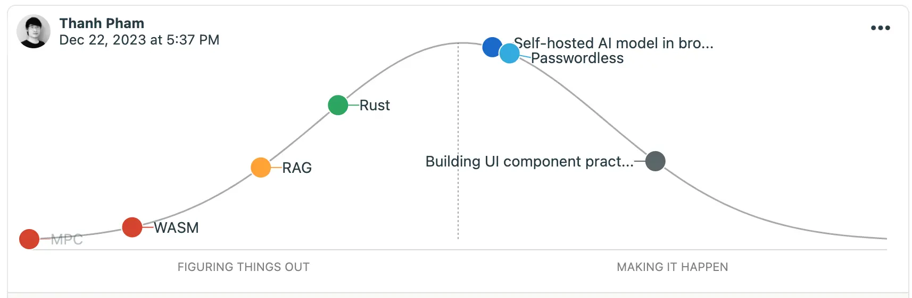

**This month**, we have focused on revamping how we learn, familiarize, and work with tech. We are excited to announce that we have updated our Forward Engineering to better reflect the feedback and insights from our Labs team, Operations Team, and Consulting Team.

This is to hopefully provide you with a more comprehensive publication that not only keeps you informed about the latest technologies and where they are applied, but also foster collaboration and innovation within our organization. We hope you find this edition of Forward Engineering informative and give you a better idea of what we’re doing. As always, we welcome your feedback and encourage you to share your thoughts on the content.

## Tech Radar

### Rust
***Assess***

|          |                                                                         |
| -------- | ----------------------------------------------------------------------- |
| Tags     | `#memory-management` `#systems-language` `#backend` `#embedded-systems` |
| Domain   | `Embedded Systems` `Networking and DNS` `Security` `Fintech`            |
| Projects | `...`                                                                |

Rust, the programming language, has been on our radar for quite some time, primarily in the context of developing compiler tooling – a niche that sparked only modest interest within our team. However, our perspective shifted significantly after engaging in [a community project](https://github.com/webuild-community/spacebot) aimed at creating a Rust-based game server. This experience opened our eyes to Rust's impressive capabilities. Our developers have come to greatly appreciate the language's speed, safety, and performance.

Furthermore, we've observed that Rust continues to evolve, increasingly supporting a wider array of applications, notably in web development and artificial intelligence. This evolution has motivated us to delve deeper into the language. Our initial steps involve comprehending Rust's concurrency model, which is pivotal for our community project. Simultaneously, we are eager to explore new facets of Rust, expanding our understanding and application of this powerful language.

### Retrieval Augmented Generation
***Trial***

|          |                                                                         |
| -------- | ----------------------------------------------------------------------- |
| Tags     | `#ai` `#llm` `#embeddings` `#llm-knowledge` `#indexing` `#vector-database` |
| Domain   | `AI` `MLOps` `Indexing` `Semantic Search`            |
| Projects | `...`                                                                |

Retrieval Augmented Generation (RAG) is a general technique used to embed knowledge into a Large Language Model (LLM) to be used in lieu of fine-tuning. Instead of using inherited knowledge that was used to train the LLM to retrieve information for the user, RAG takes advantage of LLM embedding models to vectorize semantics into a vector database to be later "retrieved" and "augmented" as context to "generate" new informed outputs for the LLM.

Before the term was coined, our team has had done several experimentation with this technique with the help of `pgvector` on Supabase on TypeScript deployments, `chroma` on Python deployments, as well as with prompt engineering to further augment context for better indexing. This technique, although coined from development with LLMs, turns out to be a useful indexing technique that can be used as an alternative to keyword-based indexing.

### Self-hosting AI Model in the Browser
***Assess***

|          |                                                                         |
| -------- | ----------------------------------------------------------------------- |
| Tags     | `#ai` `#llm` `#llm-knowledge` `#tooling` `#computer-vision` `#object-recognition` |
| Domain   | `AI` `Language` `Object Recognition`            |
| Projects | `...`                                                                |

YOLOv8 is a state-of-the-art machine learning algorithm designed for object detection, image classification, and instance segmentation tasks. It is the latest iteration in the YOLO family of models, which are known for their speed and accuracy in real-time object detection. Key features of YOLOv8 include:

- **Decoupled head with anchor-free detection**: This improvement allows for more accurate and efficient object detection.
- **Mosaic data augmentation**: This technique helps improve the model's performance by creating new training samples through various transformations.
- **Ease-of-use**: YOLOv8 is easy to implement through a user-friendly package, allowing users to quickly integrate it into their projects using the CLI and Python IDE.

We've been applying YoloV8 as part of our effort in self-hosting AI models in the browser. One of our notable demos is object detection on reCaptcha and creating a basic flow to automate reCaptcha as a fun way to bypass captchas.

### Passkeys
***Assess***

|          |                                                                         |
| -------- | ----------------------------------------------------------------------- |
| Tags     | `#security` `#authentication` `#passkey` `#authorization` |
| Domain   | `Security` `Authentication`            |
| Projects | `...`                                                                |

Passkeys are a new type of login credential that allow users to access online accounts without having to enter a password. They are FIDO credentials stored on a user's computer or phone and provide a more secure way to sign in. Passkeys offer several advantages over traditional passwords:

- **Security**: Passkeys use public key cryptography and are resistant to online attacks like phishing. They are also less susceptible to data breaches and hacking attempts.
- **Ease of use**: Users can sign in to apps and websites using their device's biometric sensor (such as a fingerprint or facial scan) or a screen lock PIN. This eliminates the need to remember and manage multiple passwords.
- **Cross-platform compatibility**: Passkeys can be used across different devices and platforms, as long as the user is logged in to their account.

Our team has been experimenting with passkeys to provide authentication alternatives for users. We believe there is a ton of convenience in using passkeys as it offers a quick way for users to authenticate themselves without passwords. We've demoed 2 similar implementations using WebAuthn.

### Building UI Library Practices
***Trial***

|          |                                                    |
| -------- | -------------------------------------------------- |
| Tags     | `#ui` `#ux` `#best-practices` `#frontend` `#react` |
| Domain   | `Web3` `Fintech` `Frontend`                        | 
| Projects | `consolelabs/web-foundation` `mochi-web`           |

Along with making our library [open-source](https://github.com/consolelabs/web-foundation), there has been a lot of advancements making Mochi UI becoming more generally available to our team and reaching towards version 1.0. Extensive effort was made to make sure component designs stay modular and allow integrated foundations set by our designer to be represented as code. User Experience is a key detail we make sure gets ironed out in every component, and has been part of our focus in standardizing the designs on Mochi UI.

Working through these challenges has given us the opportunity to lay out and consolidate our frontend foundations, showing our efforts through our recent demo workshop. Working with new standards while creating some of our own have promising results in easing developer experience and productivity. It has been an incredible learning experience and we will continue the path to transform into best practices for both our team and the wider community.

## Labs Roadmap
In a recent collaborative discussion between key members of the Labs and Consulting teams, we’ve made decisive strides in pinpointing key topics and potential projects for development. Each topic is paired with specific challenges to ensure we engage deeply with the technology, understanding its practical applications. The focal point for the coming month is WebAssembly (WASM), alongside a range of exciting use-cases we plan to implement and demonstrate.

### Currently Researching

| Research Topics         | Progress                                                                                                                                                                             | Next Step                                                                                                                                  |
| ----------------------- | ------------------------------------------------------------------------------------------------------------------------------------------------------------------------------------ | ------------------------------------------------------------------------------------------------------------------------------------------ |
| Web Assembly (WASM)     | - Self-hosted a model in the browser with Tensorflow.js + YoloV8 to bypass reCaptcha v3 - Worked with data processing with DuckDB through WASM on the browser and on ObservableHQ | - Continue forward with porting Rust games and running them through WASM - Process data with DuckDB WASM in a SME dashboard environment |
| Passwordless            | - Worked on a simple frontend and backend system on handling Passkeys with WebAuthn                                                                                                  | - Implement QR-based login to handle authentication across multiple devices - Experiment with Magic Links                                                                |
| Artificial Intelligence | - Introduced a low-code and simple code example of implementing RAG on ChatGPT and local models                                                                                      | - Boilerplate AI and RAG integration on Elixir - Deploy a Discord bot for recording and transcribing speech with Whisper                                                                                                                                           |
| Building UI Practices   | - Demoed a workshop on Mochi UI, encompassing techniques and API composition across components                                                                                       | - Iron out practices and have Mochi UI to be GA                                                                                                                                           |

## Dwarves Rewind - Discord Community
Dwarves Rewind this month will be a collection of tech interests we see happening in our Discord community. Along with our labs roadmap, the community have also shown more interest in Elixir and scalability, with a look on some old and new tools for web development. Some of the programming languages, tools and frameworks discussed this month are:

1. **Actor Model**:
   https://newsletter.systemdesign.one/p/actor-model
   https://underjord.io/unpacking-elixir-the-actor-model.html
   The Actor Model is a style of software architecture in which the basic computational unit is called an actor. It is a conceptual model for dealing with concurrent computation, defining general rules for how the system's components should behave and interact with each other. It has been been trending with our community and labs team, and we're investigating tech that include Actix in Rust and native processes in Elixir.
   
2. **Wasp Full-stack Framework**: https://wasp-lang.dev/
   Wasp is a full-stack framework packaged as a custom programming language to template models, routes, pages, queries, and actions. Wasp takes an explicit approach in bridging and scaffolding the frontend, backend, and deployment layers through a compiler that compiles Wasp into associated files, such as JSX, docker, Prisma, etc.
   
3. **Biome**: https://github.com/biomejs/biome
   Biome is a performant toolchain for web projects, it aims to provide developer tools to maintain the health of said projects. It is a fast formatter and linter for JavaScript, TypeScript, JSX, and JSON, with high compatibility with Prettier. 

4. **WebAuthn**:
   https://discord.com/blog/how-discord-modernized-mfa-with-webauthn
   https://webauthn.wtf/
   WebAuthn (short for Web Authentication) is an API specification that enables applications to use strong and secure authentication methods for user registration and login. It provides a way for end users to authenticate themselves using hardware- or software-based authenticators, such as USB security keys or secure hardware elements integrated with a laptop or mobile device, instead of relying solely on passwords. It is a both an interest for the community and for our labs team in understanding authentication patterns. 
