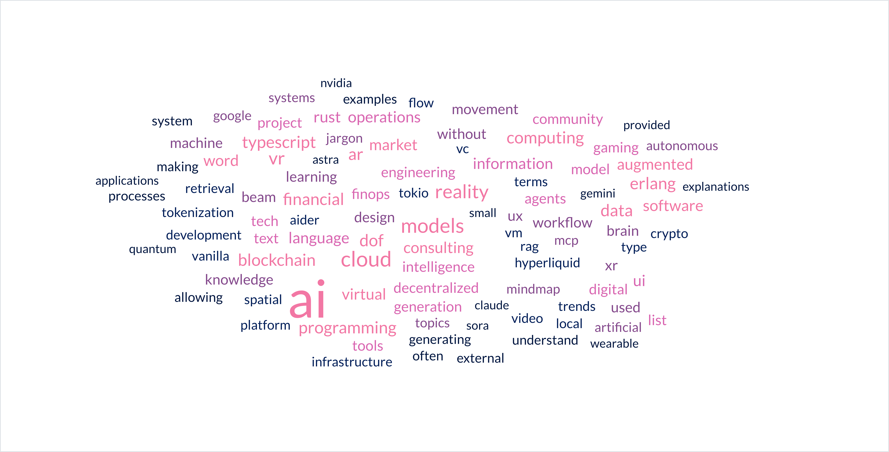
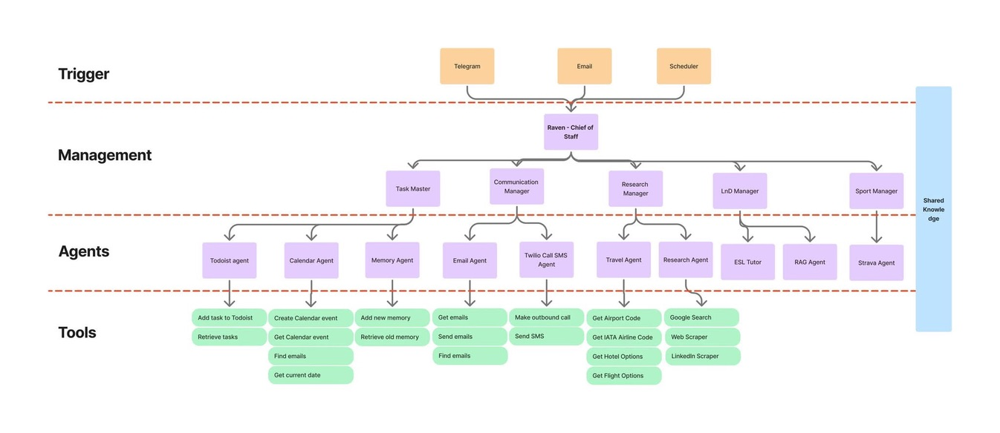
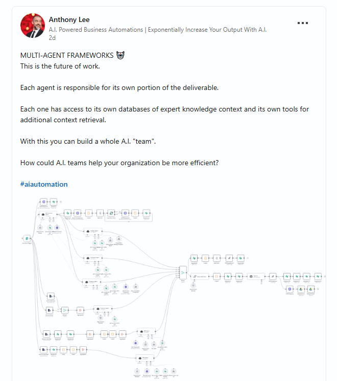
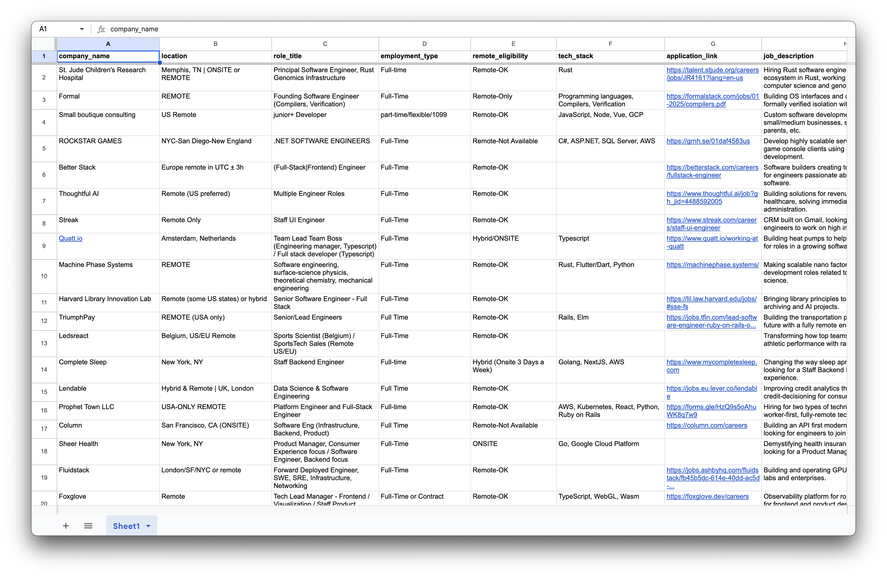

## #tech discord highlights

December 2024 and early February 2025 saw our `#tech` channel buzzing with diverse perspectives from our community. Key themes emerged:

- **AI-Assisted Coding Tools:** A significant focus on tools like Aider and Cursor. Members shared practical tips for overcoming limitations, such as preventing code truncation. We saw community members trying various prompts like, *"Do not truncate any code, provide the full contents of the file"* to achieve their desired outcome.
- **Prompt Engineering at different levels:** With the advent of AI agents, prompts are getting much more sophisticated, especially for [coding agents](https://gist.github.com/gc-victor/9619efc9048adaf6647fef295978cc68).
- **General AI & New Models:** Excitement around new AI model releases, particularly from Google Deepmind and OpenAI. Don’t forget about DeepSeek. The potential of AI agents in blockchain applications was also a recurring topic.
    
    > "G2 generate game worlds -> AI agents train on generated worlds" - mashiro5951
    > 
- **Blockchain Explorations:** Beyond just following the trends, there was exploration around the intersection of AI and blockchain, experimenting with using AI for on-chain actions and analysis.
- **Performance & Data:** A technical dive into performance optimizations, especially around DuckDB.

Our community regularly shared interesting articles and videos, expanding the community's collective knowledge base. Topics ranged from building Google Meet clones to the architecture of high-throughput systems.

## **Highlights on Memo**

### Weekly consulting snapshots

We're always tracking advancements in AI, blockchain, and other emerging technologies. We feel it's essential to stay attuned to how different markets and spaces are adapting to change. Understanding AI trends and the bubbling emergence of AI agents is crucial to making sure our foundations stay strong while encompassing new technologies and techniques.

- [**Weekly Consulting Snapshot #1: Gemini 2.0, OpenAI’s Sora, a16z’s Predictions**](https://memo.d.foundation/consulting/market-report/2024-13th-dec): An exploration of key advancements in AI, quantum computing, and emerging technologies reshaping consulting opportunities.
- [**Weekly Consulting Snapshot #2: AI Talent Wars, OpenAI’s New Models, Hyperliquid’s Rise**](https://memo.d.foundation/consulting/market-report/2024-27th-dec): Discusses key trends in AI, blockchain, and productivity hacks shaping the consulting space.
- [**Weekly Consulting Snapshot #3: AI’s Ubiquity at CES, Wall Street’s AI Boom, and Blockchain Innovations**](https://memo.d.foundation/consulting/market-report/2025-3rd-jan): Explores the impact of AI at CES 2025, Wall Street's AI-driven surge, and the fusion of blockchain and AI in emerging projects.
- [**Weekly Consulting Snapshot #4: AI Supercomputers, Mini AI PCs, Worldcoin Expansion, and SEA VC**](https://memo.d.foundation/consulting/market-report/2025-10th-jan): Discusses AI breakthroughs, expanding Worldcoin, and driving SEA investments.
- [**Weekly Consulting Snapshot #5: VC Trends, Blockchain Breakthroughs, and AI Innovations**](https://memo.d.foundation/consulting/market-report/2025-17th-jan): Showcases VC Trends, Blockchain Breakthroughs, and AI Innovations.

### Cryptocurrency & blockchain

We've seeing increased interest in sophisticated strategies as the crypto market matures and institutional adoption grows. We believe understanding the interplay between Bitcoin and altcoin performance is crucial for successful hedging. We're also aware that transparency remains a key challenge, and robust transfer tracking is essential for both users and developers. Data visualization helps understand complex trends, and we're impressed with the growing popularity of Golang for building performant tools in this space.

- [**Tracking Bitcoin-Altcoin Performance Indicators in BTC Hedging Strategy**](https://memo.d.foundation/playground/use-cases/bitcoin-alt-performance-tracking): Overview of tracking Bitcoin-Altcoin performance indicators in a Hedge trading strategy.
- [**Transfer mapping: enhancing loggers for better transparency**](https://memo.d.foundation/playground/use-cases/enhancing-cryptocurrency-transfer-logger): Improving cryptocurrency transfer logging systems for transparency and traceability.
- [**Building better Binance transfer tracking**](https://memo.d.foundation/playground/use-cases/binance-transfer-matching): Building a robust transfer tracking system for Binance accounts.
- [**Visualizing crypto market outperform BTC-Alt indicators with Golang**](https://memo.d.foundation/playground/use-cases/crypto-market-outperform-chart-rendering): Implementing a Golang-based visualization for crypto market performance indicators.

### Data engineering & architecture

We believe data as the lifeblood of modern applications, and we're strong advocates for implementing robust archival and recovery strategies. We appreciate the power of the data snapshot pattern for efficiently managing historical data, and the challenge of reconstructing historical P&L. We're always looking for new and innovative ways to tackle these problems.

- [**Setup data recovery with archive strategy**](https://memo.d.foundation/playground/use-cases/data-archive-and-recovery): Implementing data archival and recovery strategies for high-volume transactional applications.
- [**Implementing data snapshot pattern to persist historical data**](https://memo.d.foundation/playground/use-cases/persist-history-using-data-snapshot-pattern): Implementing the data snapshot pattern for efficient historical data persistence.
- [**Reconstructing historical trading PnL: a data pipeline approach**](https://memo.d.foundation/playground/use-cases/reconstructing_trading_pnl_data_pipeline_approach): Rebuilding historical trading PnL data through an efficient data pipeline approach.

### Frontend development

The frontend landscape is constantly evolving, and staying on top of the latest advancements is a high priority. We're excited about React 19's Actions, Next.js's Deno Deploy support, and AI-powered frontend tools like Transformers.js, and believe they'll be crucial for building the next generation of web applications.

- [**Frontend Report January 2025**](https://memo.d.foundation/playground/Frontend/Report/frontend-report-january-2025): Explores key frontend advancements, including React 19's Actions, Next.js 15.1's Deno Deploy support, and innovative tools like Transformers.js for AI.

### Dwarves foundation updates

We value transparency and communication a lot; sharing our team moments helps foster a strong sense of community, plus it's fun. Team building events are an important part of our DNA, and they help us connect on a personal level and start each new year with renewed energy and focus.

- [**What's New in December 2024**](https://memo.d.foundation/updates/changelog/2024-whats-new-december): Highlights progress made by Dwarves in December 2024, including team moments and steady progress.
- [**Weekly Digest #15: New year Gathering: Sharing Tết, starting strong**](https://memo.d.foundation/updates/digest/15-new-year-gathering): Shares the story of Dwarves' team reunion to share stories, reconnect, and kick off the Year of the Snake.

### Golang

In the background, we're always watching how Go continues to evolve. We see the testing/synctest experiment as a small step towards improving testing and concurrency stories in the language.

- [**Go Commentary #24: Coming in Go 1.24: testing/synctest experiment for time and concurrency testing**](https://memo.d.foundation/playground/go/weekly/dec-13): Discusses the upcoming features in Go 1.24, including the testing/synctest experiment for time and concurrency testing.

## Market report: navigating tech tides - AI agents ascend, talent reshapes, and markets shift

The tech world is rapidly changing, driven by advancements in AI, shifts in talent demands, and evolving market dynamics. This report gives a quick overview of the key trends we're seeing right now.

### AI agents take center stage: from no-code to pro-code autonomy

AI agents are moving from concept to reality, transforming industries. Initially, no-code platforms democratized AI agent creation. Now, there's a shift towards more technical, self-hosted solutions like [n8n](https://blog.n8n.io/ai-agentic-workflows/), reflecting a need for greater customization and control, especially for advanced applications.

> This transition highlights a growing sophistication in AI agent development, moving beyond simple automation to bespoke, enterprise-grade solutions.
> 

Model context protocol (MCP) is becoming crucial for advanced AI agents. MCP allows agents to use rich contextual data, improving decision-making. Tools like `mcp-server-aidd` and `continue.dev` are leading to tailored AI coding assistants, essential for enterprise AI deployments. [**Even Cloudflare is in the picture**](https://blog.cloudflare.com/model-context-protocol/). Looking ahead, expect AI agents to integrate more deeply with hardware, blurring the lines between software and physical interaction.

> Expect to see more AI solutions tailored for specific enterprise needs, demanding a deeper level of technical expertise to build and manage.
> 

*The move to platforms like n8n and the focus on MCP signal a maturing AI agent landscape. For businesses, this means needing teams with deeper technical skills to leverage the full potential of AI autonomy.*

### Talent and job market: AI expertise in high demand, traditional roles evolving

The demand for AI talent is incredibly competitive. Companies are fiercely competing for skilled AI professionals, recognizing their value as key innovators. However, traditional software engineering roles are evolving as AI automates routine coding tasks. AI is becoming a vital tool in development, handling code reviews and generation.

> The rise of "AI employees" isn't just a buzzword; it's a reflection of how AI proficiency is becoming core to tech roles.
> 

While the AI sector booms, layoffs across tech indicate a market recalibration. This restructuring suggests a move toward leaner operations and greater AI-driven automation. New job roles are emerging around AI – think AI supervisors and prompt engineers – even as traditional roles shift.

*The talent market is bifurcating. Deep AI expertise is premium, but for broader engineering, adaptability and AI tool proficiency are becoming table stakes.*

**The proof: job startup demands - Full-stack & AI roles lead**

Recent job postings on platforms like Hacker News further emphasize current talent demands.  Full-stack and AI/ML engineers are prominently sought after, reflecting the industry's need for both versatile developers and specialized AI expertise.

> The job market is clearly signaling a dual demand: for broad software engineering skills and for niche AI/ML specializations.
> 

While remote work remains a strong trend, a notable segment of postings, particularly for senior and leadership positions, are hybrid or onsite, especially in major tech hubs. Compensation packages are competitive, with equity often included, especially in startups and for senior roles, indicating the ongoing battle to attract top tech talent.

*Analyzing Hacker News job trends confirms the broader market shifts.  Full-stack skills remain crucial, but AI/ML expertise is increasingly becoming a core differentiator for both companies and individual engineers.*

### Market dynamics: VC focus, regional growth, and blockchain innovations

The US continues to lead in venture capital, especially in AI. Emerging markets like India and Canada show strong VC growth, while cost-sensitive regions like China face funding declines, pushing them towards cost-efficient tech solutions.

> AI-related fields are VC magnets in the US, but globally, strategic, cost-effective tech investments are on the rise.
> 

Blockchain and AI are increasingly converging. We're seeing experimental projects combining decentralized tech with AI for enhanced transparency and new applications, especially in DeFi and asset tokenization. Decentralized exchanges like Hyperliquid are showcasing blockchain's potential in finance.

*VC funding trends signal where the smart money is going: AI and efficient growth. For consultants, understanding these regional and sector dynamics is crucial for strategic advice.*

This market report provides a snapshot of a tech world in flux. AI's increasing sophistication, evolving job roles, and shifting investment patterns are key trends to watch and navigate.