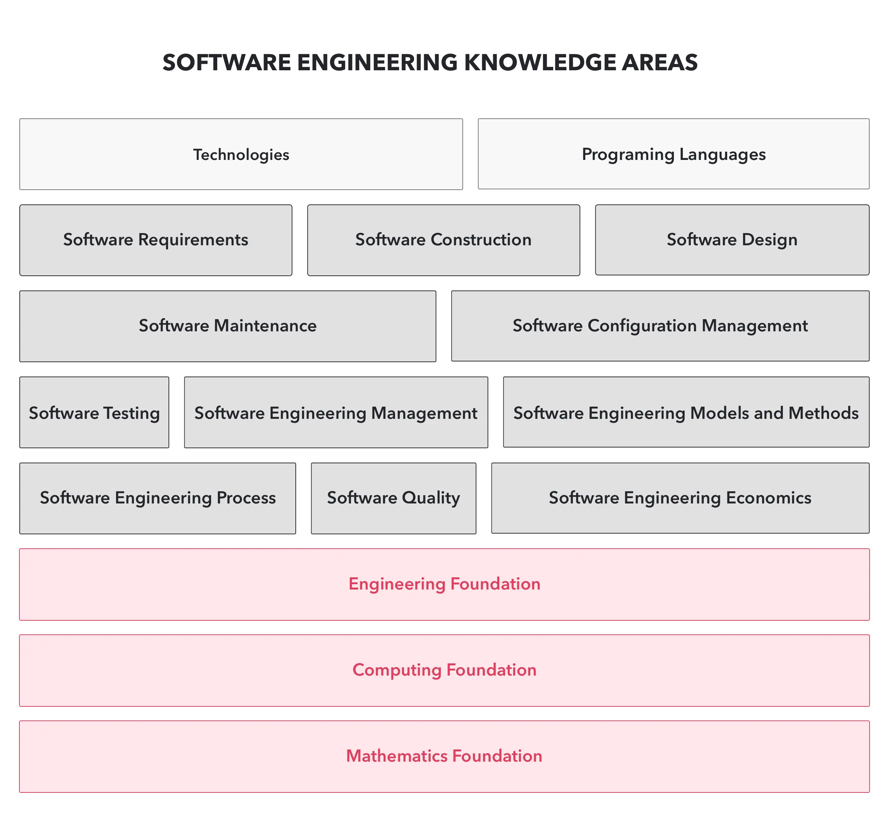

## Our Perspective on Technology

Technology is eating the world. The technology we used yesterday may be deprecated today. New technology has enabled us to create new things. With the existing set of problems, new solutions will emerge along with new technologies.

Over five years of working as an innovative software firm, other than the energetic tech-savvy workforce, we shape the team day by day with the core values that move towards the engineering culture. We start this team with the mission to empower innovation and join the force to co-create the future. This urges us to learn the newest and the best technology and new practices out there to enhance the output quality, speed up the development process, also to bring the best pieces of software to life.

We launch The Dwarves Tech Radar as a living asset to evaluate the adoption decision and keep the technology direction stays on track. Tech Radar is how we do R&D, how we work on self-growth and motivate continuous curiosity.

## Adoption Process

When we observe a new tech, we map to the movement of the certain market to evaluate if the new tech could fit in. The main idea is to see if the new tech could help to make anything better than before in the long run and also serve our development direction.

The Dwarves are encouraged to gather into small focus groups to discuss and study a particular topic. The below format could be found originated from ThoughtWorks. We organize the topics using two categorizing elements:

* Quadrants represent different kinds of topics.
* The rings indicate what stage in an adoption lifecycle we think they should be in.

## Quadrants

The quadrants consist of:

* Languages and Frameworks, e.g., Erlang, Svelte, R
* Techniques, e.g., new design technique, software structure, microservices architect.
* Tools, e.g., editors, databases, software development tools.
* Platforms, e.g., things provided by others that we build software on top like Vault, Istio, JupyterLab.

## Rings

Our radar has four rings, start from the middle.

* Adopt: proven and mature for use.
* Trial: ready for use but not completely proven.
* Assess: things to explore, look at closely.
* Hold: things that not fit us or we’ve had a good experience.

For each batch, we will organize into volume in our github repository (dwarvesf/radar) and track down the changes or comments from the study group.

## The Tech Knowledge Areas

Above is the knowledge areas that we think the software engineers should have been through. Our current tech stack is the reflection of how we apply those theoretical knowledge in real life. Run through the software development lifecycle and engineering disciplines, it mainly cover

* Requirement
* Design
* Development
* Testing
* Deployment
* Maintenance / Monitoring

In each particular topic, there are new practices, tools, frameworks and services that keeps evolving. The lower the topic in knowledge areas stack, the more important it is to set the foundation for engineers.
