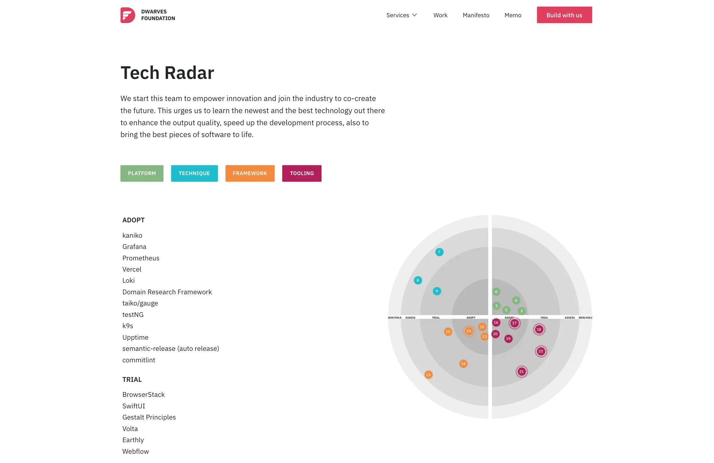

The Dwarves have their tradition to explore the tech scene and learn new things. Dwarves Tech Radar kicked the initial step since January of 2020.

It is the first time we sit down and do it in written form. It's a bit hard for the engineers at first, but we managed to complete the volume with ten reports.

Besides volume 01, we have an opportunity to sort out our current technology index and put it at <https://d.foundation/radar>](<https://d.foundation/radar>). And for this edition, the theme is to get the whole team used to the concept of a central knowledge base, every study to expand our view to the tech scene counts. The design team also has a place to contribute and discuss their practices.

Let us walk you through the first Volume.

## Language & Framework

### WebAssembly

Previously, it takes HTML, CSS, and Javascript to perform an interactive web-app for users. But with the continually higher demand, web-app must serve at a better velocity. Web Assembly was created to tackle the performance-critical problem that Javascript is struggling, leveraging the calculating ability in client-server, especially in multimedia processing tasks. The topic is a quick playing-around that will help engineers shorten their time to get to know the WebAssembly concepts.

### Progressive Web App

Native applications are known for being incredibly productive and reliable. It's fast, convenient, user-friendly, and work regardless of network connection and can be considered part of the device it's run on. Given this noticeable feature, PWA is an enhanced technique built with modern APIs. PWA equips web-app with native-like capabilities, reliability, and installation while reaching anyone, anywhere, on any device with a single codebase. In short, it supports and provides users with a unique opportunity to upgrade their web experience.

### Three.js

Three.js is a library that is used to create and display 3D animation in web applications. Comes with a short demo on how to turn music audio files into sound waves using three.js and WebAudio API, this topic can be considered a self-project from one of our front-end Dwarves, applying the basic concept of three.js and use it for audio visualization.

### Istio

Istio is an excellent choice for service mesh due to its amazing and useful feature set. Service discovery, traffic management, service-to-service, and origin-to-service security, observability (including telemetry and distributed tracing), rolling releases, and resiliency.

Still, our infrastructure scale is far from utilizing all of those functions. Given that reason, Istio is quite complex and resource-consuming to adopt. We've decided to hold its implementation in the time being.

### SwiftUI

SwiftUI is a UI framework that lets developers create apps in a declarative way. There are minimal code changes as a lot of the same components on SwiftUI can be reused. Learn once & apply anywhere, SwiftUI Stacks, Control, and Layouts work the same with mini changes and navigation. Most controls and data work across all platforms and will be automatically translated to the user.

Swift UI is still in its early stage and not yet mature to apply for any production scale. But we think it will be kicked in on iOS 15. To make sure we can be all ready by then, we are using it for our internal projects and exploring the new iOS features, like Widget and so on.

### XPC Service

Running an application needs more than one processor. It takes support from other process helpers. This makes sure the app can still run once one of the process helpers is crashed; leave the minimum of memory footprint and enhancing security. Acts as an inter-process-communication mechanism, XPC Service manages the communication between the processors and the application by calling the processors in the time of need and turned off once the process is done.

Applying XPC-service in mobile development touches some advantages: reduce memory footprint or separated permission for each service. But on the other hand, it triggers the coding boilerplate and the latency between some specific services.

## Practices & Approach

### Software Reusability

Systems are repeatedly created in a specific field, with set variables to fulfill the requirements. Instead of rebuilding these systems every time a product is made, reusability in software is how developers shorten the effort by re-picking the elements from the previous system. This topic is a brief explanation of why we opt for frameworks in the development process or why web service standards are being used widely. It's also the answer for some software matters such as lower software production and maintenance costs, faster delivery of systems, and increased software quality to get the final goal is the increment of return on software investments.

### CLI Assistant

During the coding process, we realize people will soon forget about the code information. It happens every once in a while. The most usual scenario is to switch to the browser and Google the hell out of it. This terminal assistant is a heuristic-approach tool to provide the knowledge we need in the software process. Combining with a rubber duck for debugging, CLI Assistant helps reduce the effort to search for answers constantly, as it manages to contain the info we need along the way.

### Gestalt UI Principles

User Interface isn't only about aesthetics. It's also about usability, performance, and how users experience the product along the way.

Gestalt Principles will be an active supporter for us during our UI design process. Before we fully understand UI's beauty and how to create it, those principles are our guidance.

However, never limit yourself to any line or principles. Rules are subjected to be broken. Feel free to stay creative. A great UI design is a harmonious combination of accessibility, feasibility, and art.

### Go-routine Underlying

Go's native concurrency model allows it to rise in popularity for creating truly concurrent systems. Goroutines, in fact, acts as a vital part of its functioning. They are the heart and soul of the language and can provide a massive performance boost if used appropriately.

### Applied Security Aspects in

* SSH
* SSL
* Blockchain

From the dawn of the network until now, security has always been essential. But as time goes by, security is embedded into frameworks and low-level level layers of the tech stacks. Hence, many developers spend their time messing around with the top-level level layers, confident that the security issues are covered by frameworks & libraries. Security somehow is placed in a black box, and we are gradually getting ignorant about how it works. This explains the underlying security principles of Blockchain and SSL (Secure Sockets Layers), providing the foundation of how to put the security into action.

### AARRR Funnel

With AARRR funnel, we could build a product based on a concrete foundation and minimize the risks by defining what it takes to get the business goal and how to get there (metrics).

Along the way, we could define the metrics for each stage and which one deserves the utmost focus. It creates our ability to do things in the right way.

### Blockchain for Designer

The key value proposition of Blockchain is to provide users with transparency and efficiency. Many businesses take off by applying Blockchain, especially in finance, supply chain, healthcare, and gaming. Blockchain is believed to help users resolve trust issues when it comes to personal information and assets.

Thus, design for Blockchain is the most critical challenge for raising adoption. Effective UX design is essential to create useful and valuable applications. This keeps end-users comfortable and, eventually, forget about the sophisticated underlying technology.

Although Blockchain will change and develop in the future, the principle remains the same. That means product designers must always stay posted on new Tech that can become a savior for users' pain points.

### Remote UX Testing

Thanks to the usability test, we were able to address the user's trouble. It lets us improve the information architecture and visual hierarchy and product performance to bring users a better experience. This reduces their effort and time to the minimum, which, in return, should drive more sales.

As we have no idea when the Covid-19 pandemic is over and work from home is strongly recommended, it's the right time to adopt remote methods in UX design, including Remote Moderated Usability Testing. Although there are some drawbacks, it's still a good solution for our team, client, and test participants.

## Reaching Toward

These above are just the beginning of a long run. We're thinking of bringing everything alive once all the topics are wrapped up. In the meantime, we'd love to receive all of the comments, contributions, and advice to make this Radar more completed. The best can always become better.

Though this began as a side project, The Dwarves Tech Radar speaks up the code that sticks us together for over the years.

**Innovation** - the urge to discover new ways of solving the current problems and create impacts
**Craftsmanship** - the mindset of dedicating your time and effort in every piece of work
**Teamwork** - the spirit of connecting and collaborate effectively amongst the crew without breaking the present value.

Innovation happens almost every day, and it's our job to pursue the latest version. It's what sets the business successful and giving them a competitive advantage. That begins with nothing but keeps the employee updated on the latest development.

Grab a seat and stay abreast of our latest topic updates.
