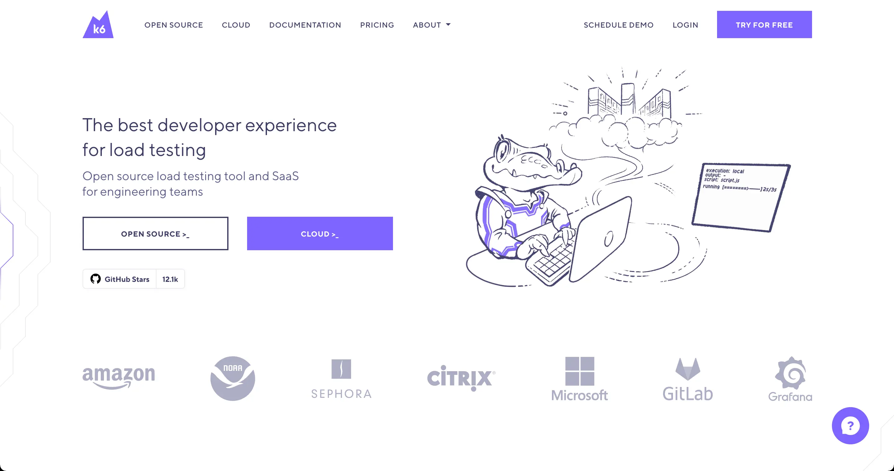
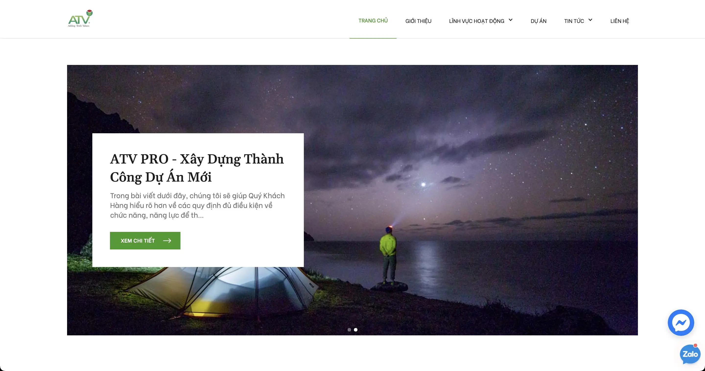

We started [the 1st volume](https://github.com/dwarvesf/radar/tree/master/vol-01) a year ago, mostly about assessing all the tech indexes we have adopted for 5 years. Then we moved to [the 2nd volume](https://github.com/dwarvesf/radar/tree/master/vol-02), where we figured ways to simplify the workflow and complete our project toolkit.

And here we go again, another version of tech radar at Dwarves Foundation. 2021 has just gone through its first quarter, and we've left with some new toys to trial and see if they create any impact. In short, this 3rd volume is all about one thing: **Trial**.

We also have the GitHub version at **[dwarvesf/radar/vol-03](https://github.com/dwarvesf/radar/tree/master/vol-03)**.

## Testing
### [k6](https://github.com/dwarvesf/radar/blob/master/vol-03/k6.md)
*[https://k6.io/](https://k6.io/)*

Open-sourced load testing tool to verify the system's loading tolerance. By applying k6, developers can measure the limited amount of requests that the system can handle.

Though k6 is written in Go, its scripts are made out of Javascript. Thanks to its code-driven mechanism, with the powerful code-based scripting from JS, k6 was built to prioritize developers. It's easy to maintain and integrate k6 with the daily tools of developers, like GitHub, Grafana, VSCode, GraphQL.

Since functional testing is still our main work, Quynh Le - our QC Team Lead, decided to take a good look at it as a reference before moving to Testlink.

### [Testlink](https://github.com/dwarvesf/radar/blob/master/vol-03/testlink.md)
*[https://testlink.org/](https://testlink.org/)*

After k6, Testlink is the next thing on queue - An open-sourced test management tool that oversees and controls everything in test, test cases, test report, requirement, or test execution. We hosted a radio talk on this, mainly to demo the team on how we set up and apply Testlink into our current testing workflow.

Currently, we're trialing Testlink with BaseHQ and Aharooms. We get to know the project quality status or how many percentage requirements are covered by using it. The plan is to configure and sync the automation test report with TestLink and task report tools such as Jira.

## Front-end Development
### [Preact](https://github.com/dwarvesf/radar/blob/master/vol-03/preact.md)
*[https://preactjs.com/](https://preactjs.com/)*

A JS library developed on React structure, with the same API, component and virtual DOM integration. Thanks to the light bundle size (3kb), the Preact-based website is faster in rendering and boosting user experience. The next level for React alternative and the smallest library in size so far.

Providing the same APIs and mechanism as React, Preact can be used directly in the browser and doesn't require any build or tools. Using `preact-compat` in Webpack/ Browserify, developers create an alias to achieve 100% compatibility with React.

A significant advantage of switching to Preact from React is the smaller bundle size that helps the app to load faster - this can be a key requirement for some projects. We're using Preact to bootstrap some projects of the marketplace and product showcases.

## DevOps and Maintenance
### [ArgoCD](https://github.com/dwarvesf/radar/blob/master/vol-03/argoCD.md)
Acts as a Kubernetes controller which continuously monitors running applications and compares the current, live state against the desired target state (as specified in the Git repo); ArgoCD helps update, manage and control the code versions during its development phase on k8s. Testers can export the environment configuration in different formats, such as customize files, YAML files or jsonnet.

## No-code Platform
### [Webflow and Bubble.io](https://github.com/dwarvesf/radar/blob/master/vol-03/nocode.md)
We did bring up [Webflow](https://webflow.com/) in the previous version and applied it in [KiwiPay](https://kiwipay.webflow.io/) - marking our first attempt in no-code development. Succeeding this, we used Webflow to finetune the website of [ATVPro](https://atvpro.webflow.io/)

Aiming for a more complex tool, we dived in [bubble](https://bubble.io/) - a no-code tool with the same concept. After using it for one of our design projects, we realize it somehow refrains developers from learning and adjusting the code. Meanwhile, it requires a deeper level of code and database, making it hard for designers to pick up. That leaves us with hitting a pause on bubble, and sticking with Webflow for our future projects.
