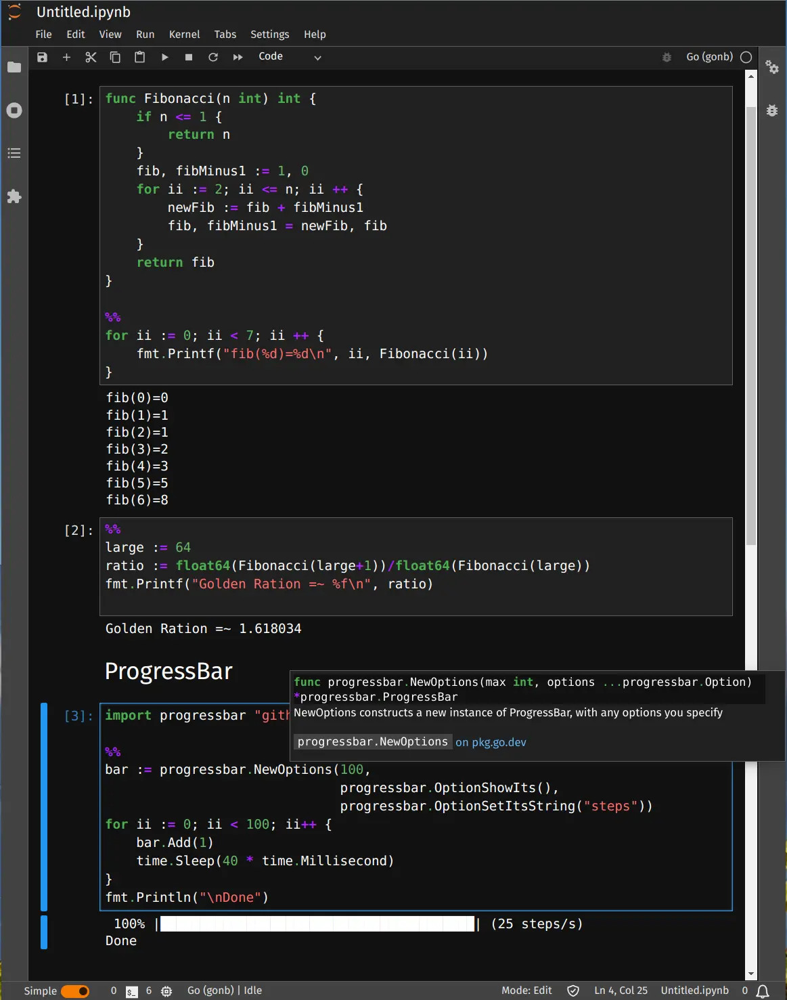
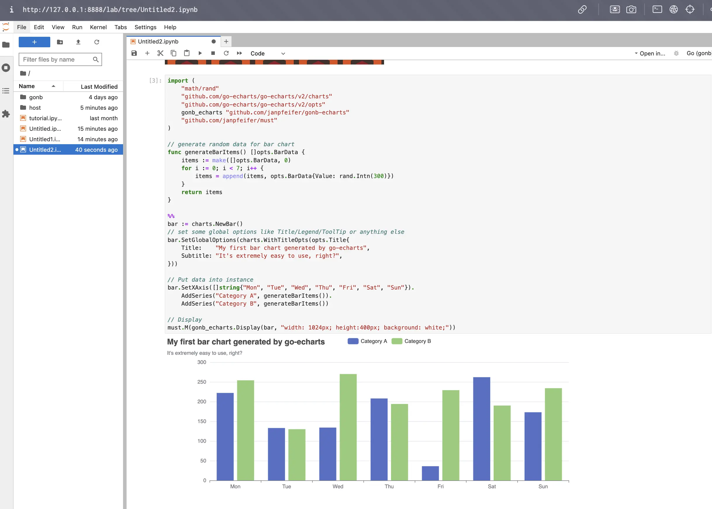

---
tags:
  - golang
  - go-weekly
  - networking
authors:
  - fuatto
title: 'Go Commentary #8: Jupyter Notebooks, Kubernetes Tools, GopherCon Talks'
short_title: '#8: GoNB, kubetrim, and GopherCon UK 2024'
description: "Explore GoNB for Jupyter notebooks, kubetrim for KUBECONFIG management, and key highlights from GopherCon UK 2024 talks, covering performance testing, software design, event-driven workflows, and AI's impact on tech jobs."
date: 2024-08-23
---

## [GoNB: A Go Notebook Kernel for Jupyter](https://github.com/janpfeifer/gonb)

- Auto-complete and contextual help while coding.
- Rich content display: HTML, markdown (with latex), images, javascript, svg, videos, etc.



- Widgets (sliders, buttons) support: interact using HTML elements
- Plotly integration using [go-plotly](https://github.com/go-echarts/go-echarts)
- Apache ECharts integration using [gonb-echarts](https://github.com/janpfeifer/gonb-echarts) and [go-echarts](https://github.com/go-echarts/go-echarts)



## [kubetrim: Trim Your KUBECONFIG Automatically](https://github.com/alexellis/kubetrim)

```cli
$ kubectx

default
do-lon1-openfaas-cluster
kind-2
kind-ingress

$ kubetrim

kubetrim (dev) by Alex Ellis

Loaded: /home/alex/.kube/config. Checking..
  - kind-2: ✅
  - kind-ingress: ❌ - (failed to connect to cluster: Get "https://127.0.0.1:40349/api/v1/nodes": dial tcp 127.0.0.1:40349: connect: connection refused)
  - default: ✅
  - do-lon1-openfaas-cluster: ❌ - (failed to connect to cluster: Get "https://da39a3ee5e6b4b0d3255bfef95601890afd80709.k8s.ondigitalocean.co.uk/api/v1/nodes": dial tcp: lookup da39a3ee5e6b4b0d3255bfef95601890afd80709.k8s.ondigitalocean.co.uk on 127.0.0.53:53: no such host)
Updated: /home/alex/.kube/config (in 364ms).

$ kubectx

default
kind-2
```

## [12 Talks from GopherCon UK 2024](https://youtube.com/playlist?list=PLDWZ5uzn69ezR6D6FUj_iBSOyRc9xaZFP&si=IdFGYzOivQqFRsVb)

- Key highlights:
  1. **Performance Testing Tools**: One of the standout presentations was about a home-grown performance testing tool used to replay HTTP access logs against infrastructure setups. This tool was crucial for performance testing at scale, particularly during low-traffic periods, ensuring the system’s responsiveness without disrupting overnight operations.
  2. **Software Design and Complexity**: A session by Shivam Acharya and Peter Chai delved into the complexities of software design, discussing how complexity should be embraced and managed thoughtfully. They explored how decisions in API design can either simplify or complicate the interaction between different system components.
  3. **Event-Driven Workflows**: Another notable talk covered the implementation of event-driven workflows, highlighting the challenges and decisions in designing a technology-agnostic library that could work with various technologies like Kafka, Redux, Postgres, and MySQL.
  4. **AI and the Future of Work**: There was also a provocative discussion on how AI is influencing the future of jobs in tech, encouraging developers to think about how they can stay relevant as automation and AI continue to evolve.

---

- https://github.com/janpfeifer/gonb
- https://github.com/go-echarts/go-echarts
- https://github.com/janpfeifer/gonb-echarts
- https://github.com/go-echarts/go-echarts
- https://github.com/alexellis/kubetrim
- https://youtube.com/playlist?list=PLDWZ5uzn69ezR6D6FUj_iBSOyRc9xaZFP&si=IdFGYzOivQqFRsVb
