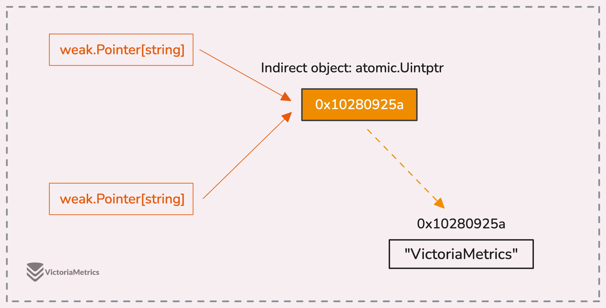
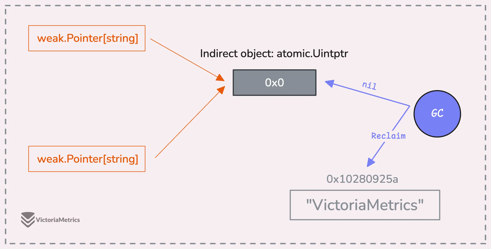

---
tags:
  - golang
  - go-weekly
authors:
  - fuatto
title: 'Go Commentary #23: Draft Release Notes for Go 1.24 and weak pointers in Go'
short_title: '#23 Draft Release Notes for Go 1.24 and weak pointers in Go'
description: Draft Release Notes for Go 1.24 and the incoming of weak pointers in Go
date: 2024-12-06
---

## [Draft Release Notes Go 1.24](https://tip.golang.org/doc/go1.24)

### Go 1.24 is not yet released. These are work-in-progress release notes. Go 1.24 is expected to be released in February 2025.

- Fully supports *generic type aliases*: a type alias may be parameterized like a defined type

```go
type (
	nodeList = []*Node  // nodeList and []*Node are identical types
	Polar    = polar    // Polar and polar denote identical types
)
```

  => Specs:

```go
type set[P comparable] = map[P]bool
type A[P any] = P    // illegal: P is a type parameter
```

  => the feature can be disabled by setting `GOEXPERIMENT=noaliastypeparams`; but the `aliastypeparams` setting will be removed for Go 1.25.

- Some updates for tools `go tool` or `-tool` flag, new `tests` analyzer for `go vet`

- Some updates for Cgo, Runtime, Compiler, Linker, Bootstrap

- Some updates for stdlibs:

  - The new `os.Root` type provides the ability to perform filesystem operations within a specific directory.

  - The `os.OpenRoot` function opens a directory and returns an `os.Root`. Methods on `os.Root` operate within the directory and do not permit paths that refer to locations outside the directory, including ones that follow symbolic links out of the directory.

    `os.Root.Open` opens a file for reading.

    `os.Root.Create` creates a file.

    `os.Root.OpenFile` is the generalized open call.

    `os.Root.Mkdir` creates a directory.

  - Some updates for `crypto`, `hash` package

  - Some updates for `net/http` including support for HTTP/2 protocol settings in `Transport` and `Server`

  - New implementation for `sync.Map` that will improve overall performance and resolve some long-standing issues


## [Weak Pointers in Go: Why They Matter Now](https://victoriametrics.com/blog/go-weak-pointer/)

### Definition:

A type of reference to an object that does not prevent the object from being garbage collected

=> `weak` package:

```go
type Pointer[T any] struct {
	u unsafe.Pointer
}

// Make creates a weak pointer from a strong pointer to some value of type T.
func Make[T any](ptr *T) Pointer[T] {
  //...
}
```

- If the memory they’re pointing to gets cleaned up, the weak pointer automatically becomes `nil` — so there’s no risk of accidentally pointing to freed memory => they are safe

```go
type T struct {
  a int
  b int
}

func main() {
  a := new(string)
  println("original:", a)

  // make a weak pointer
  weakA := weak.Make(a)

  runtime.GC()

  // use weakA
  strongA := weakA.Strong()
  println("strong:", strongA, a)

  runtime.GC()

  // use weakA again
  strongA = weakA.Strong()
  println("strong:", strongA)
}

// Output:
// original: 0x1400010c670
// strong: 0x1400010c670 0x1400010c670
// strong: 0x0
```

- After the first garbage collection `runtime.GC()`, the weak pointer weakA still points to the memory because we’re still using the variable a in the `println("strong:", strongA, a)` line. The memory can’t be cleaned up yet since it’s in use.
- But when the second garbage collection runs, the strong reference (a) isn’t used anymore. That means the garbage collector can safely clean up the memory, leaving `weakA.Strong()` to return `nil`.

### Use case

- Canonicalization maps, where you only want to keep one copy of a piece of data around 
- Initial purpose is in internal packages, e.g: `unique`

```go
func main() {
	h1 := unique.Make("Hello")
	h2 := unique.Make("Hello")
	w1 := unique.Make("World")

	fmt.Println("h1:", h1)
	fmt.Println("h2:", h2)
	fmt.Println("w1:", w1)
	fmt.Println("h1 == h2:", h1 == h2)
	fmt.Println("h1 == w1:", h1 == w1)
}

// Output:
// h1: {0x14000090270}
// h2: {0x14000090270}
// w1: {0x14000090280}
// h1 == h2: true
// h1 == w1: false
```

### How does it work

- Having a in-between tiny object (8bytes)



- This setup lets the garbage collector clean up weak pointers to a specific object all at once, efficiently: 
  - the collector only needs to set the pointer in the indirection object to nil (or 0x0). No need to go around updating each weak pointer individually.



---

https://tip.golang.org/doc/go1.24

https://victoriametrics.com/blog/go-weak-pointer/  