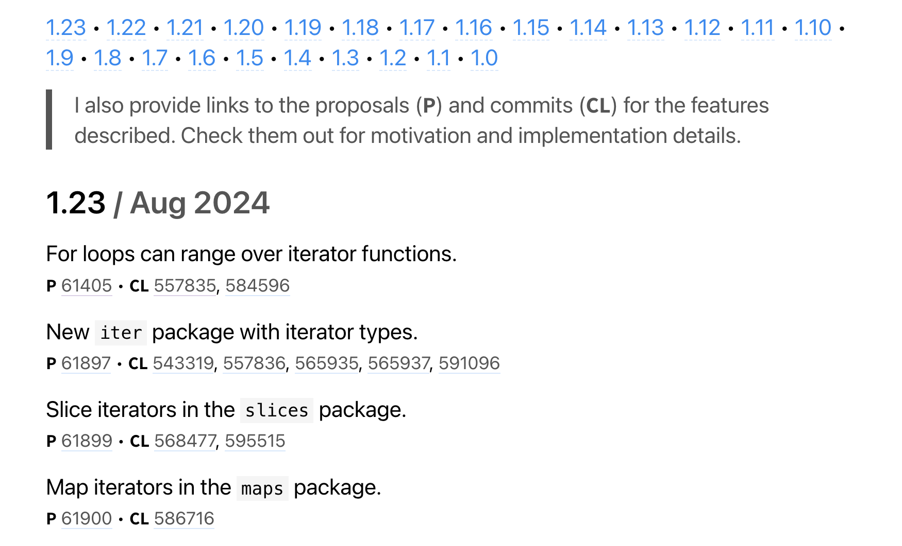
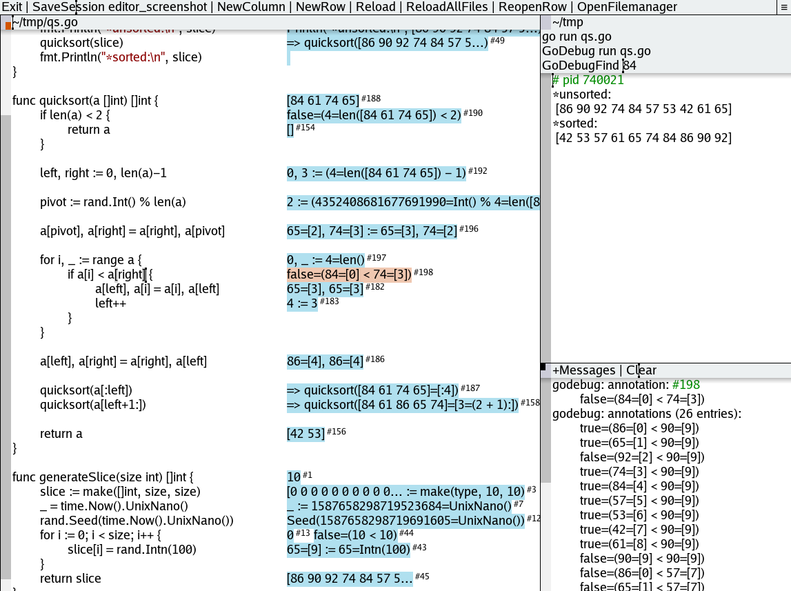
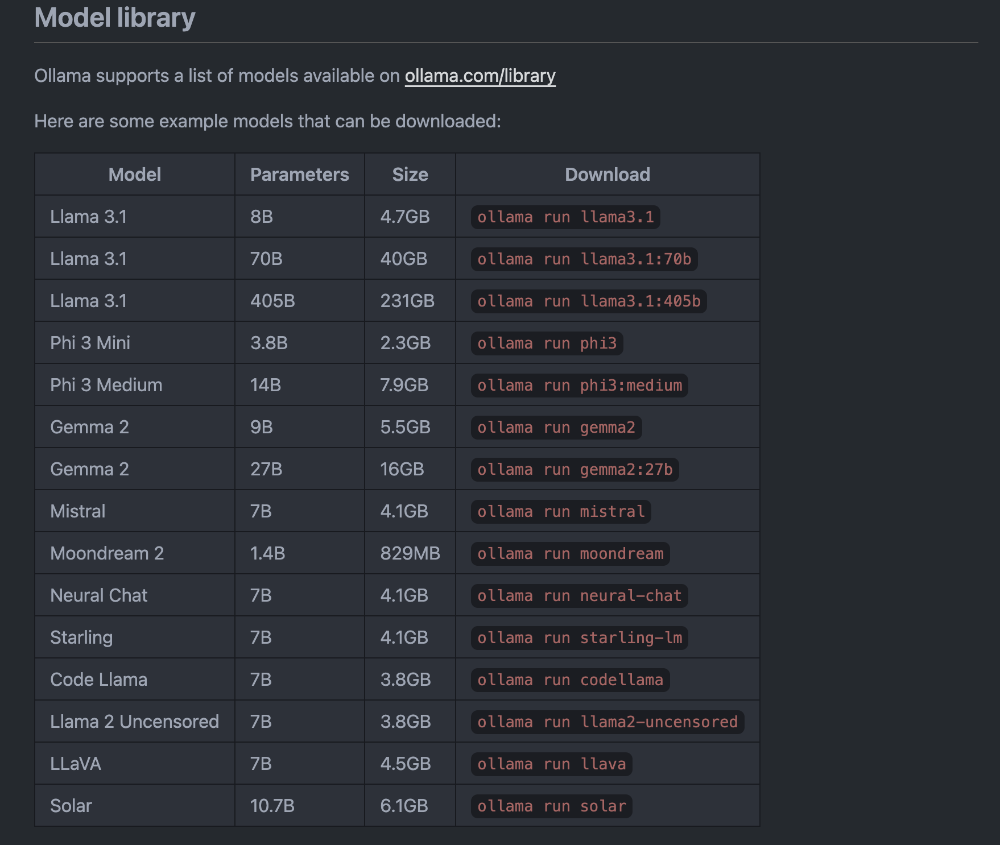

---
tags:
  - golang
  - go-weekly
  - networking
authors:
  - fuatto
title: "Go Commentary #5: Features, Memory Optimization, Minecraft Server, Code Editor, and LLM Tool"
description: "Explore Go version features, memory optimization techniques, a Go-powered Minecraft server, a pure Go source code editor, and a tool for running large language models."
date: 2024-08-02
---
## [Go Features By Version](https://antonz.org/which-go/)

- Context:

    - Go is released every six months. 
    - Each major Go release is supported until there are two newer major releases. 
    - Critical problems are fixed by issuing minor revisions.

- Solution:

    

## [Make Your Programs Use Less Memory](https://github.com/dkorunic/betteralign)

- Context:

  - Package [fieldalignment](https://pkg.go.dev/golang.org/x/tools/go/analysis/passes/fieldalignment) defines an Analyzer that detects structs that would use less memory if their fields were sorted.

- Solution:

  - betteralign is fork of fieldalignment with:
    - skips over generated files, either files with known "generated" suffix (_generated.go, _gen.go, .gen.go, .pb.go, .pb.gw.go) or due to package-level comment containing Code generated by... DO NOT EDIT. string,
    - skips over test files (files with _test.go suffix),
    - skips over structs marked with comment betteralign:ignore,
    - doesn't lose comments (field comments, doc comments, floating comments or otherwise) but the comment position heuristics is still work in progress,
    - does very reliable atomic file I/O with strong promise not to corrupt and/or lose contents upon rewrite (not on Windows platform),
    - has more thorough testing in regards to expected optimised vs golden results,
    - integrates better with environments with restricted CPU and/or memory resources (Docker containers, K8s containers, LXC, LXD etc).
 

## [A Go-powered Minecraft 1.21 server](https://github.com/ZeppelinMC/Zeppelin)

- Context:

  - Blazingly fast, highly optimized server implementation written in Go for Minecraft 1.21

## [A Source Code Editor in Pure Go](https://github.com/jmigpin/editor)

  - Auto-indentation of wrapped lines.
  - No code coloring (except comments and strings).
  - Many TextArea utilities: undo/redo, replace, comment, ...
  - Handles big files.
  - Start external processes from the toolbar with a click, capturing the output to a row.
  - Drag and drop files/directories to the editor.
  - Detects if files opened are changed outside the editor.
  - Plugin support
    - examples such as gotodefinition and autocomplete below.
  - Golang specific:
    - Calls goimports if available when saving a .go file.
    - Clicking on .go files identifiers will jump to the identifier definition (needs gopls).
    - Debug utility for go programs (GoDebug cmd).
      - allows to go back and forth in time to consult code values.
  - Language Server Protocol (LSP) (code analysis):
    - -lsproto cmd line option
    - basic support for gotodefinition and completion
    - mostly being tested with clangd and gopls
  - Inline complete
    - code completion by hitting the tab key (uses LSP).

## [Ollama 0.3 Quickly Run Large Language Models](https://github.com/ollama/ollama)

---

- https://antonz.org/which-go
- https://github.com/dkorunic/betteralign
- https://pkg.go.dev/golang.org/x/tools/go/analysis/passes/fieldalignment
- https://github.com/ZeppelinMC/Zeppelin
- https://github.com/jmigpin/editor
- https://github.com/ollama/ollama