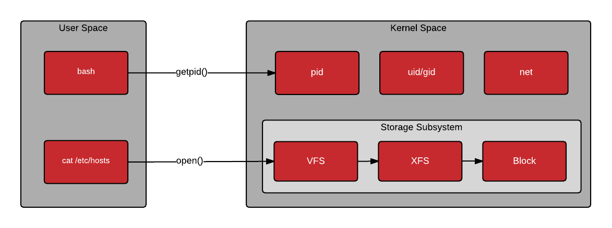
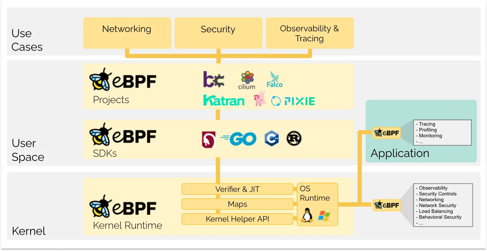
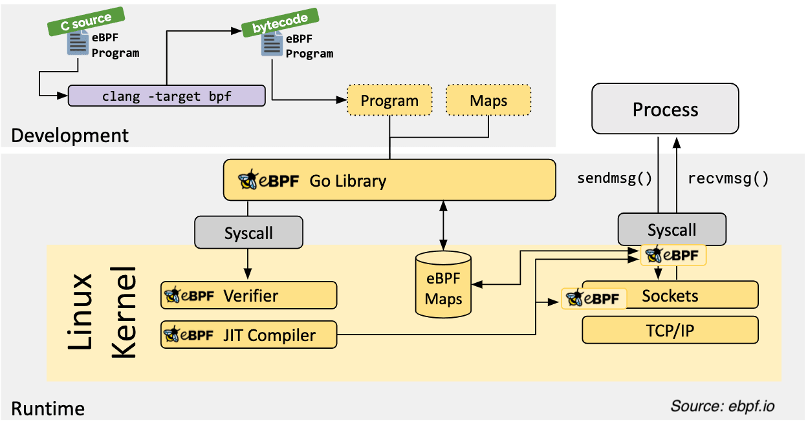
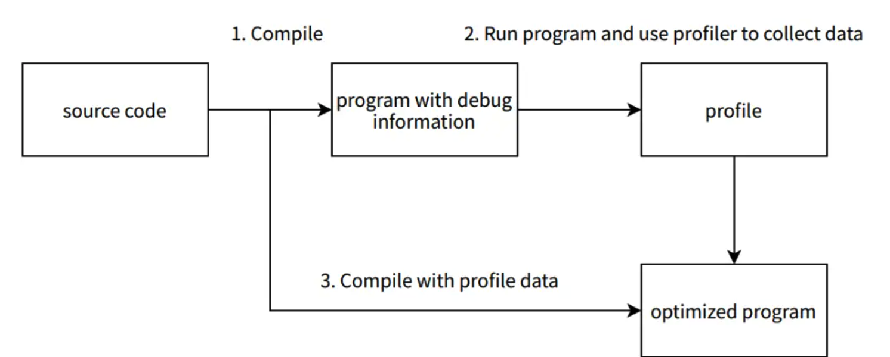

---
tags:
  - golang
  - kernel-programing
  - go-weekly
authors:
  - fuatto
title: 'Go Weekly #1: Mastering Go Performance - eBPF and PGO Optimization Techniques'
description: 'Explore advanced Go optimization techniques using eBPF for kernel-level insights and Profile-Guided Optimization (PGO) for compiler enhancements. Learn how to boost performance and efficiency in Go applications.'
date: 2024-06-27
---

## [An Applied Introduction to eBPF with Go](https://sazak.io/articles/an-applied-introduction-to-ebpf-with-go-2024-06-06)

- Context:

  - We usually write software in user space (outside the OS's kernel, e.g: user apps like utilities, programming languages, GUI...).

  

- Problem:

  - When profiling the application: if we do it from user space (e.g: [pprof](https://go.dev/blog/pprof)) => result is not reliable because there will be some overhead of each layer on top of the CPU/ memory.

  - 2 initial options:
    - _Edit the Kernel Source Code_: not really practical since the usecase is trivial amount. (pending for years to be adopted by distros)
    - _Write a Kernel Model_: this is more practical however, regular maintenance is inevitable as keeping up with the new kernel versions + risking corrupting the Kernel (e.g: if the module has a bug => crash the whole system)

- Solution:

  - **BPF** was originally used in Linux to filter network packets.
  - **eBPF (Extended Berkeley Packet Filter)** allows to trace syscalls, user space/ library functions, network packets... => system performance, monitoring, security...

  

  - _How it works:_
    - Pre-defined hooks: system calls, function entry/exit, kernel tracepoints, network events...
    - eBPF programs are event-driven, run at certain hook point then:
      - Safe checked by Verifier
      - Then compiled by JIT compiler from bytecode to instructions
    - Execute the desired code right before actual system calls

  

- Conclusion:
  - Powerful tool to dive deep in Kernel therefore many applicable usecase: systems programming, observability, security...
  - For profiling usecase, can use existing projects: [Parca](https://www.parca.dev/docs/overview/), [Pyroscope](https://pyroscope.io/) or [PGO](https://go.dev/doc/pgo) (from Go 1.20) for convenience.

## [The Profile-Guided Optimization Experience at Grab](https://engineering.grab.com/profile-guided-optimisation)

- Context:

  - PGO (Profile-Guided Optimization) is introduced in Go version 1.20, a.k.a FDO (feedback-directed optimization), a technique collects and feeds the profile data back to the next compilier build.
  - From the 2nd build/release, expectedly improving 2-14% performance (on-going for future builds)

  

- Problem:

  - Grab wanted to experiment this to some of their services: use self-managed database [TalariaDB](https://github.com/grab/talaria), orchestrated service and a monorepo one.

- Results:

  - In a service cluster's image that uses TalariaDB, add `-PGO=./talaria.PGO` to the `go build` command: 10% CPU usage reduction, 30% memory usage reduction and 38% volume usage reduction.
  - On the orchestrated service: the reduction is only around 5% << the effort the enable PGO => not substaintial
  - Monorepo service is currently not supported since needing a seperated pprof service and a build process supporting PGO arguments to attach/retrieve pprof file

- Conclusion:
  - Applicable on simple, yet low-effort deployed services

---

- https://sazak.io/articles/an-applied-introduction-to-ebpf-with-go-2024-06-06
- https://www.redhat.com/en/blog/architecting-containers-part-1-why-understanding-user-space-vs-kernel-space-matters
- https://ebpf.io/what-is-ebpf/
- https://www.parca.dev/docs/overview/
- https://pyroscope.io/

- https://engineering.grab.com/profile-guided-optimisation
- https://go.dev/doc/pgo
