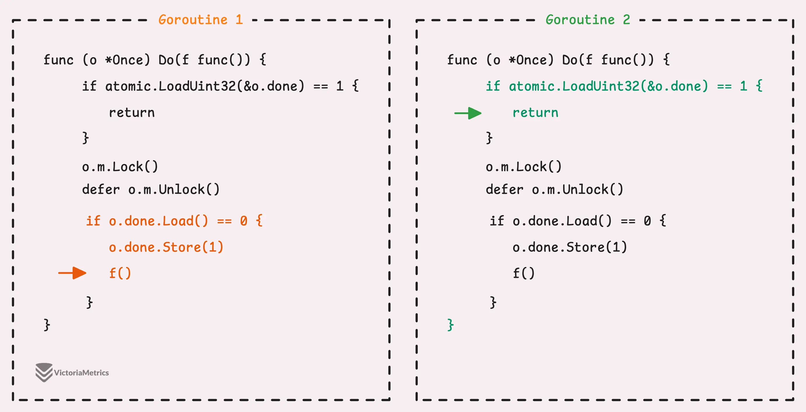

---
tags:
  - golang
  - go-weekly
authors:
  - fuatto
title: 'Go Commentary #21: Go sync.Once is Simple'
short_title: '#21 Go sync.Once is Simple'
description: Understanding Go's sync.Once - A Deep Dive into Single-Execution Guarantees and Atomic Operations
date: 2024-11-22
---

## [Go sync.Once is simple... Is it really?](https://victoriametrics.com/blog/go-sync-once/)

### What is sync.Once?

- "Once is an object that will perform exactly one action"

```go
var once sync.Once
var conf Config

func GetConfig() Config {
    once.Do(func() {
        conf = fetchConfig()
    })
    return conf
}
```

- If `GetConfig()` is called multiple times, `fetchConfig()` is executed only once.

```go
type Singleton struct {
    // fields
}

var (
    instance *Singleton
    once     sync.Once
)

func GetSingleton() *Singleton {
    once.Do(func() {
        instance = &Singleton{}
    })
    return instance
}
```

- The benefit: it delays certain operations until they are first needed (lazy-loading), which can improve runtime performance and reduce initial memory usage.

```go
var once sync.Once

func main() {
    once.Do(func() {
        fmt.Println("This will be printed once")
    })

    once.Do(func() {
        fmt.Println("This will not be printed")
    })
}

// Output:
// This will be printed once
```

- No built-in way to reset a sync.Once, so if the function passed to Once.Do panics while running, the future calls to `Do(f)` won't run f again and will be tricky to catch the panic and handle the error afterward

```go
var once sync.Once
var config Config

func GetConfig() (Config, error) {
    var err error
    once.Do(func() {
        config, err = fetchConfig()
    })
    return config, err
}
```

- From Go 1.21, we get: `OnceFunc`, `OnceValue` and `OnceValues`

```go
// If f panics, the returned function will panic with the same value on every call. (cached)
func OnceFunc(f func()) func() { 
  ...
}

// returns the value returned by f
func OnceValue[T any](f func() T) func() T {
  ...
}

// returns the values returned by f
func OnceValues[T1, T2 any](f func() (T1, T2)) func() (T1, T2) {
  ...
}
```

- Example use:

```go
var config Config

var getConfigOnce = sync.OnceValues(fetchConfig)

func main() {
  var err error

  config, err = getConfigOnce()
  if err != nil {
    log.Fatalf("Failed to fetch config: %v", err)
  }
  ...
}
```

### How it works?

- The implementation of Once

```go
type Once struct {
	done atomic.Uint32
	m    Mutex
}
```

- Simply use mutex to lock and allows only 1 goroutine to enter; then if `done` is still 0 (function f hasn't run yet) set done to 1 and runs f()

=> Original version of sync.Once, written by Rob Pike in 2010
```go
func (o *Once) Do(f func()) {
	o.m.Lock()
	defer o.m.Unlock()

	if o.done.Load() == 0 {
		o.done.Store(1)
		f()
	}
}
```

- Not performant since it always locks first (goroutines wait on each other) whenever Do(f) is called.

=> check the flag done first before the lock

```go
func (o *Once) Do(f func()) {
  if atomic.LoadUint32(&o.done) == 1 {
    return
  }

  // slow path
  o.m.Lock()
  defer o.m.Unlock()

  if o.done.Load() == 0 {
    o.done.Store(1)
    f()
  }
}
```

- This introduces the race condition



=> add defer to when setting flag

```go
func (o *Once) Do(f func()) {
  if o.done.Load() == 1 {
    return
  }

  // slow path
  o.m.Lock()
  defer o.m.Unlock()

  if o.done.Load() == 0 {
    defer o.done.Store(1)
    f()
  }
}
```

- Since Go compiler supports inlining (taking the function's code and paste it directly to where the function is called) optimization

```go
func (o *Once) Do(f func()) {
	if o.done.Load() == 0 {
		o.doSlow(f)
	}
}

func (o *Once) doSlow(f func()) {
	o.m.Lock()
	defer o.m.Unlock()

	if o.done.Load() == 0 {
		defer o.done.Store(1)
		f()
	}
}
```

---

https://victoriametrics.com/blog/go-sync-once/

https://go.dev/ref/mem