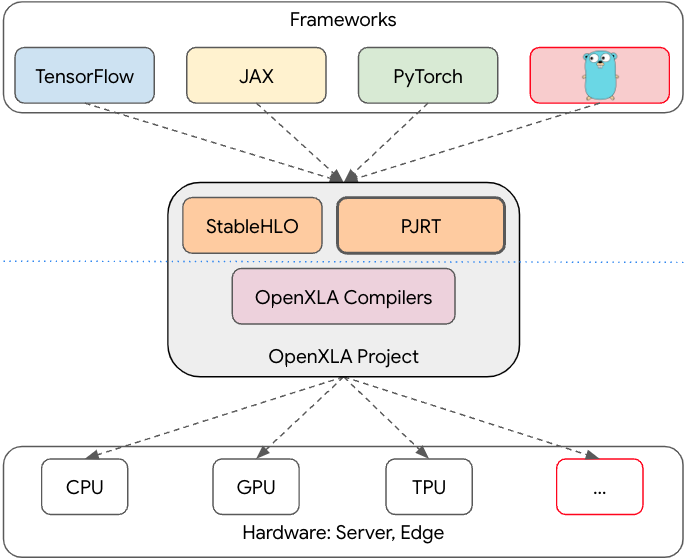

---
tags:
  - golang
  - go-weekly
authors:
  - fuatto
title: 'Go Commentary #22: GoMLX: ML in Go without Python'
short_title: '#22 GoMLX: ML in Go without Python'
description: Running Machine Learning inference in Go without Python
date: 2024-11-29
---

## [GoMLX: ML in Go without Python](https://eli.thegreenplace.net/2024/gomlx-ml-in-go-without-python)

### How ML models are implemented

- Written in Python, using frameworks like TensorFlow, JAX or Pytorch that take care of:

  - Expressive way to describe the model architecture, including auto-differentiation for training.
  - Efficient implementation of computational primitives on common HW: CPUs, GPUs and TPUs.



- The frameworks that provide high-level primitives to define and translate ML models to a common interchange format called StableHLO (High-Level Operations).

- The OpenXLA system, which includes two major components: the XLA compiler translating HLO to HW machine code, and PJRT - the runtime component responsible for managing HW devices, moving data (tensors) between the host CPU and these devices, executing tasks, sharding and so on.

- HW that executes these models efficiently. (C/C++ hidden complexity)

### GoMLX

- Wraps XLA - access to all building blocks TF and JAX use

### Examples

- a CNN (convolutional neural network) without any Python, training it on [CIFAR-10](https://www.cs.toronto.edu/~kriz/cifar.html)

as expected, Go code is longer and more explicit
```go
// define the model graph
func C10ConvModel(mlxctx *mlxcontext.Context, spec any, inputs []*graph.Node) []*graph.Node {
  batchedImages := inputs[0]
  g := batchedImages.Graph()
  dtype := batchedImages.DType()
  batchSize := batchedImages.Shape().Dimensions[0]
  logits := batchedImages

  layerIdx := 0
  nextCtx := func(name string) *mlxcontext.Context {
    newCtx := mlxctx.Inf("%03d_%s", layerIdx, name)
    layerIdx++
    return newCtx
  }

  // Convolution / activation layers
  logits = layers.Convolution(nextCtx("conv"), logits).Filters(32).KernelSize(3).PadSame().Done()
  logits.AssertDims(batchSize, 32, 32, 32)
  logits = activations.Relu(logits)
  logits = layers.Convolution(nextCtx("conv"), logits).Filters(32).KernelSize(3).PadSame().Done()
  logits = activations.Relu(logits)
  logits = graph.MaxPool(logits).Window(2).Done()
  logits = layers.DropoutNormalize(nextCtx("dropout"), logits, graph.Scalar(g, dtype, 0.3), true)
  logits.AssertDims(batchSize, 16, 16, 32)

  logits = layers.Convolution(nextCtx("conv"), logits).Filters(64).KernelSize(3).PadSame().Done()
  logits.AssertDims(batchSize, 16, 16, 64)
  logits = activations.Relu(logits)
  logits = layers.Convolution(nextCtx("conv"), logits).Filters(64).KernelSize(3).PadSame().Done()
  logits.AssertDims(batchSize, 16, 16, 64)
  logits = activations.Relu(logits)
  logits = graph.MaxPool(logits).Window(2).Done()
  logits = layers.DropoutNormalize(nextCtx("dropout"), logits, graph.Scalar(g, dtype, 0.5), true)
  logits.AssertDims(batchSize, 8, 8, 64)

  logits = layers.Convolution(nextCtx("conv"), logits).Filters(128).KernelSize(3).PadSame().Done()
  logits.AssertDims(batchSize, 8, 8, 128)
  logits = activations.Relu(logits)
  logits = layers.Convolution(nextCtx("conv"), logits).Filters(128).KernelSize(3).PadSame().Done()
  logits.AssertDims(batchSize, 8, 8, 128)
  logits = activations.Relu(logits)
  logits = graph.MaxPool(logits).Window(2).Done()
  logits = layers.DropoutNormalize(nextCtx("dropout"), logits, graph.Scalar(g, dtype, 0.5), true)
  logits.AssertDims(batchSize, 4, 4, 128)

  // Flatten logits, and apply dense layer
  logits = graph.Reshape(logits, batchSize, -1)
  logits = layers.Dense(nextCtx("dense"), logits, true, 128)
  logits = activations.Relu(logits)
  logits = layers.DropoutNormalize(nextCtx("dropout"), logits, graph.Scalar(g, dtype, 0.5), true)
  numClasses := 10
  logits = layers.Dense(nextCtx("dense"), logits, true, numClasses)
  return []*graph.Node{logits}
}
```

```go
// the classifier
func main() {
  flagCheckpoint := flag.String("checkpoint", "", "Directory to load checkpoint from")
  flag.Parse()

  mlxctx := mlxcontext.New()
  backend := backends.New()

  _, err := checkpoints.Load(mlxctx).Dir(*flagCheckpoint).Done()
  if err != nil {
    panic(err)
  }
  mlxctx = mlxctx.Reuse() // helps sanity check the loaded context
  exec := mlxcontext.NewExec(backend, mlxctx.In("model"), func(mlxctx *mlxcontext.Context, image *graph.Node) *graph.Node {
    // Convert our image to a tensor with batch dimension of size 1, and pass
    // it to the C10ConvModel graph.
    image = graph.ExpandAxes(image, 0) // Create a batch dimension of size 1.
    logits := cnnmodel.C10ConvModel(mlxctx, nil, []*graph.Node{image})[0]
    // Take the class with highest logit value, then remove the batch dimension.
    choice := graph.ArgMax(logits, -1, dtypes.Int32)
    return graph.Reshape(choice)
  })

  // classify takes a 32x32 image and returns a Cifar-10 classification according
  // to the models. Use C10Labels to convert the returned class to a string
  // name. The returned class is from 0 to 9.
  classify := func(img image.Image) int32 {
    input := images.ToTensor(dtypes.Float32).Single(img)
    outputs := exec.Call(input)
    classID := tensors.ToScalar[int32](outputs[0])
    return classID
  }

  // ...
}
```

- [a Gemma2 from Kaggle](https://www.kaggle.com/models/google/gemma-2) example

```go
var (
  flagDataDir   = flag.String("data", "", "dir with converted weights")
  flagVocabFile = flag.String("vocab", "", "tokenizer vocabulary file")
)

func main() {
  flag.Parse()
  ctx := context.New()

  // Load model weights from the checkpoint downloaded from Kaggle.
  err := kaggle.ReadConvertedWeights(ctx, *flagDataDir)
  if err != nil {
    log.Fatal(err)
  }

  // Load tokenizer vocabulary.
  vocab, err := sentencepiece.NewFromPath(*flagVocabFile)
  if err != nil {
    log.Fatal(err)
  }

  // Create a Gemma sampler and start sampling tokens.
  sampler, err := samplers.New(backends.New(), ctx, vocab, 256)
  if err != nil {
    log.Fatalf("%+v", err)
  }

  start := time.Now()
  output, err := sampler.Sample([]string{
    "Are bees and wasps similar?",
  })
  if err != nil {
    log.Fatalf("%+v", err)
  }
  fmt.Printf("\tElapsed time: %s\n", time.Since(start))
  fmt.Printf("Generated text:\n%s\n", strings.Join(output, "\n\n"))
}
```

### Conclusion

- Using GoMLX can help implement ML inference in Go without Python

- Since it's a relatively new project, it may be a little risky for production uses for now.

---

https://eli.thegreenplace.net/2024/gomlx-ml-in-go-without-python

https://www.cs.toronto.edu/~kriz/cifar.html

https://www.kaggle.com/models/google/gemma-2