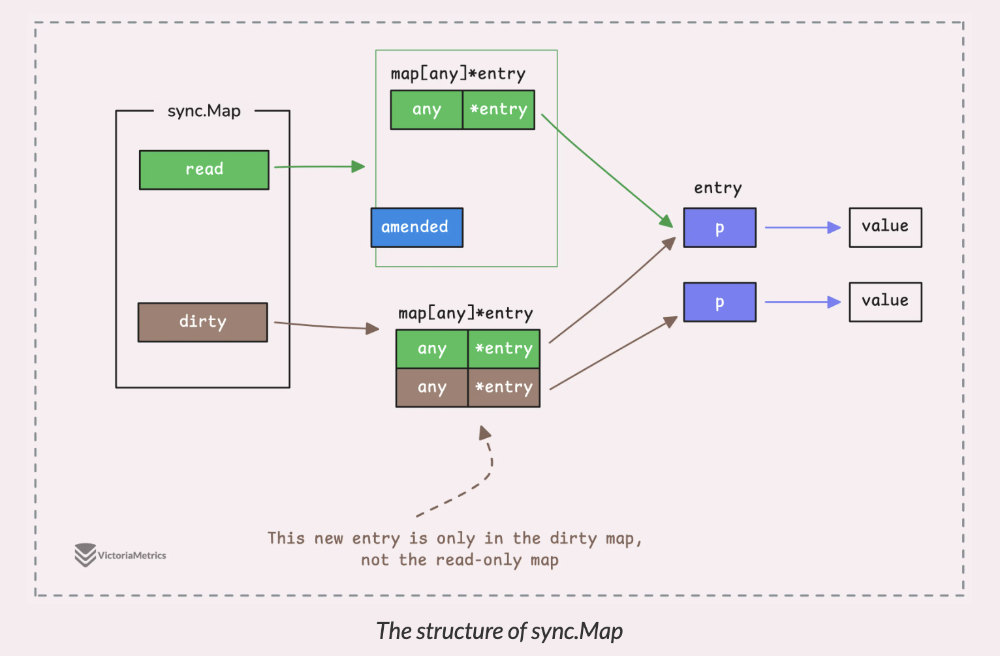
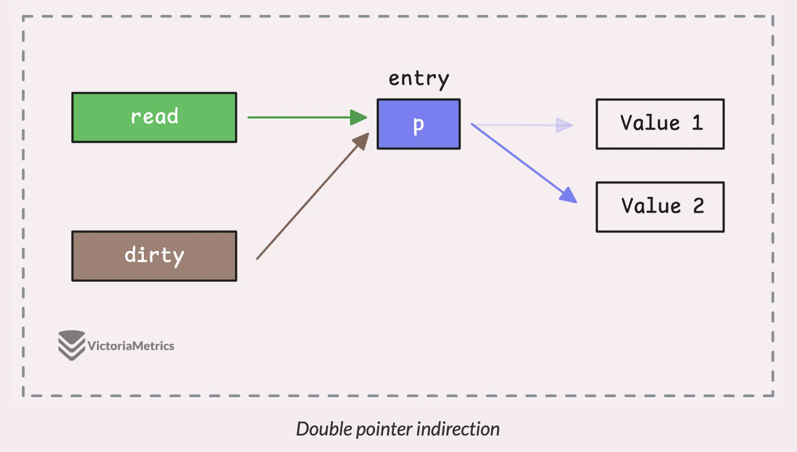
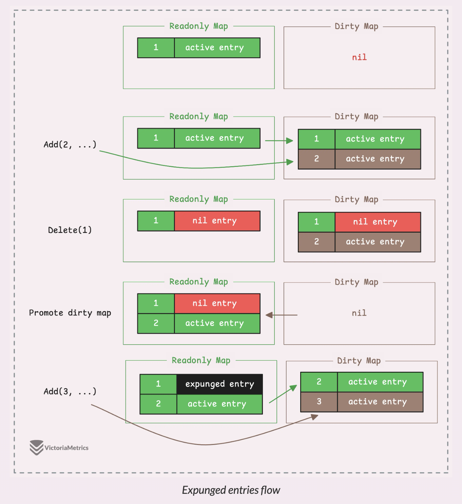

---
tags:
  - golang
  - go-weekly
authors:
  - fuatto
title: 'Go Commentary #16: Understand sync.Map'
short_title: '#16: Understand sync.Map'
description: Understand sync.Map
date: 2024-10-18
---

## [Go sync.Map: The Right Tool for the Right Job](https://victoriametrics.com/blog/go-sync-map/index.html)

- Context:

  ```go
  func main() {
      m := make(map[string]int)

      go func() {
          for {
              m["blog"] = 1
          }
      }()

      go func() {
          for {
              fmt.Println(m["blog"])
          }
      }()

      select{} // block-forever trick
  }
  // fatal error: concurrent map read and map write

  ```

- sync.Map:

  - **sync.Map** takes care of all that locking (or atomic operations) for you - so no manual locking needed, and no worrying about race conditions.

  - reading, writing, and deleting keys faster

  ```go
    func main() {
      var syncMap sync.Map

      // store a key-value pair
      syncMap.Store("blog", "VictoriaMetrics")

      // load a value by key "blog"
      value, ok := syncMap.Load("blog")
      fmt.Println(value, ok)

      // delete a key-value pair by key "blog"
      syncMap.Delete("blog")
      value, ok = syncMap.Load("blog")
      fmt.Println(value, ok)
    }

    // Output:
    // VictoriaMetrics true
    // <nil> false
  ```

  ```go
  func (m *Map) Load(key any) (value any, ok bool)

  func (m *Map) Store(key, value any)
  func (m *Map) LoadOrStore(key, value any) (actual any, loaded bool)

  func (m *Map) Delete(key any)
  func (m *Map) LoadAndDelete(key any) (value any, loaded bool)
  func (m *Map) CompareAndDelete(key, old any) (deleted bool)

  func (m *Map) Swap(key, value any) (previous any, loaded bool)
  func (m *Map) CompareAndSwap(key, old, new any) (swapped bool)

  func (m *Map) Range(f func(key, value any) bool)
  func (m *Map) Clear()
  ```

- even when iterate through a map while writing is not safe

  ```go
    func main() {
      m := make(map[string]int)

      go func() {
          for {
              m["blog"] = 1
          }
      }()

      go func() {
          for {
              for range m {
                  fmt.Println("iterating")
              }
          }
      }()

      select{} // block-forever trick
    }

    // fatal error: concurrent map iteration and map write
  ```

  - With **sync.Map.Range**, it’s designed to handle concurrent reads and writes during iteration without locking up the entire map. The trade-off, though, is that you might not get a perfectly consistent snapshot of the map while you’re iterating.


- How it works:

  - two separate native maps: the readonly map and the dirty map.

  ```go
    type Map struct {
      mu Mutex
      read atomic.Pointer[readOnly]
      dirty map[any]*entry
      misses int
    }

    type readOnly struct {
      m       map[any]*entry
      amended bool // true if the dirty map contains some key not in m.
    }

    type entry struct {
      p atomic.Pointer[any]
    }
  ```

  - readonly map is where the fast, lock-free lookups happen; built around an atomic.Pointer, which lets multiple goroutines access it without needing to lock anything. (ideal for scenarios where data is mostly being read and not frequently modified) 
  => the readonly map might not always hold the most up-to-date data, therefore dirty map

  - dirty map stores any new entries that get added while the readonly map is still being used for lookups

  

  => dirty map contains all the data from the readonly map, along with any new entries that haven’t yet been promoted to the readonly map

  - when you update a value, all you need to do is update this pointer. Since both the readonly and dirty maps point to the same entry

  

  - The behavior of the pointer in the entry struct defines the state of the entry in the map, and there are 3 possible states:

    - **Normal state**: This is when the entry is valid. The pointer p is pointing to a real value, and the entry exists in those maps, meaning it’s actively in use and can be read without any issues.

    - **Deleted state**: When an entry is deleted from a sync.Map, it’s not immediately removed from the readonly maps. Instead, the pointer p is simply set to nil, signaling that the entry has been deleted but still exists in the maps.

    - **Expunged state**: This is a special state where the key is fully removed. The entry is marked with a special sentinel value that indicates it’s been completely deleted.

  


---

https://victoriametrics.com/blog/go-sync-map/index.html