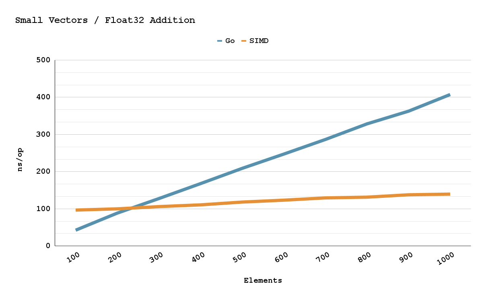
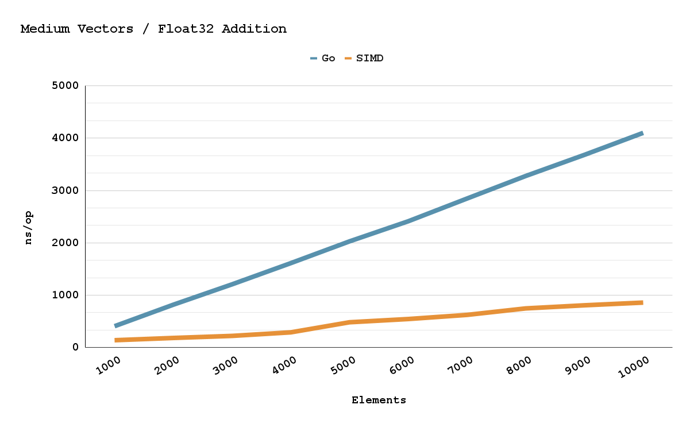
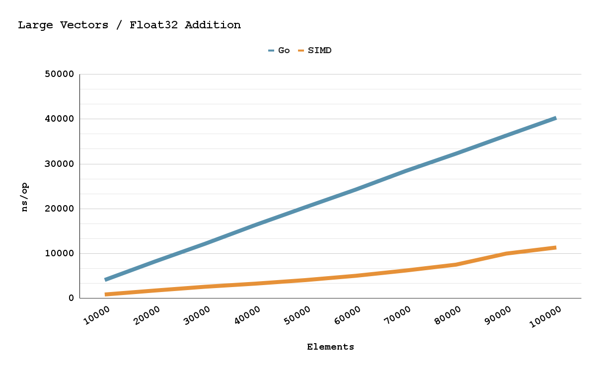

---
tags:
  - golang
  - go-weekly
authors:
  - fuatto
title: 'Go Commentary #17: Leveraging benchstat Projects in Go benchmark and Go Plan9 memo on 450% speeding up calculations'
short_title: '#17 Leveraging benchstat Projects in Go benchmark and Go Plan9 memo on 450% speeding up calculations'
description: Understanding benchstat usage in Go benchmark and Go Plan9 on boosting up performance
date: 2024-10-25
---

## [Leveraging benchstat Projections in Go Benchmark Analysis!](https://www.bwplotka.dev/2024/go-microbenchmarks-benchstat/)

Context: (golang.org/x/perf/cmd/benchstat)

  - Old-school: 

    1. Creating the benchmark test code:

      ```go
        func BenchmarkFoo(b *testing.B) {
          b.Run(...)
        }
      ```
      
    2. Running the benchmark for the version A of your code

    ```bash
      export bench=v1 && go test \
      -run '^$' -bench '^BenchmarkFoo' \
      -benchtime 5s -count 6 -cpu 2 -benchmem -timeout 999m \
      | tee ${bench}.txt 
    ```

    3. Running the benchmark for the version B of your code 

    4. Analyze the A/B benchmark results
    ```bash
      benchstat base=v1.txt new=v2.txt
    ``` 

  Example:

  - to compare the encoding efficiency of the [Remote Write 1.0](https://prometheus.io/docs/specs/remote_write_spec/) protocol to the [2.0 version](https://prometheus.io/docs/specs/remote_write_spec_2_0/) for different sample sizes, ideally across different compressions and two different Go protobuf encoders (marshallers).

    ```go
      package across_versions

      // ...

      /*
        export bench=v2 && go test \
          -run '^$' -bench '^BenchmarkEncode' \
          -benchtime 5s -count 6 -cpu 2 -benchmem -timeout 999m \
        | tee ${bench}.txt
      */
      func BenchmarkEncode(b *testing.B) {
        for _, sampleCase := range sampleCases {
          b.Run(fmt.Sprintf("sample=%v", sampleCase.samples), func(b *testing.B) {
            batch := utils.GeneratePrometheusMetricsBatch(sampleCase.config)

            // Commenting out what we used in v1.txt
            //msg := utils.ToV1(batch, true, true)
            msg := utils.ToV2(utils.ConvertClassicToCustom(batch))

            compr := newCompressor("zstd")
            marsh := newMarshaller("protobuf")

            b.ReportAllocs()
            b.ResetTimer()
            for i := 0; i < b.N; i++ {
              out, err := marsh.marshal(msg)
              testutil.Ok(b, err)

              out = compr.compress(out)
              b.ReportMetric(float64(len(out)), "bytes/message")
            }
          })
        }
      }
    ```

    ```bash
    $ benchstat base=v1.txt new=v2.txt
    goos: darwin
    goarch: arm64
    pkg: go-microbenchmarks-benchstat/across_versions
                          │     base     │                new                 │
                          │    sec/op    │   sec/op     vs base               │
    Encode/sample=200-2      264.7µ ± 3%   107.0µ ± 4%  -59.58% (p=0.002 n=6)
    Encode/sample=2000-2    2672.9µ ± 3%   900.3µ ± 3%  -66.32% (p=0.002 n=6)
    Encode/sample=10000-2   13.335m ± 4%   3.299m ± 6%  -75.26% (p=0.002 n=6)
    geomean                  2.113m        682.4µ       -67.70%

                          │     base      │                 new                  │
                          │ bytes/message │ bytes/message  vs base               │
    Encode/sample=200-2      5.964Ki ± 1%    5.534Ki ± 0%   -7.21% (p=0.002 n=6)
    Encode/sample=2000-2     45.88Ki ± 0%    33.45Ki ± 0%  -27.08% (p=0.002 n=6)
    Encode/sample=10000-2    227.4Ki ± 0%    122.0Ki ± 3%  -46.33% (p=0.002 n=6)
    geomean                  39.62Ki         28.27Ki       -28.66%

                          │     base      │                 new                 │
                          │     B/op      │     B/op      vs base               │
    Encode/sample=200-2     336.76Ki ± 0%   64.02Ki ± 0%  -80.99% (p=0.002 n=6)
    Encode/sample=2000-2    1807.7Ki ± 0%   370.8Ki ± 0%  -79.49% (p=0.002 n=6)
    Encode/sample=10000-2    9.053Mi ± 0%   1.322Mi ± 0%  -85.40% (p=0.002 n=6)
    geomean                  1.739Mi        317.9Ki       -82.14%

                          │    base     │                 new                 │
                          │  allocs/op  │ allocs/op   vs base                 │
    Encode/sample=200-2      2.000 ± 0%   2.000 ± 0%        ~ (p=1.000 n=6) ¹
    Encode/sample=2000-2    10.000 ± 0%   2.000 ± 0%  -80.00% (p=0.002 n=6)
    Encode/sample=10000-2   16.000 ± 0%   2.000 ± 0%  -87.50% (p=0.002 n=6)
    geomean                  6.840        2.000       -70.76%
    ¹ all samples are equal

    ```

    -> Limitations:

      - **Difficult to track changes**: easy to lost track of when current optimizations are not helping, and need to revert to previous states.

      - **Accidental benchmark changes**: Unintentional modifications to the benchmark code can lead to unreliable comparisons and are hard to notice in this flow.

      - **Limited collaboration**: hard to share/replicate, esp for bigger projects, where reviews need to ensure the reliability of the author’s benchmark/claimed results.

  - New-school:


  ```bash
    export bench=allcases && go test \
    -run '^$' -bench '^BenchmarkFoo' \
    -benchtime 5s -count 6 -cpu 2 -benchmem -timeout 999m \
    | tee ${bench}.txt 
  ```

  ```go
  package across_cases

  // ...

  /*
    export bench=allcases && go test \
      -run '^$' -bench '^BenchmarkEncode' \
      -benchtime 5s -count 6 -cpu 2 -benchmem -timeout 999m \
    | tee ${bench}.txt
  */
  func BenchmarkEncode(b *testing.B) {
    for _, sampleCase := range sampleCases {
      b.Run(fmt.Sprintf("sample=%v", sampleCase.samples), func(b *testing.B) {
        for _, compr := range compressionCases {
          b.Run(fmt.Sprintf("compression=%v", compr.name()), func(b *testing.B) {
            for _, protoCase := range protoCases {
              b.Run(fmt.Sprintf("proto=%v", protoCase.name), func(b *testing.B) {
                for _, marshaller := range marshallers {
                  b.Run(fmt.Sprintf("encoder=%v", marshaller.name()), func(b *testing.B) {
                    msg := protoCase.msgFromConfigFn(sampleCase.config)

                    b.ReportAllocs()
                    b.ResetTimer()
                    for i := 0; i < b.N; i++ {
                      out, err := marshaller.marshal(msg)
                      testutil.Ok(b, err)

                      out = compr.compress(out)
                      b.ReportMetric(float64(len(out)), "bytes/message")
                    }
                  })
                }
              })
            }
          })
        }
      })
    }
  }

  var (
    sampleCases = []struct {
      samples int
      config  utils.GenerateConfig
    }{
      {samples: 200, config: generateConfig200samples},
      {samples: 2000, config: generateConfig2000samples},
      {samples: 10000, config: generateConfig10000samples},
    }
    compressionCases = []*compressor{
      newCompressor(""),
      newCompressor(remote.SnappyBlockCompression),
      newCompressor("zstd"),
    }
    protoCases = []struct {
      name            string
      msgFromConfigFn func(config utils.GenerateConfig) vtprotobufEnhancedMessage
    }{
      {
        name: "prometheus.WriteRequest",
        msgFromConfigFn: func(config utils.GenerateConfig) vtprotobufEnhancedMessage {
          return utils.ToV1(utils.GeneratePrometheusMetricsBatch(config), true, true)
        },
      },
      {
        name: "io.prometheus.write.v2.Request",
        msgFromConfigFn: func(config utils.GenerateConfig) vtprotobufEnhancedMessage {
          return utils.ToV2(utils.ConvertClassicToCustom(utils.GeneratePrometheusMetricsBatch(config)))
        },
      },
    }
    marshallers = []*marshaller{
      newMarshaller("protobuf"), newMarshaller("vtprotobuf"),
    }
  )

  ```

  - In Jan 2023, benchstat is [rewritten](https://cs.opensource.google/go/x/perf/+/02c55175bb825ade4507ee5d459ea6a1ab6e0af5)

  ```bash
  benchstat -row ".name /sample /compression /encoder" -filter "/compression:zstd /encoder:protobuf" -col /proto allcases.txt
  ```

  ```bash
  goos: darwin
  goarch: arm64
  pkg: go-microbenchmarks-benchstat/across_cases
                            │ prometheus.WriteRequest │   io.prometheus.write.v2.Request   │
                            │         sec/op          │   sec/op     vs base               │
  Encode 200 zstd protobuf                 268.8µ ± 2%   103.3µ ± 7%  -61.57% (p=0.002 n=6)
  Encode 2000 zstd protobuf               2671.4µ ± 5%   877.4µ ± 4%  -67.16% (p=0.002 n=6)
  Encode 10000 zstd protobuf              12.834m ± 2%   3.059m ± 8%  -76.16% (p=0.002 n=6)
  geomean                                  2.097m        652.1µ       -68.90%

                            │ prometheus.WriteRequest │    io.prometheus.write.v2.Request    │
                            │      bytes/message      │ bytes/message  vs base               │
  Encode 200 zstd protobuf                5.949Ki ± 0%   5.548Ki ±  0%   -6.73% (p=0.002 n=6)
  Encode 2000 zstd protobuf               45.90Ki ± 0%   33.49Ki ±  0%  -27.03% (p=0.002 n=6)
  Encode 10000 zstd protobuf              227.8Ki ± 1%   121.4Ki ± 25%  -46.70% (p=0.002 n=6)
  geomean                                 39.62Ki        28.26Ki        -28.68%

                            │ prometheus.WriteRequest │   io.prometheus.write.v2.Request    │
                            │          B/op           │     B/op      vs base               │
  Encode 200 zstd protobuf               336.00Ki ± 0%   64.00Ki ± 0%  -80.95% (p=0.002 n=6)
  Encode 2000 zstd protobuf              1799.8Ki ± 1%   368.0Ki ± 0%  -79.55% (p=0.002 n=6)
  Encode 10000 zstd protobuf              9.015Mi ± 2%   1.312Mi ± 0%  -85.44% (p=0.002 n=6)
  geomean                                 1.732Mi        316.3Ki       -82.17%

                            │ prometheus.WriteRequest │   io.prometheus.write.v2.Request    │
                            │        allocs/op        │ allocs/op   vs base                 │
  Encode 200 zstd protobuf                  2.000 ± 0%   2.000 ± 0%        ~ (p=1.000 n=6) ¹
  Encode 2000 zstd protobuf                10.000 ± 0%   2.000 ± 0%  -80.00% (p=0.002 n=6)
  Encode 10000 zstd protobuf               16.000 ± 0%   2.000 ± 0%  -87.50% (p=0.002 n=6)
  geomean                                   6.840        2.000       -70.76%
  ¹ all samples are equal

  ```

  -> Limitations:

  - Rerunning benchmarks with a large amount of cases takes significantly time (slower feedback loop!).
  - It yields more complex benchmarking code, which makes it hard to iterate on, and spot places where you benchmark the testing code vs the portion of the code you wanted to.
  - For continuous production use, it does not make sense to commit that benchmark with all cases, which are no longer being continued. It fits better to capture such a benchmark in some remote branch for future reference though.

Conclusion:

  - Should use both in a hybrid approach, depending on your goals. 

  - Can even use more features like `-format csv` to export to sheets and render charts

## [Go Plan9 Memo, Speeding Up Calculations 450%](https://pehringer.info/go_plan9_memo.html)

Context 

- want more power than Go's concurrency, encounter SIMD - Same Instruction Muliple Data, that many languages either have compiler optimizations use simd or libs that support it.

- "I just want a package that offers a thin abstraction layer over arithmetic and bitwise simd operations."

- Go's assembler uses [Plan9](https://9p.io/plan9/)'s assemblers guidance which uses target platforms instructions and registers with slight modifications to their names and usage. This means that x86 Plan9 is different then say arm Plan9.

  ```
  example
  ┣━ AddInts_amd64.s
  ┗━ main.go
  ```

  ```
  // +build amd64

  TEXT ·AddInts(SB), 4, $0
      MOVL    left+0(FP), AX
      MOVL    right+8(FP), BX
      ADDL    BX, AX
      MOVL    AX, int+16(FP)
      RET
  ```

  ```go
  package main

  import "fmt"

  func AddInts(left, right) int

  func main() {
      fmt.Println("1 + 2 = ", AddInts(1, 2))
  }
  ```

  **LINE 1**: The file contains amd64 specific instructions, so we need to include a Go build tag to make sure Go does not try to compile this file for non x86 machines.

  **LINE 3**: You can think of this line as the functions declaration. TEXT declares that this is a function or text section. ·AddInts(SB) specifies our functions name. 4 represents “NOSPLIT” which we need for some reason. And $0 is the size of the function’s stack frame (used for local variables). It’s zero in this case because we can easily fit everything into the registers.

  **LINE 4 & 5**: Go’s calling convention is to put the function arguments onto the stack. So we MOVe both Long 32-bit values into the AX and BX registers by dereferencing the frame pointer (FP) with the appropriate offsets. The first argument is stored at offset 0. The second argument is stored at offset 8 (int’s only need 4 bytes but I think Go offsets all arguments by 8 to maintain memory alignment).

  **LINE 6**: Add the Long 32-bit value in AX (left) with the Long 32-bit value in BX. And store the resulting Long 32-bit value in AX.

  **LINE 7 & 8**: Go’s calling convention (as far as I can tell) is to put the function return values after its arguments on the stack. So we MOVe the Long 32-bit values in the AX register onto the stack by dereferencing the frame pointer (FP) with the appropriate offset. Which is 16 in this case.

  
  
  

Conclusion:

- There is roughly a 200-450% speed up depending on the number of elements using Plan9. Hope this inspires others to use it.

- The package currently supports x84 only, hopefully arm in future.

---

https://www.bwplotka.dev/2024/go-microbenchmarks-benchstat/

https://pehringer.info/go_plan9_memo.html


